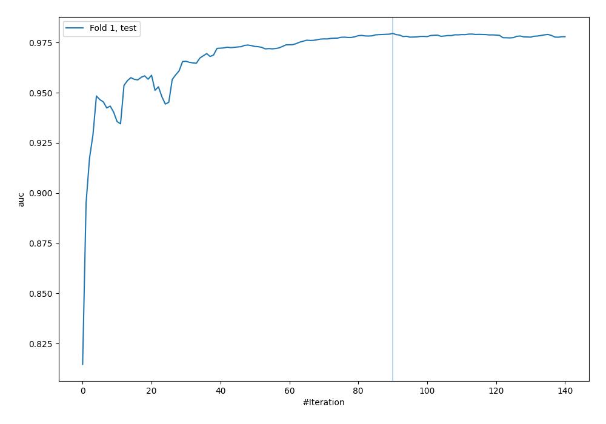
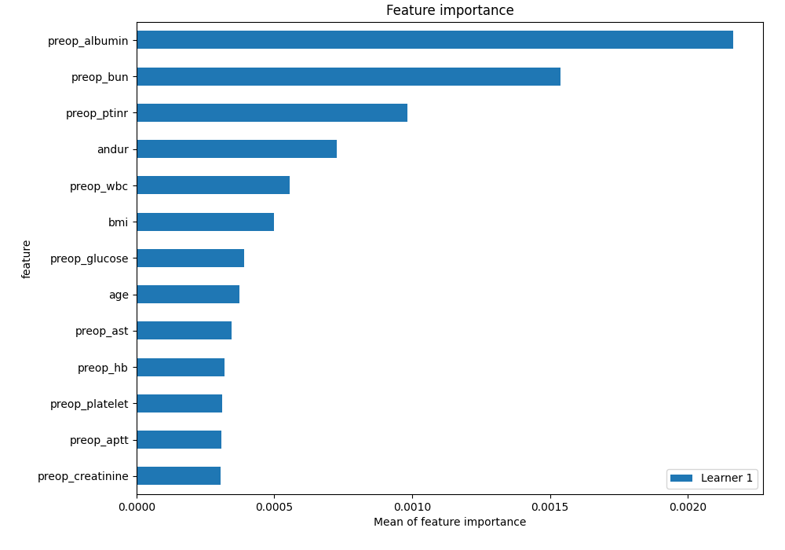
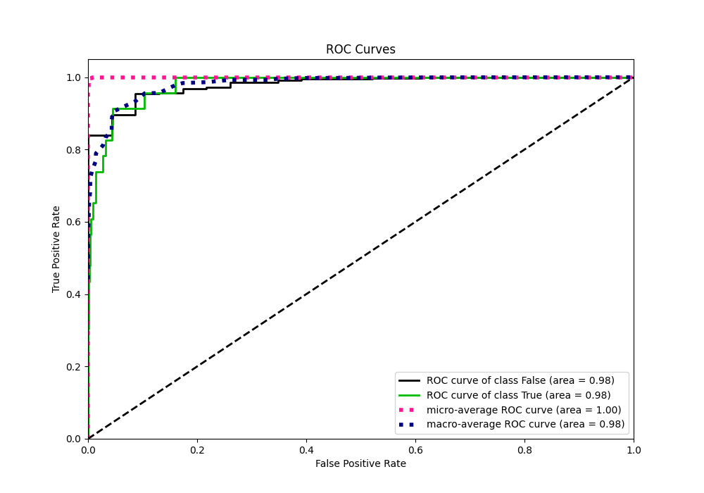
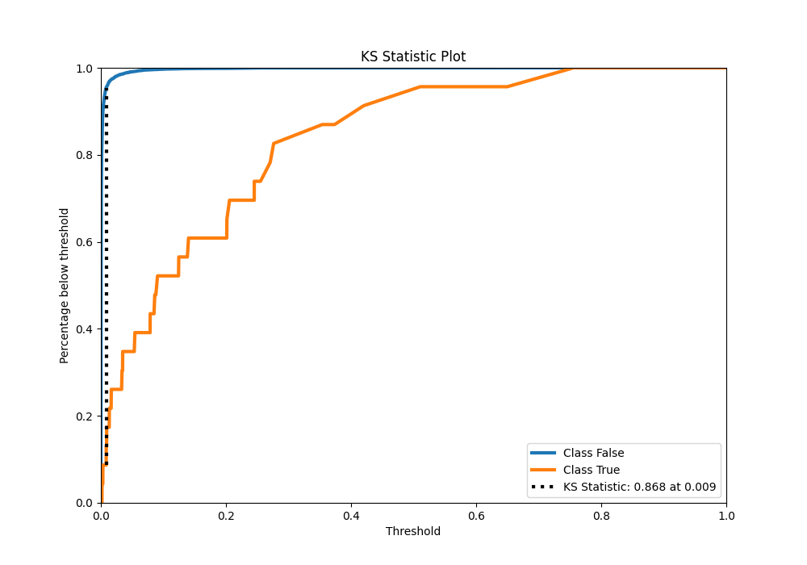
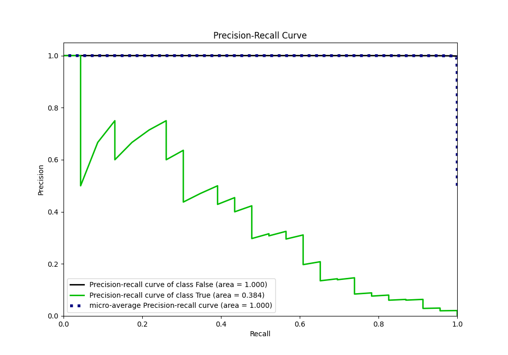
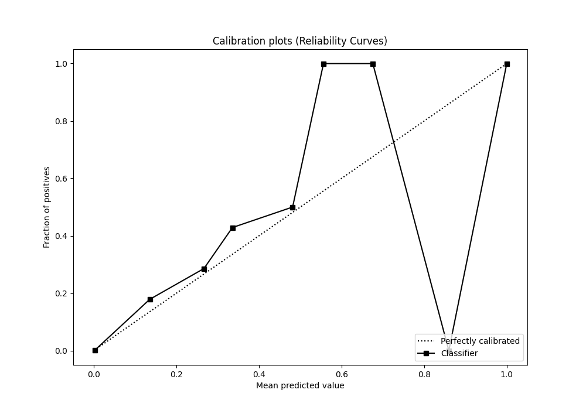
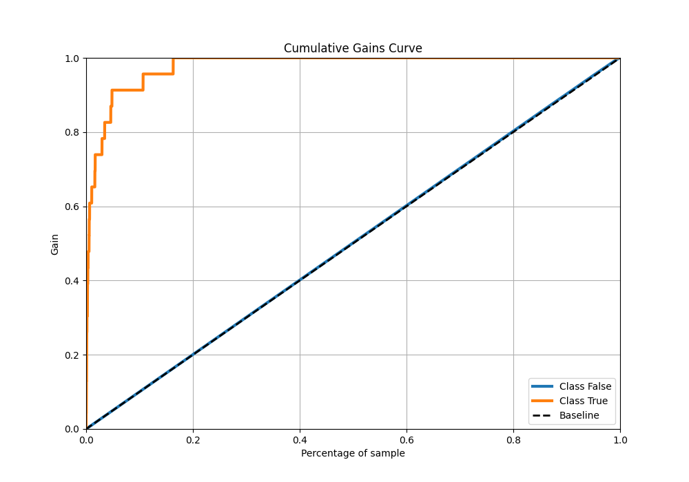
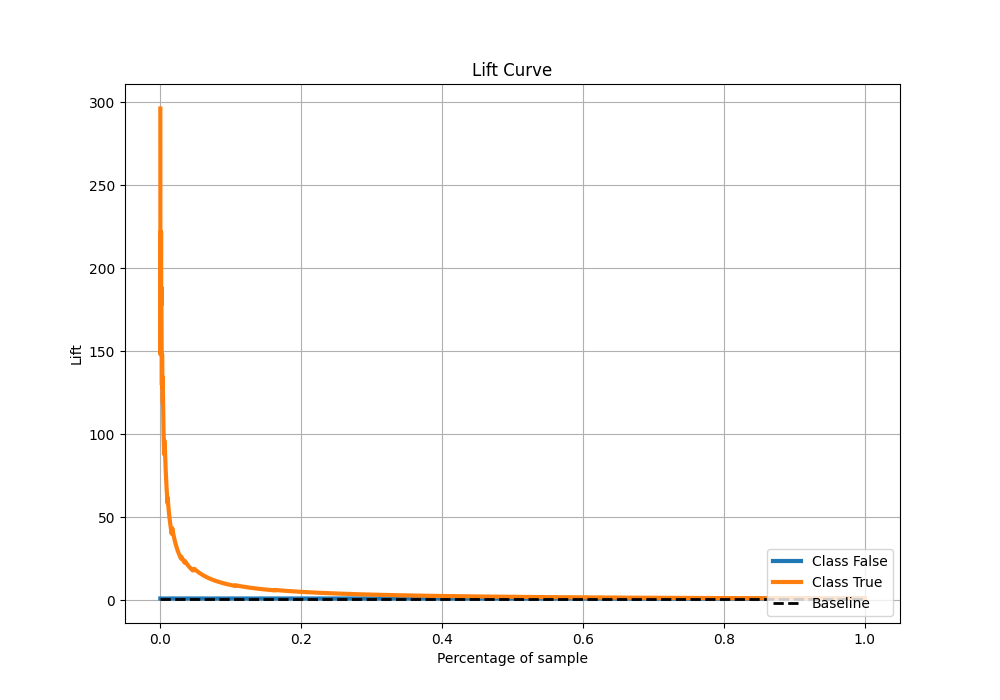

# Summary of 104_CatBoost_SelectedFeatures

[<< Go back](../README.md)

## CatBoost
- **n_jobs**: -1
- **learning_rate**: 0.1
- **depth**: 8
- **rsm**: 0.9
- **loss_function**: Logloss
- **eval_metric**: AUC
- **explain_level**: 2

## Validation
 - **validation_type**: split
 - **train_ratio**: 0.9
 - **shuffle**: True
 - **stratify**: True

## Optimized metric
auc

## Training time

6.4 seconds

## Metric details
|           |    score |    threshold |
|:----------|---------:|-------------:|
| logloss   | 0.011657 | nan          |
| auc       | 0.979548 | nan          |
| f1        | 0.29703  |   0.0491727  |
| accuracy  | 0.989576 |   0.0491727  |
| precision | 0.192308 |   0.0491727  |
| recall    | 1        |   1.7556e-05 |
| mcc       | 0.350527 |   0.0491727  |

## Metric details with threshold from accuracy metric
|           |    score |   threshold |
|:----------|---------:|------------:|
| logloss   | 0.011657 | nan         |
| auc       | 0.979548 | nan         |
| f1        | 0.29703  |   0.0491727 |
| accuracy  | 0.989576 |   0.0491727 |
| precision | 0.192308 |   0.0491727 |
| recall    | 0.652174 |   0.0491727 |
| mcc       | 0.350527 |   0.0491727 |

## Confusion matrix (at threshold=0.049173)
|              |   Predicted as 0 |   Predicted as 1 |
|:-------------|-----------------:|-----------------:|
| Labeled as 0 |             6725 |               63 |
| Labeled as 1 |                8 |               15 |

## Learning curves

## Permutation-based Importance

## Confusion Matrix

## Normalized Confusion Matrix

## ROC Curve

## Kolmogorov-Smirnov Statistic

## Precision-Recall Curve

## Calibration Curve

## Cumulative Gains Curve

## Lift Curve

[<< Go back](../README.md)
