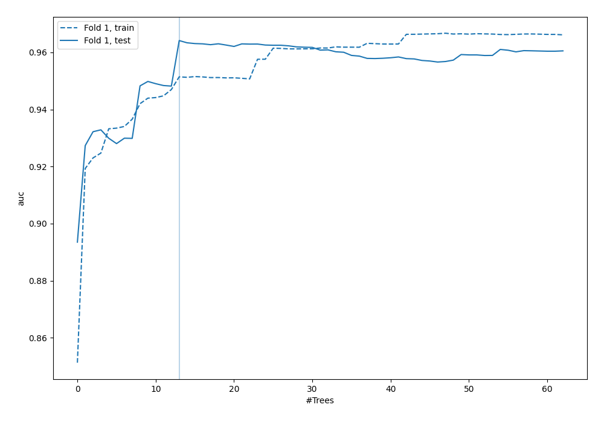
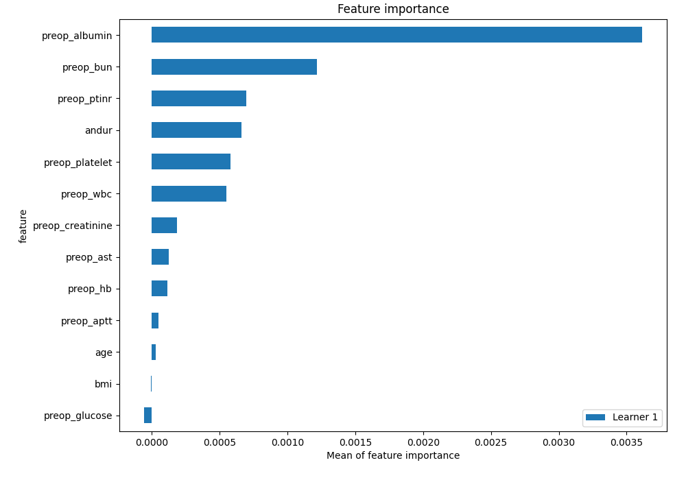
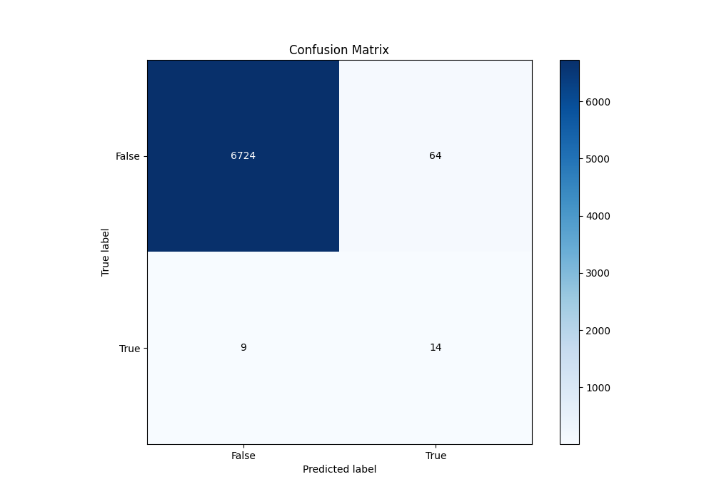
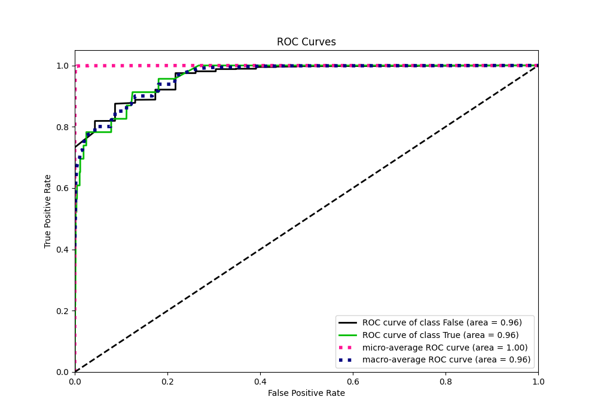
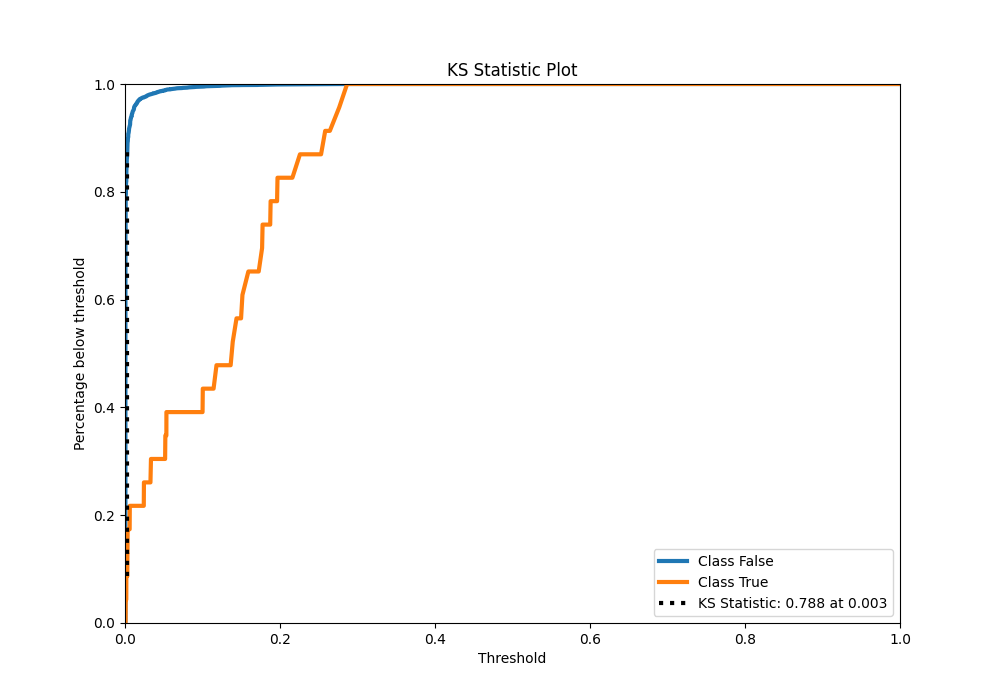
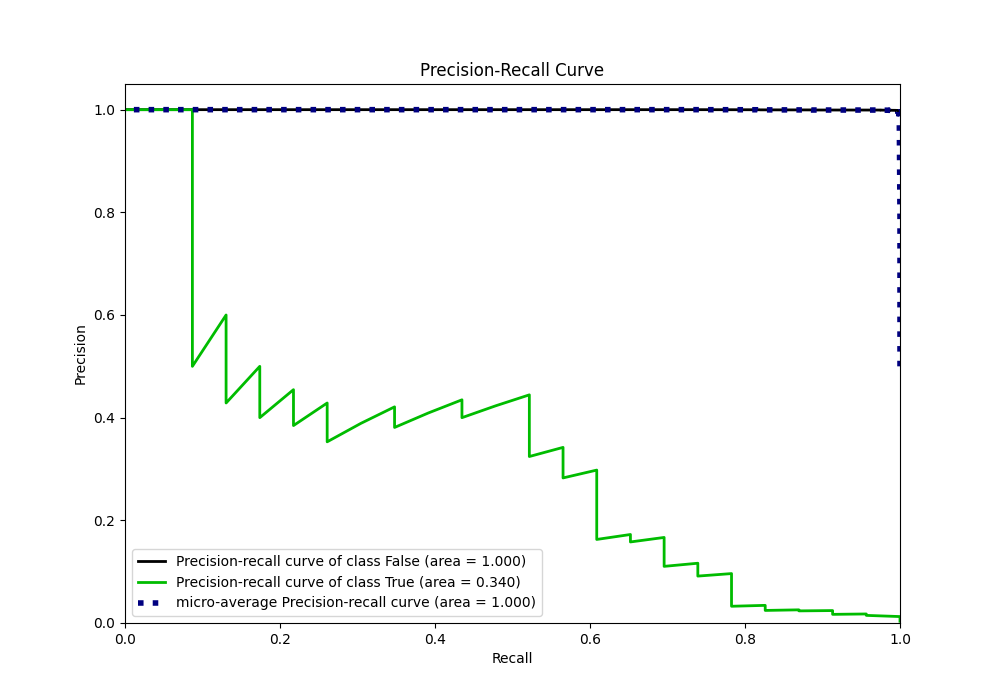
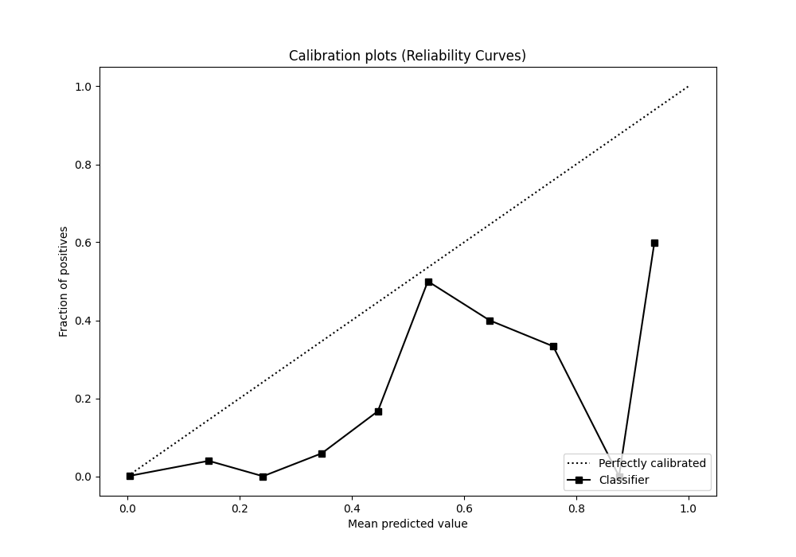
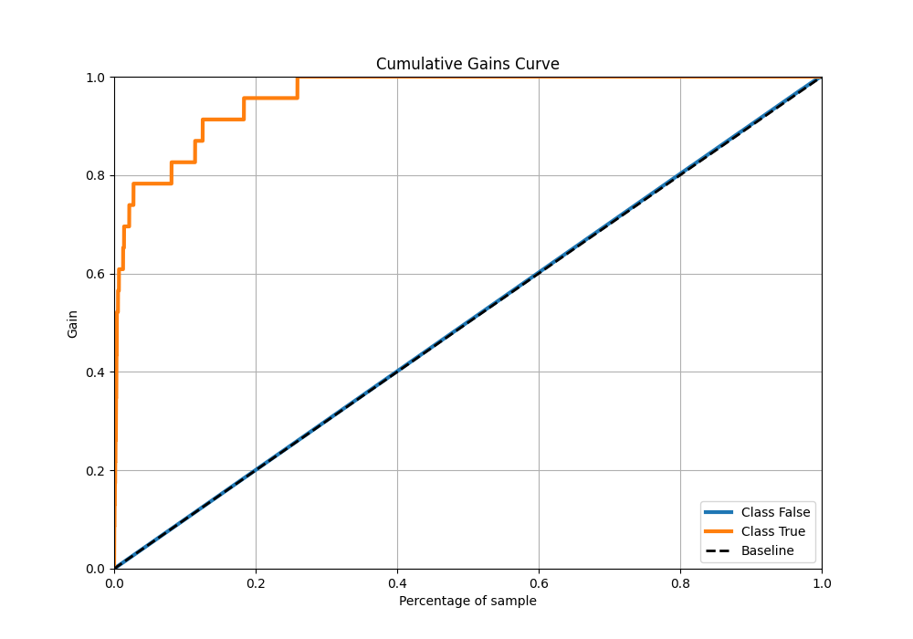
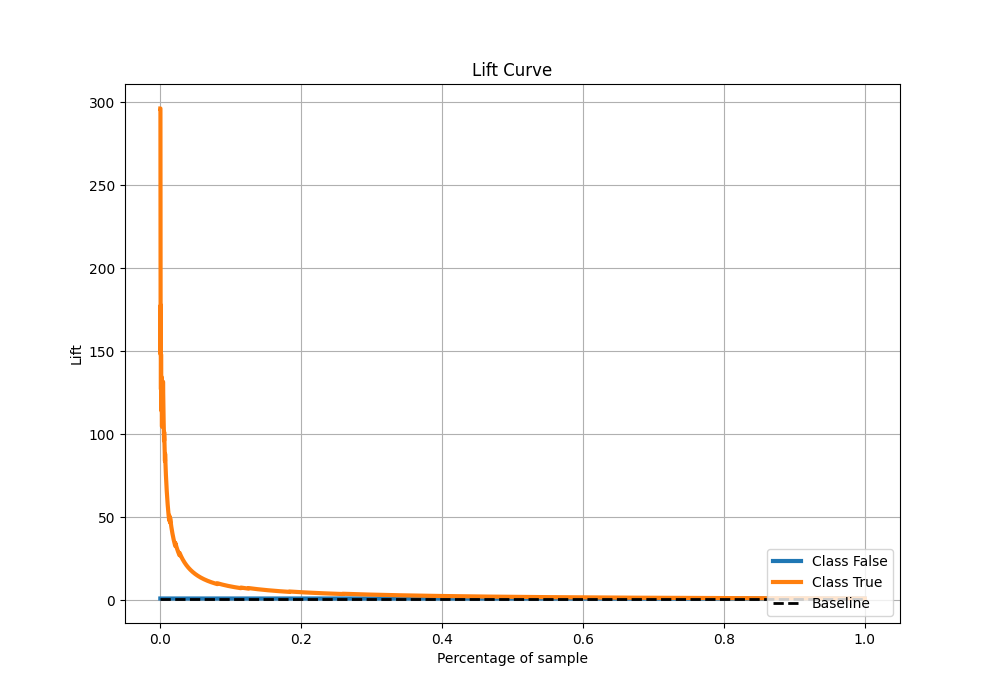

# Summary of 110_RandomForest_SelectedFeatures

[<< Go back](../README.md)

## Random Forest
- **n_jobs**: -1
- **criterion**: gini
- **max_features**: 0.6
- **min_samples_split**: 50
- **max_depth**: 6
- **eval_metric_name**: auc
- **explain_level**: 2

## Validation
 - **validation_type**: split
 - **train_ratio**: 0.9
 - **shuffle**: True
 - **stratify**: True

## Optimized metric
auc

## Training time

8.4 seconds

## Metric details
|           |     score |     threshold |
|:----------|----------:|--------------:|
| logloss   | 0.0130972 | nan           |
| auc       | 0.964137  | nan           |
| f1        | 0.277228  |   0.060441    |
| accuracy  | 0.989282  |   0.060441    |
| precision | 0.179487  |   0.060441    |
| recall    | 1         |   0.000471932 |
| mcc       | 0.326741  |   0.060441    |

## Metric details with threshold from accuracy metric
|           |     score |   threshold |
|:----------|----------:|------------:|
| logloss   | 0.0130972 |  nan        |
| auc       | 0.964137  |  nan        |
| f1        | 0.277228  |    0.060441 |
| accuracy  | 0.989282  |    0.060441 |
| precision | 0.179487  |    0.060441 |
| recall    | 0.608696  |    0.060441 |
| mcc       | 0.326741  |    0.060441 |

## Confusion matrix (at threshold=0.060441)
|              |   Predicted as 0 |   Predicted as 1 |
|:-------------|-----------------:|-----------------:|
| Labeled as 0 |             6724 |               64 |
| Labeled as 1 |                9 |               14 |

## Learning curves

## Permutation-based Importance

## Confusion Matrix

## Normalized Confusion Matrix

## ROC Curve

## Kolmogorov-Smirnov Statistic

## Precision-Recall Curve

## Calibration Curve

## Cumulative Gains Curve

## Lift Curve

[<< Go back](../README.md)
