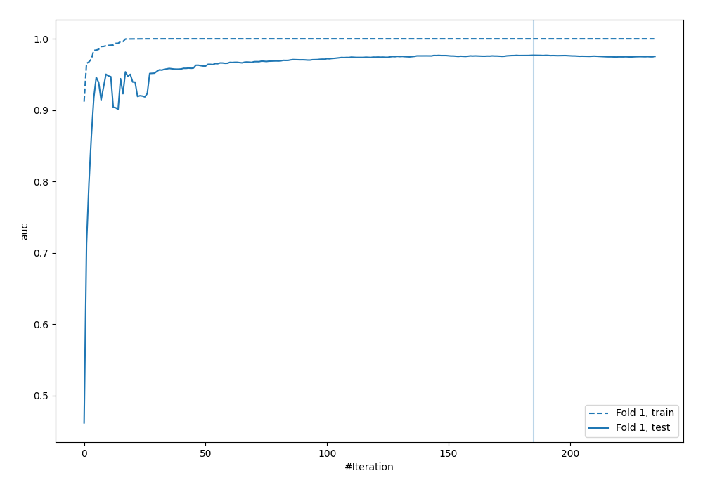
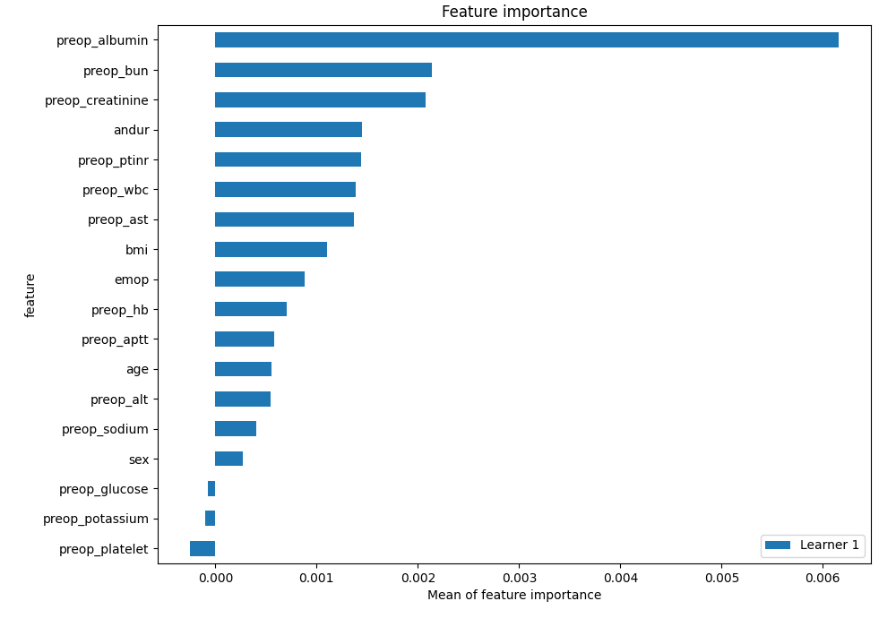
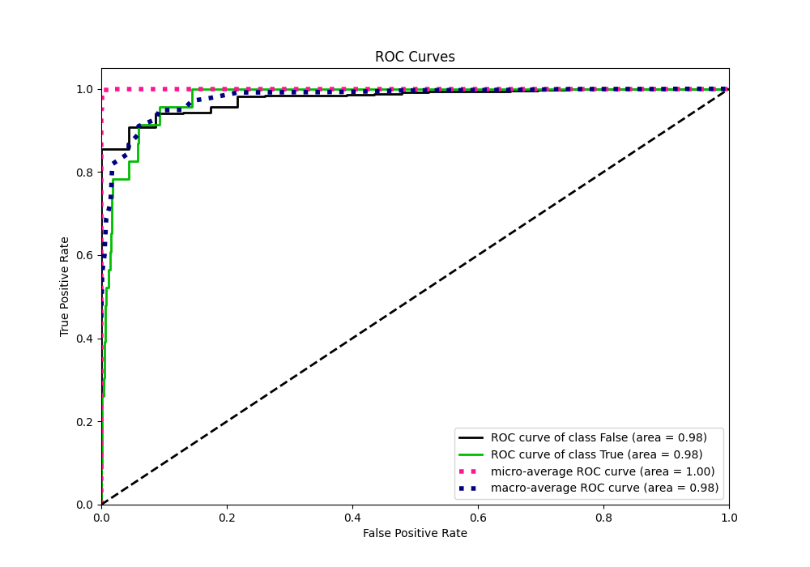
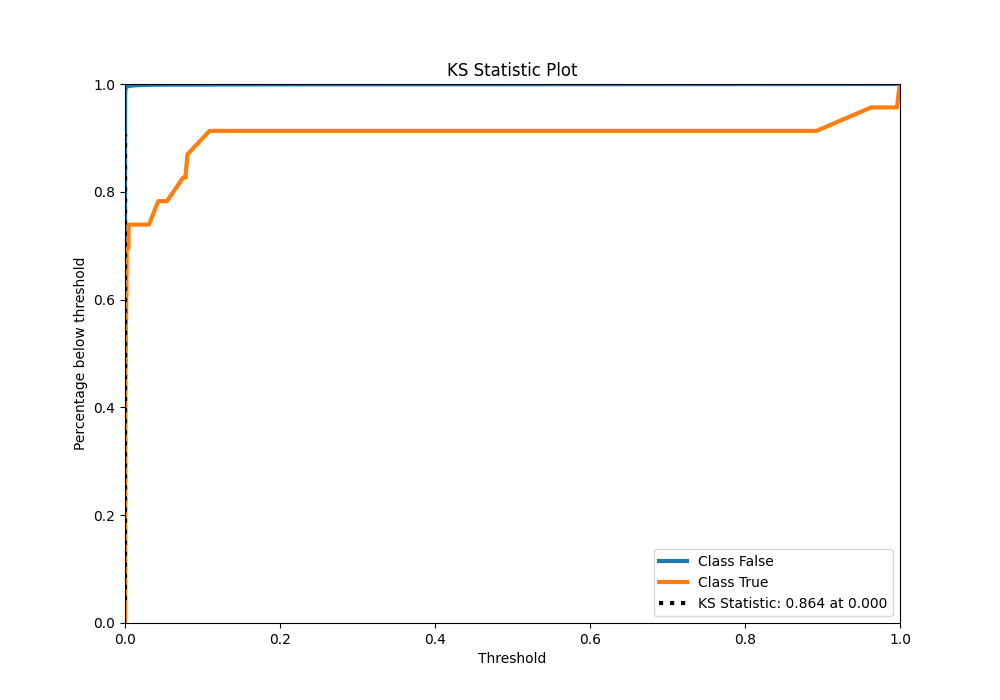
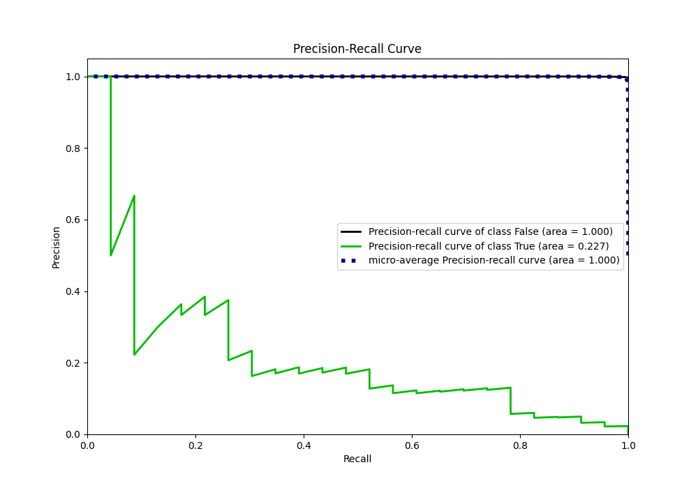
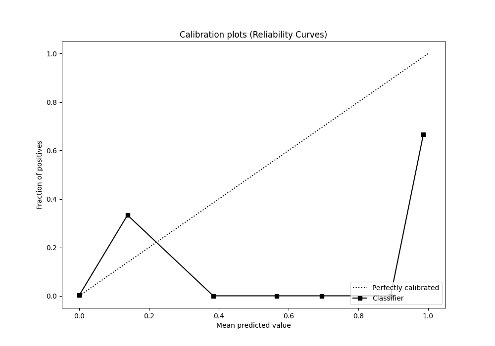
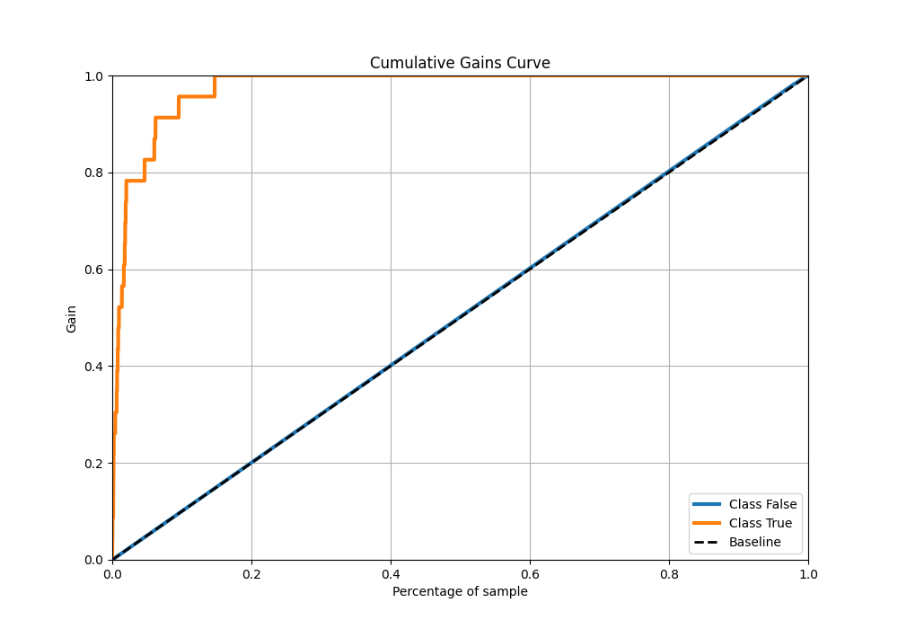
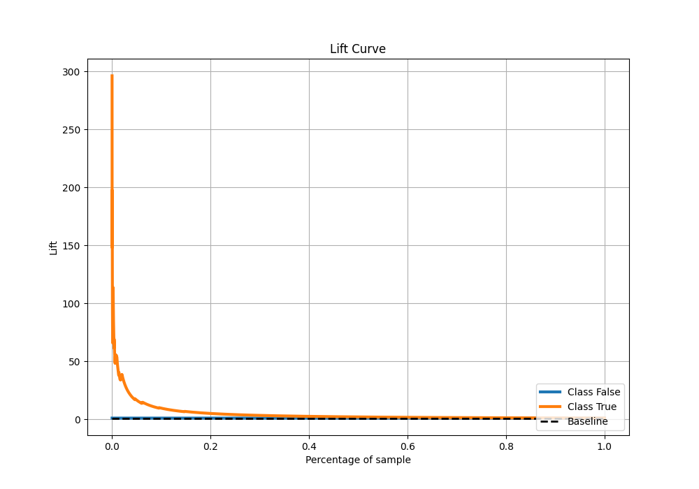
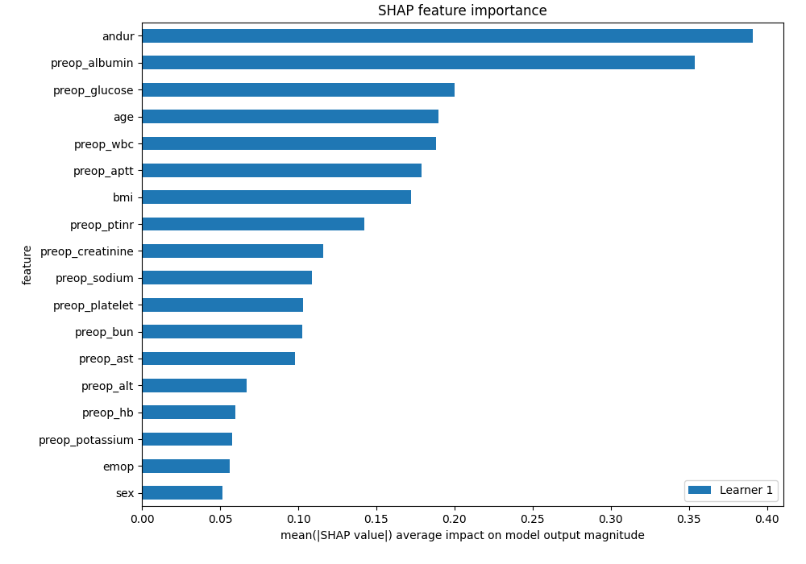
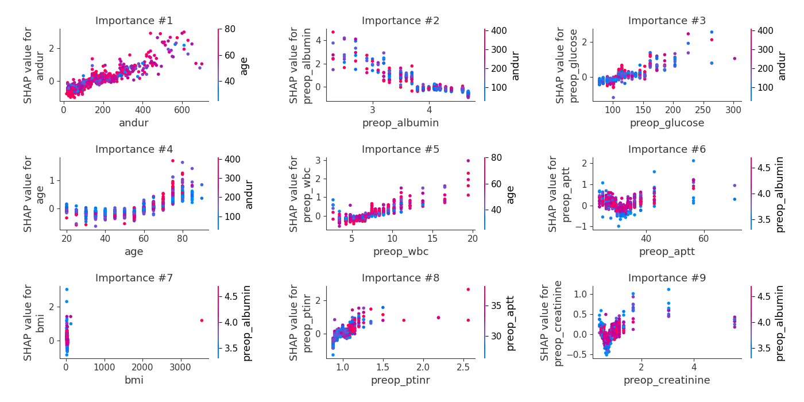

# Summary of 111_LightGBM

[<< Go back](../README.md)

## LightGBM
- **n_jobs**: -1
- **objective**: binary
- **num_leaves**: 95
- **learning_rate**: 0.05
- **feature_fraction**: 0.8
- **bagging_fraction**: 1.0
- **min_data_in_leaf**: 10
- **metric**: auc
- **custom_eval_metric_name**: None
- **explain_level**: 2

## Validation
 - **validation_type**: split
 - **train_ratio**: 0.9
 - **shuffle**: True
 - **stratify**: True

## Optimized metric
auc

## Training time

15.8 seconds

## Metric details
|           |     score |     threshold |
|:----------|----------:|--------------:|
| logloss   | 0.0239037 | nan           |
| auc       | 0.976845  | nan           |
| f1        | 0.237624  |   0.000670972 |
| accuracy  | 0.988695  |   0.000670972 |
| precision | 0.153846  |   0.000670972 |
| recall    | 1         |   2.95154e-07 |
| mcc       | 0.305922  |   0.000204881 |

## Metric details with threshold from accuracy metric
|           |     score |     threshold |
|:----------|----------:|--------------:|
| logloss   | 0.0239037 | nan           |
| auc       | 0.976845  | nan           |
| f1        | 0.237624  |   0.000670972 |
| accuracy  | 0.988695  |   0.000670972 |
| precision | 0.153846  |   0.000670972 |
| recall    | 0.521739  |   0.000670972 |
| mcc       | 0.279169  |   0.000670972 |

## Confusion matrix (at threshold=0.000671)
|              |   Predicted as 0 |   Predicted as 1 |
|:-------------|-----------------:|-----------------:|
| Labeled as 0 |             6722 |               66 |
| Labeled as 1 |               11 |               12 |

## Learning curves

## Permutation-based Importance

## Confusion Matrix

## Normalized Confusion Matrix

## ROC Curve

## Kolmogorov-Smirnov Statistic

## Precision-Recall Curve

## Calibration Curve

## Cumulative Gains Curve

## Lift Curve

## SHAP Importance

## SHAP Dependence plots

### Dependence (Fold 1)

## SHAP Decision plots

[<< Go back](../README.md)
