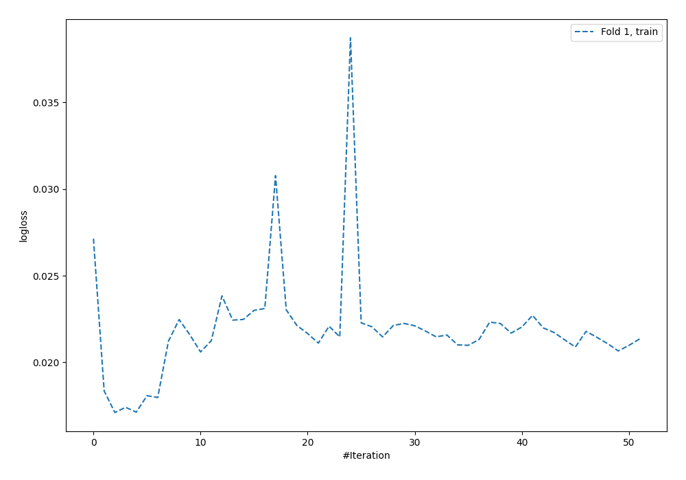
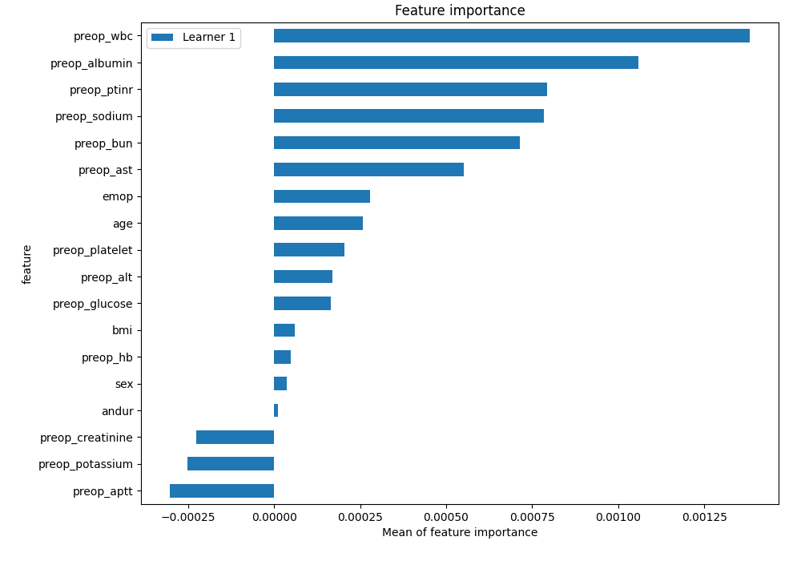
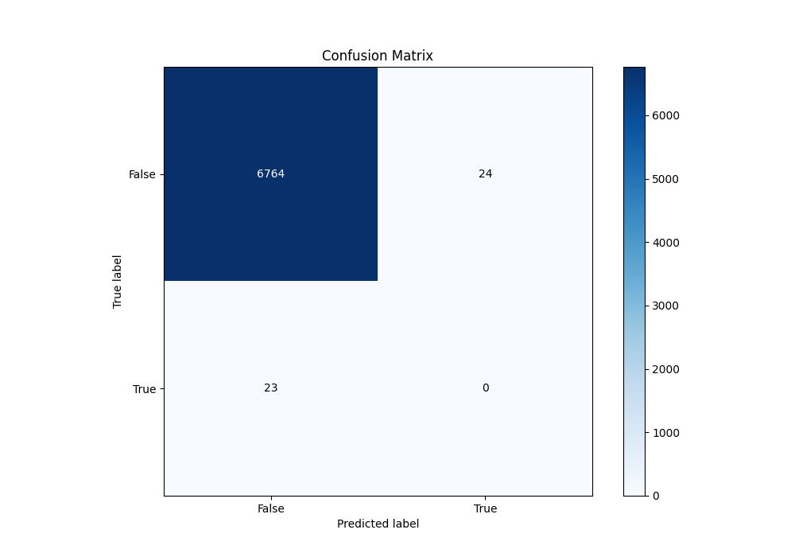
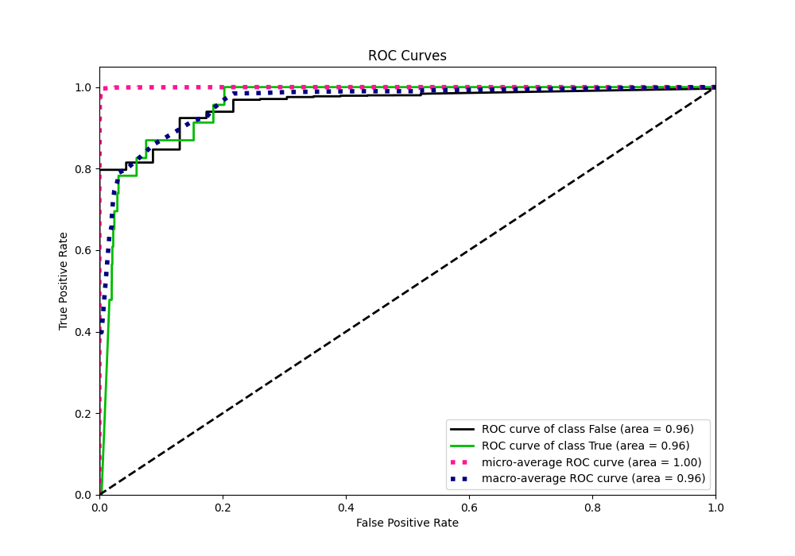
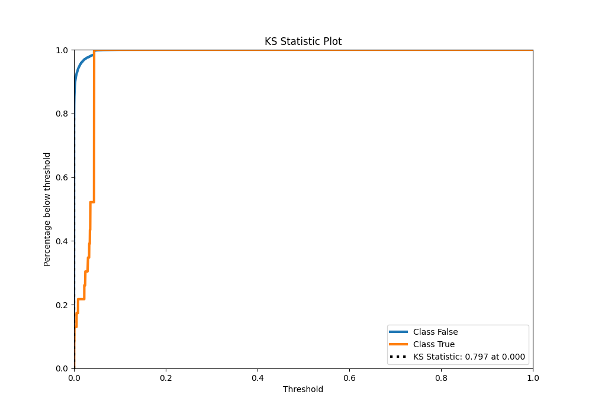
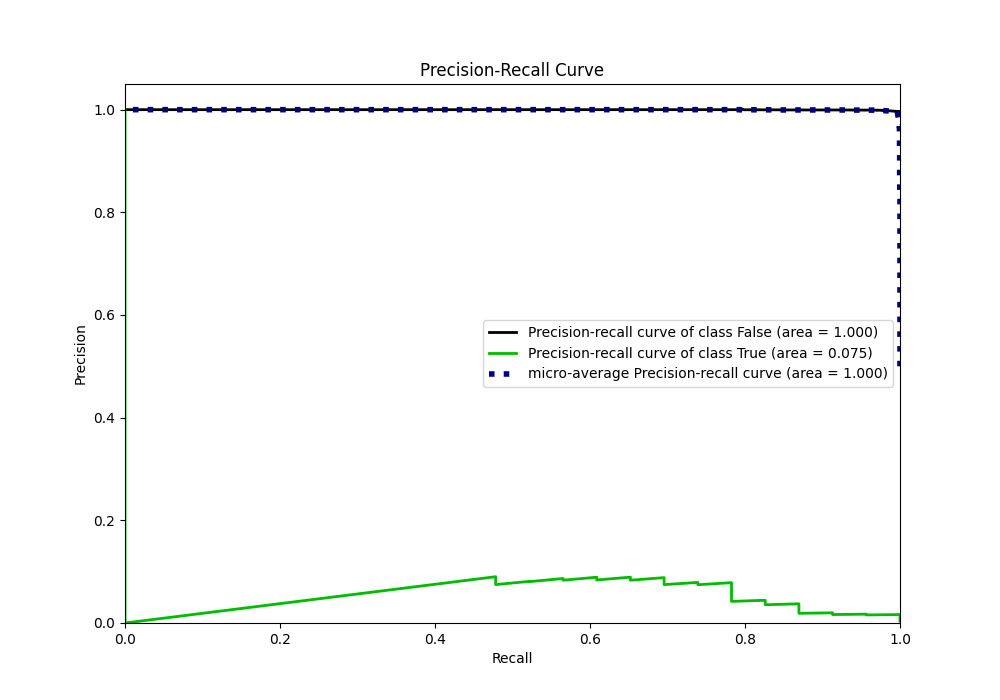
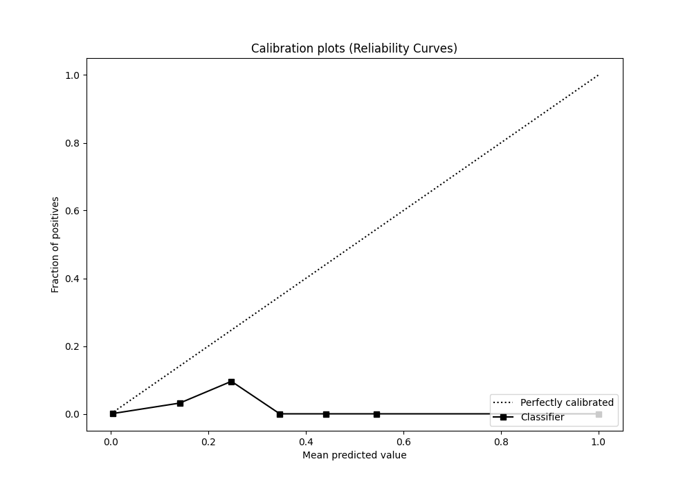
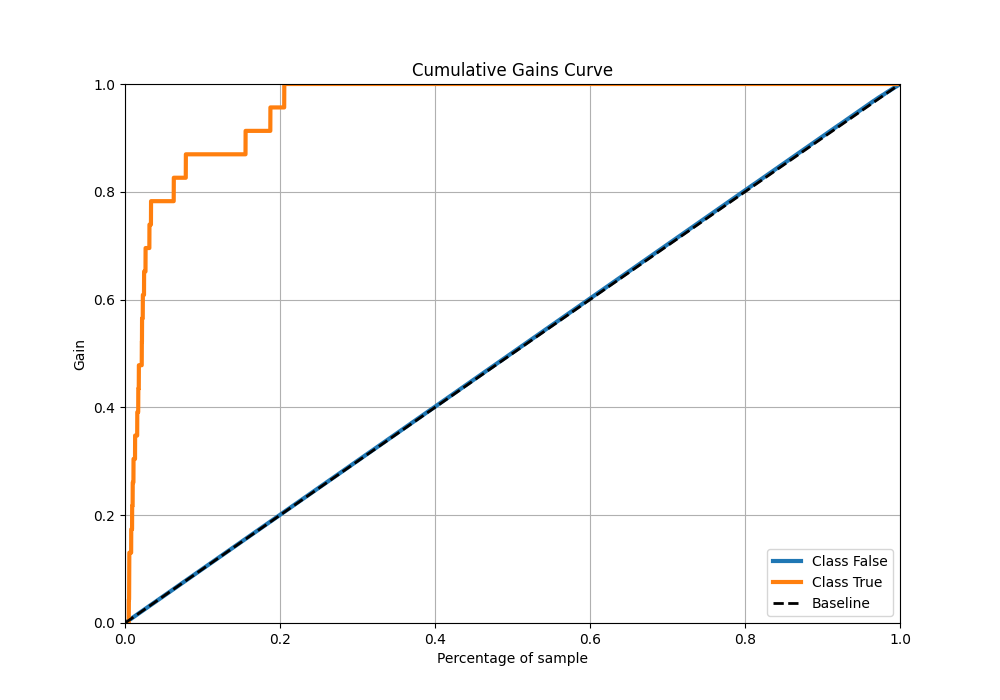
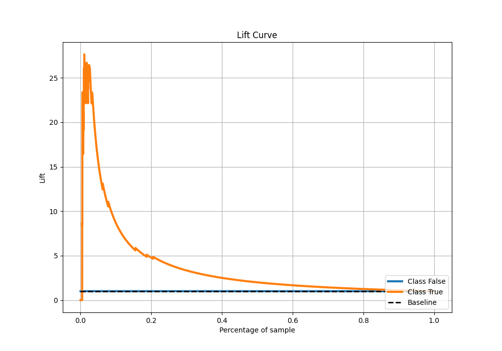

# Summary of 115_NeuralNetwork

[<< Go back](../README.md)

## Neural Network
- **n_jobs**: -1
- **dense_1_size**: 32
- **dense_2_size**: 32
- **learning_rate**: 0.08
- **explain_level**: 2

## Validation
 - **validation_type**: split
 - **train_ratio**: 0.9
 - **shuffle**: True
 - **stratify**: True

## Optimized metric
auc

## Training time

14.8 seconds

## Metric details
|           |     score |      threshold |
|:----------|----------:|---------------:|
| logloss   | 0.0155786 | nan            |
| auc       | 0.958479  | nan            |
| f1        | 0.135021  |   0.0247586    |
| accuracy  | 0.993099  |   0.0438574    |
| precision | 0.0753425 |   0.036171     |
| recall    | 1         |   1.91775e-140 |
| mcc       | 0.221638  |   0.0247586    |

## Metric details with threshold from accuracy metric
|           |       score |   threshold |
|:----------|------------:|------------:|
| logloss   |  0.0155786  | nan         |
| auc       |  0.958479   | nan         |
| f1        |  0          |   0.0438574 |
| accuracy  |  0.993099   |   0.0438574 |
| precision |  0          |   0.0438574 |
| recall    |  0          |   0.0438574 |
| mcc       | -0.00346146 |   0.0438574 |

## Confusion matrix (at threshold=0.043857)
|              |   Predicted as 0 |   Predicted as 1 |
|:-------------|-----------------:|-----------------:|
| Labeled as 0 |             6764 |               24 |
| Labeled as 1 |               23 |                0 |

## Learning curves

## Permutation-based Importance

## Confusion Matrix

## Normalized Confusion Matrix

## ROC Curve

## Kolmogorov-Smirnov Statistic

## Precision-Recall Curve

## Calibration Curve

## Cumulative Gains Curve

## Lift Curve

[<< Go back](../README.md)
