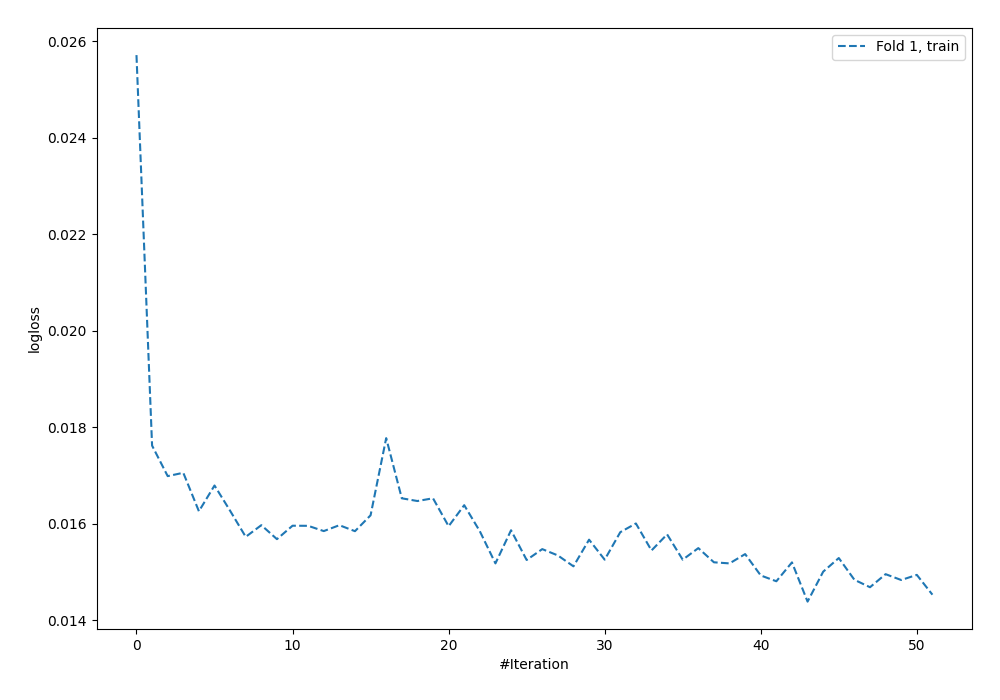
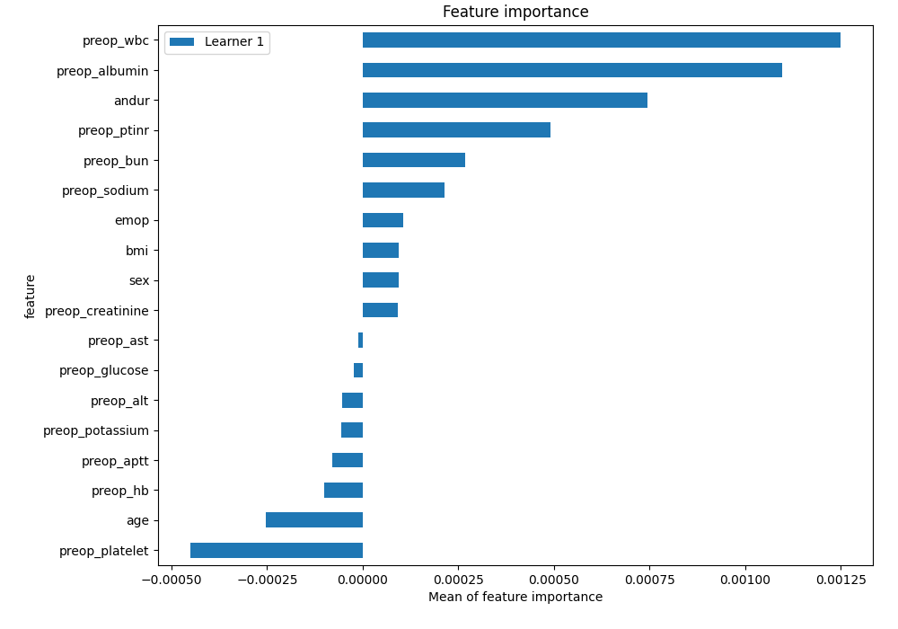
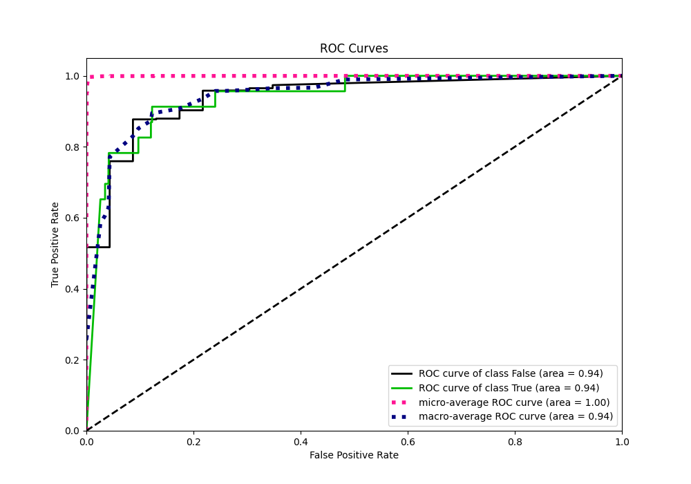
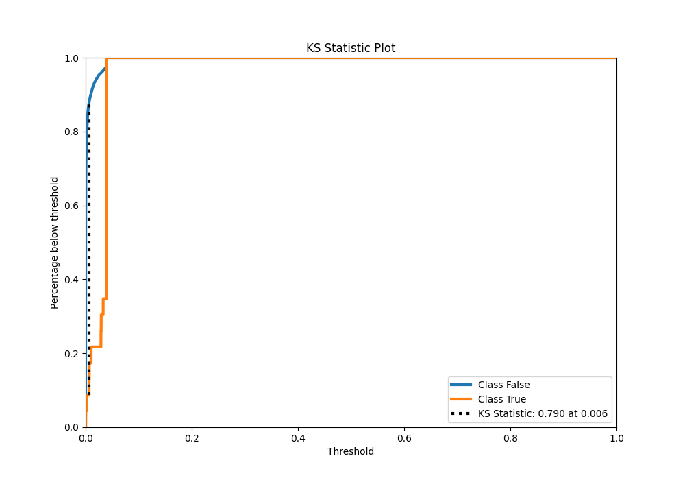
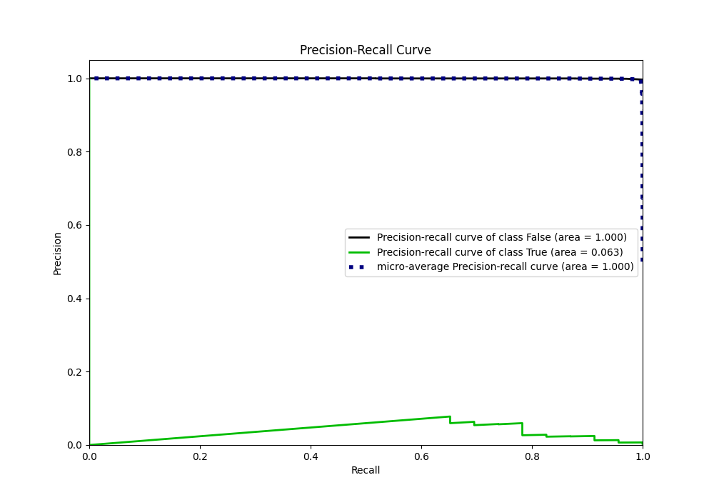
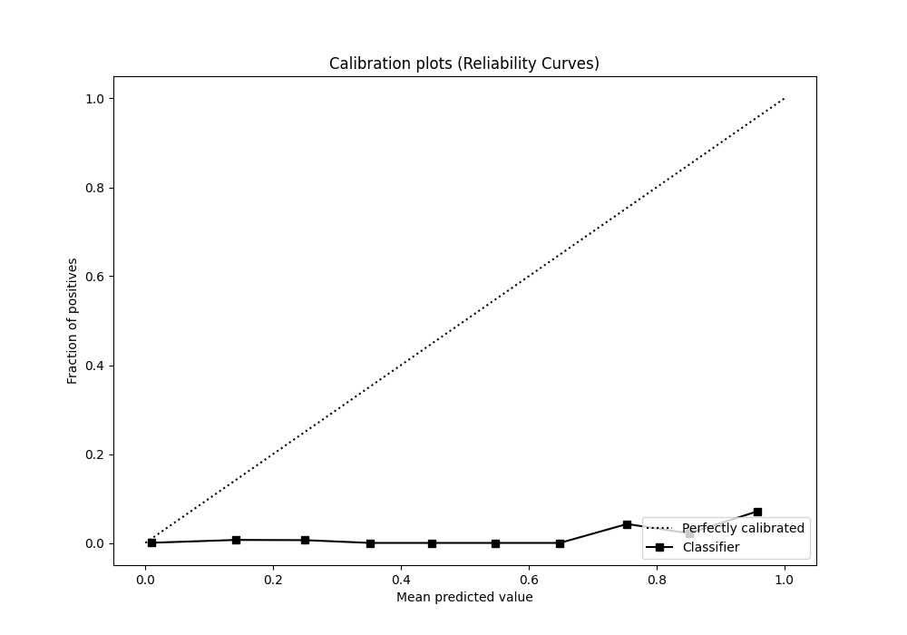
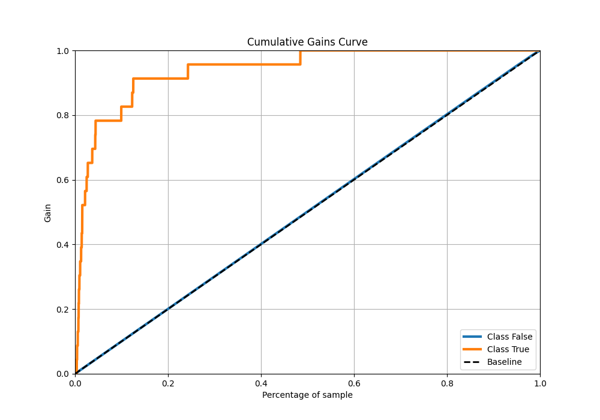
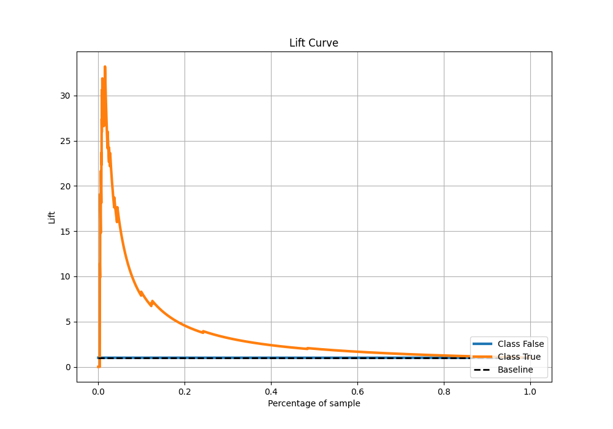

# Summary of 116_NeuralNetwork

[<< Go back](../README.md)

## Neural Network
- **n_jobs**: -1
- **dense_1_size**: 16
- **dense_2_size**: 32
- **learning_rate**: 0.05
- **explain_level**: 2

## Validation
 - **validation_type**: split
 - **train_ratio**: 0.9
 - **shuffle**: True
 - **stratify**: True

## Optimized metric
auc

## Training time

13.6 seconds

## Metric details
|           |     score |     threshold |
|:----------|----------:|--------------:|
| logloss   | 0.0163788 | nan           |
| auc       | 0.940019  | nan           |
| f1        | 0.126582  |   0.0364113   |
| accuracy  | 0.996476  |   0.0391212   |
| precision | 0.0700935 |   0.0364113   |
| recall    | 1         |   9.0289e-235 |
| mcc       | 0.20713   |   0.0364113   |

## Metric details with threshold from accuracy metric
|           |        score |   threshold |
|:----------|-------------:|------------:|
| logloss   |  0.0163788   | nan         |
| auc       |  0.940019    | nan         |
| f1        |  0           |   0.0391212 |
| accuracy  |  0.996476    |   0.0391212 |
| precision |  0           |   0.0391212 |
| recall    |  0           |   0.0391212 |
| mcc       | -0.000705374 |   0.0391212 |

## Confusion matrix (at threshold=0.039121)
|              |   Predicted as 0 |   Predicted as 1 |
|:-------------|-----------------:|-----------------:|
| Labeled as 0 |             6787 |                1 |
| Labeled as 1 |               23 |                0 |

## Learning curves

## Permutation-based Importance

## Confusion Matrix

## Normalized Confusion Matrix

## ROC Curve

## Kolmogorov-Smirnov Statistic

## Precision-Recall Curve

## Calibration Curve

## Cumulative Gains Curve

## Lift Curve

[<< Go back](../README.md)
