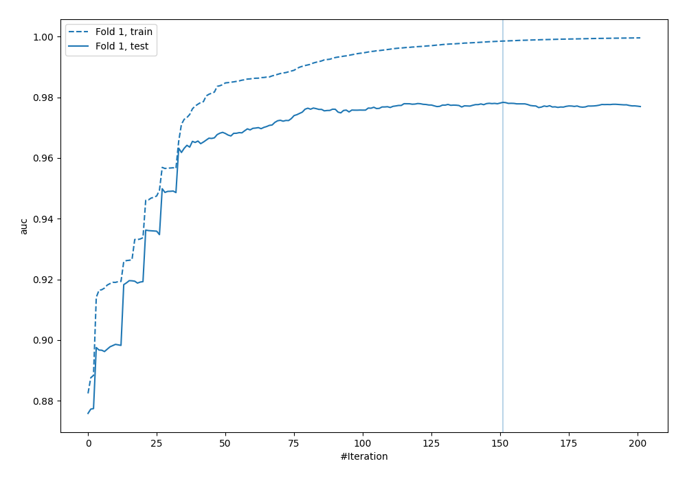
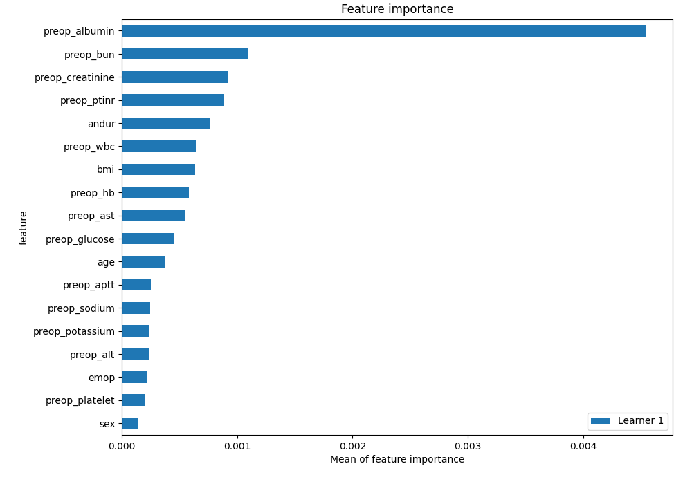
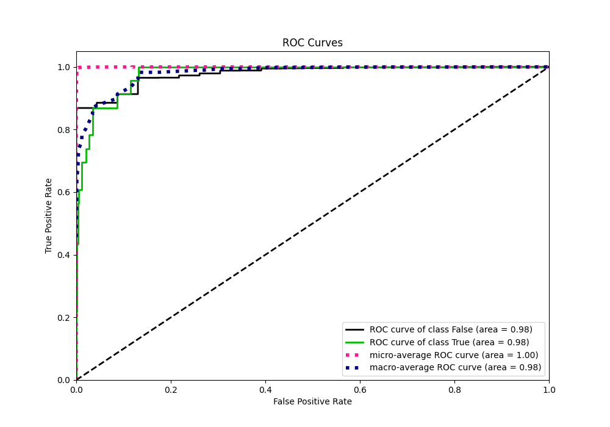
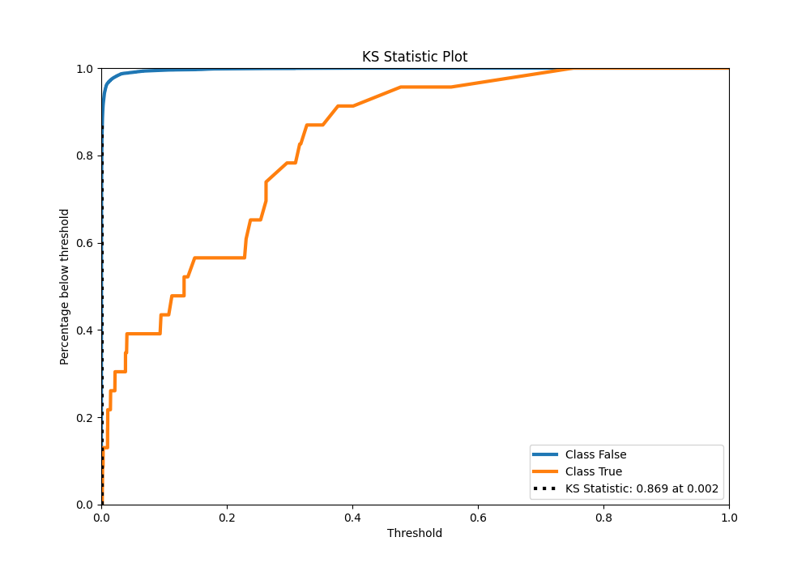
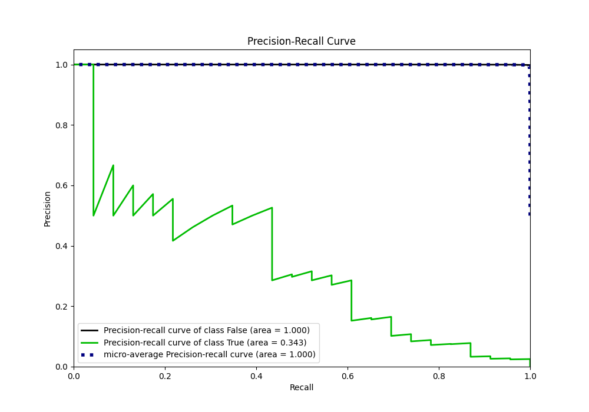
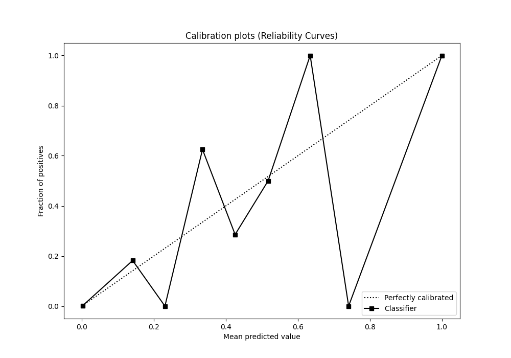
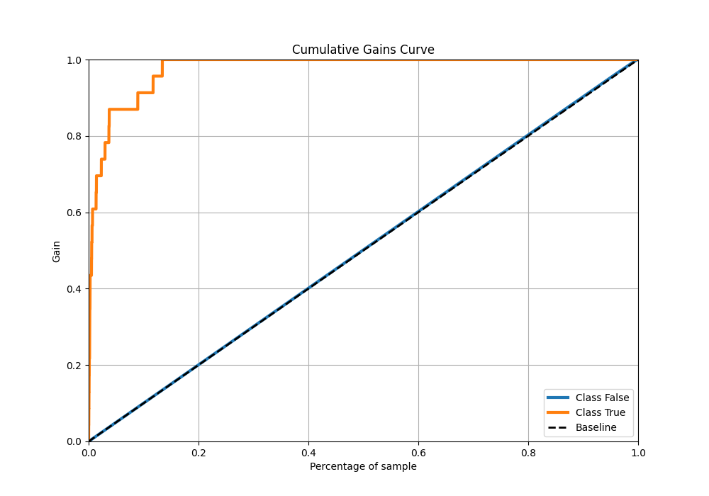
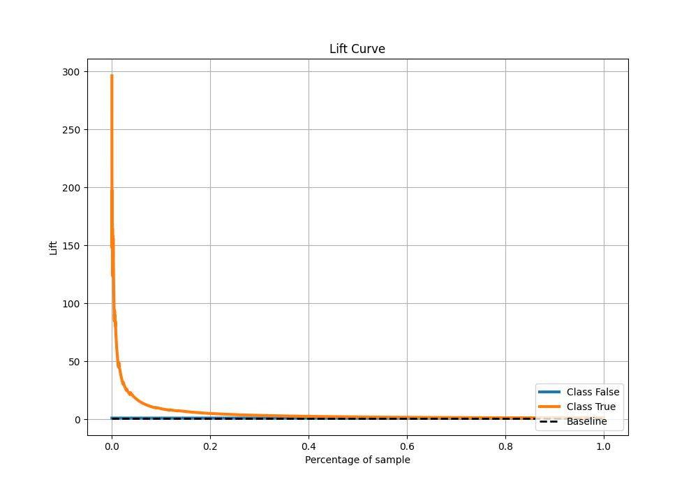
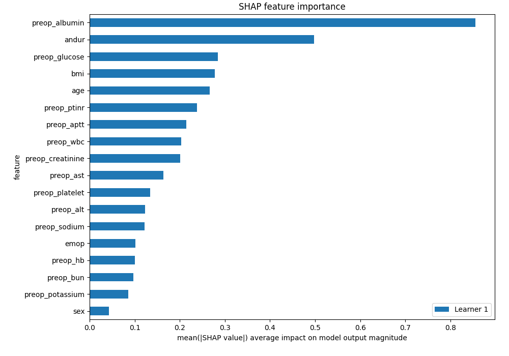
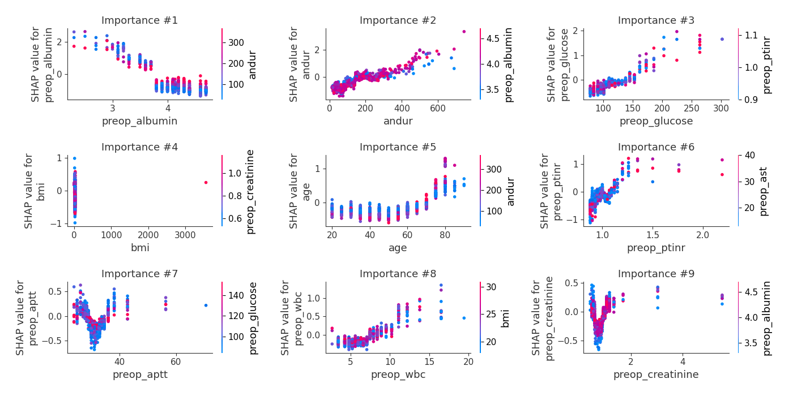

# Summary of 11_Xgboost

[<< Go back](../README.md)

## Extreme Gradient Boosting (Xgboost)
- **n_jobs**: -1
- **objective**: binary:logistic
- **eta**: 0.075
- **max_depth**: 8
- **min_child_weight**: 5
- **subsample**: 1.0
- **colsample_bytree**: 1.0
- **eval_metric**: auc
- **explain_level**: 2

## Validation
 - **validation_type**: split
 - **train_ratio**: 0.9
 - **shuffle**: True
 - **stratify**: True

## Optimized metric
auc

## Training time

8.8 seconds

## Metric details
|           |     score |    threshold |
|:----------|----------:|-------------:|
| logloss   | 0.0117523 | nan          |
| auc       | 0.978363  | nan          |
| f1        | 0.277228  |   0.0524817  |
| accuracy  | 0.989282  |   0.0524817  |
| precision | 0.179487  |   0.0524817  |
| recall    | 1         |   1.6807e-05 |
| mcc       | 0.326741  |   0.0524817  |

## Metric details with threshold from accuracy metric
|           |     score |   threshold |
|:----------|----------:|------------:|
| logloss   | 0.0117523 | nan         |
| auc       | 0.978363  | nan         |
| f1        | 0.277228  |   0.0524817 |
| accuracy  | 0.989282  |   0.0524817 |
| precision | 0.179487  |   0.0524817 |
| recall    | 0.608696  |   0.0524817 |
| mcc       | 0.326741  |   0.0524817 |

## Confusion matrix (at threshold=0.052482)
|              |   Predicted as 0 |   Predicted as 1 |
|:-------------|-----------------:|-----------------:|
| Labeled as 0 |             6724 |               64 |
| Labeled as 1 |                9 |               14 |

## Learning curves

## Permutation-based Importance

## Confusion Matrix

## Normalized Confusion Matrix

## ROC Curve

## Kolmogorov-Smirnov Statistic

## Precision-Recall Curve

## Calibration Curve

## Cumulative Gains Curve

## Lift Curve

## SHAP Importance

## SHAP Dependence plots

### Dependence (Fold 1)

## SHAP Decision plots

[<< Go back](../README.md)
