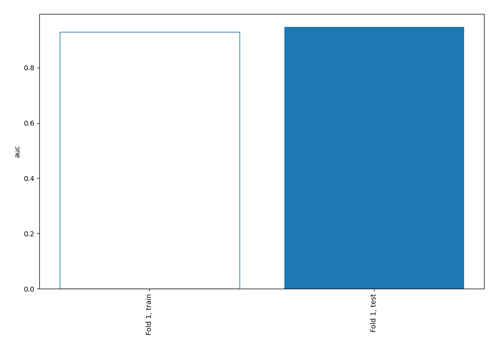
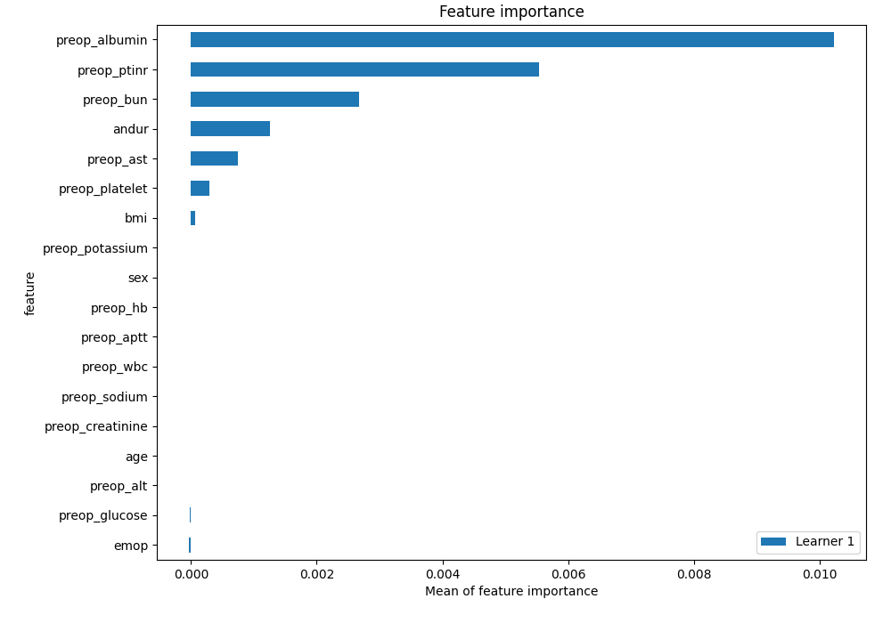
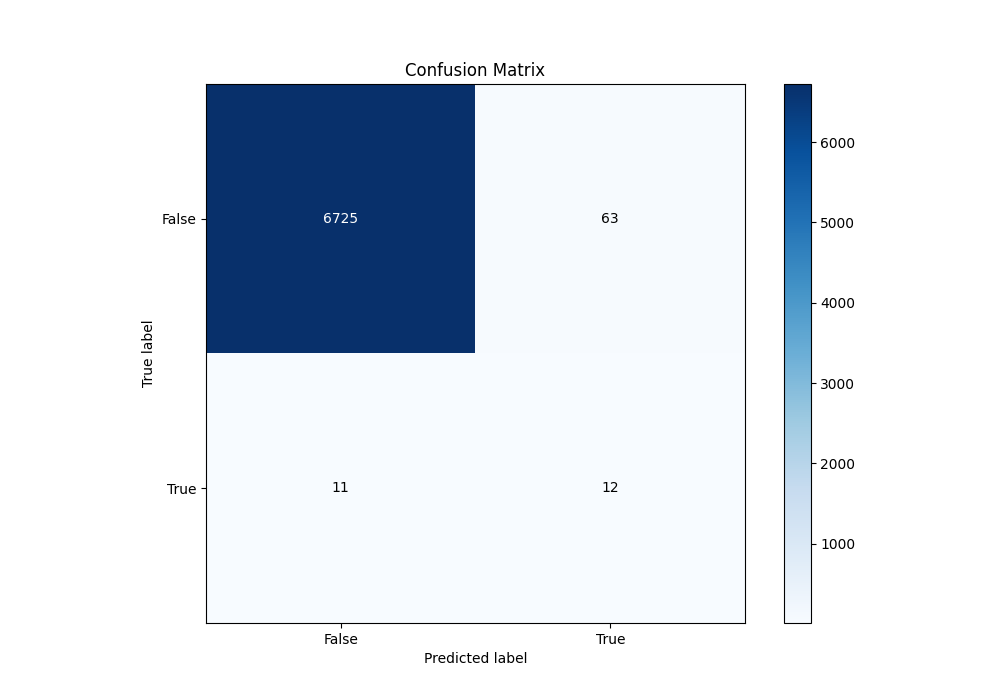
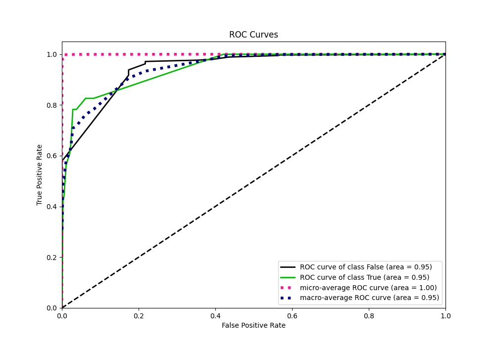
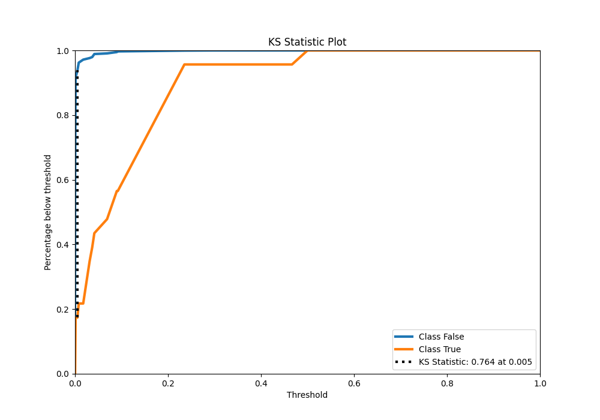
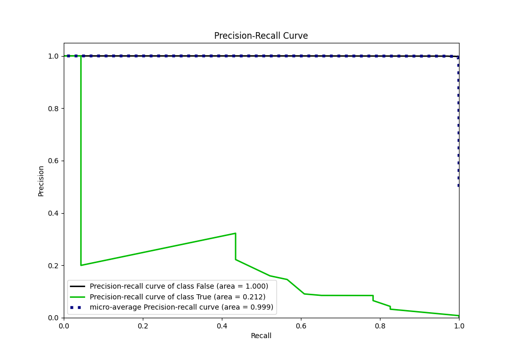
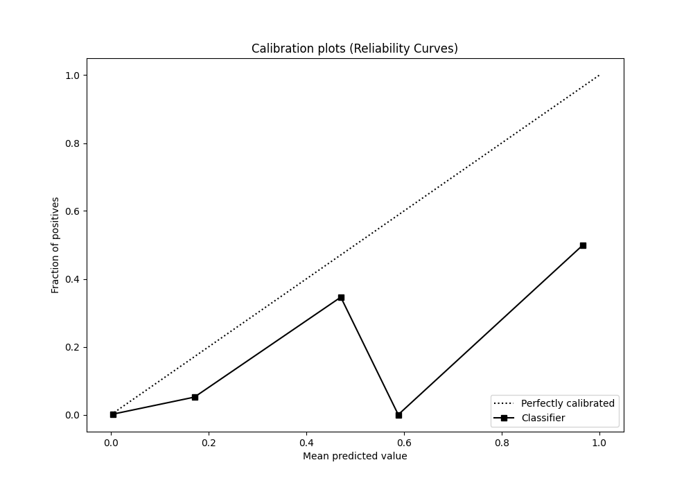
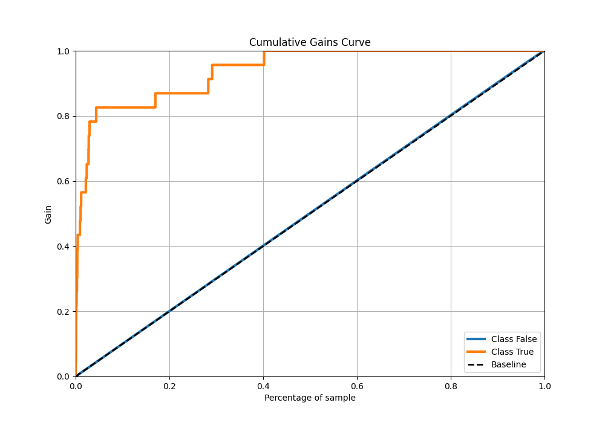
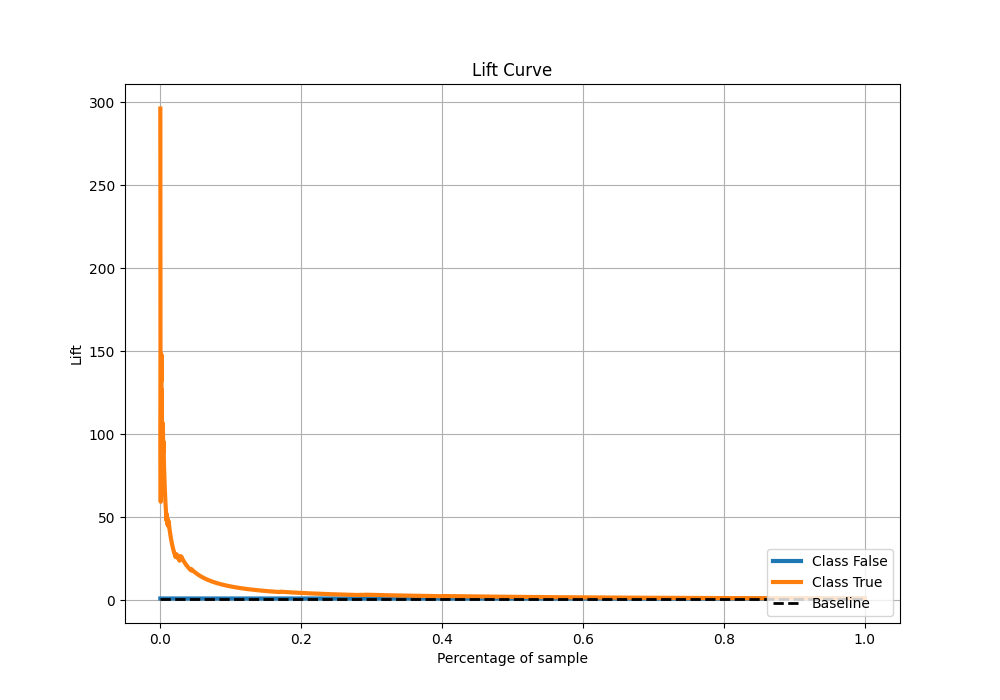

# Summary of 121_DecisionTree

[<< Go back](../README.md)

## Decision Tree
- **n_jobs**: -1
- **criterion**: entropy
- **max_depth**: 4
- **explain_level**: 2

## Validation
 - **validation_type**: split
 - **train_ratio**: 0.9
 - **shuffle**: True
 - **stratify**: True

## Optimized metric
auc

## Training time

14.8 seconds

## Metric details
|           |     score |   threshold |
|:----------|----------:|------------:|
| logloss   | 0.0135296 | nan         |
| auc       | 0.947084  | nan         |
| f1        | 0.244898  |   0.0689655 |
| accuracy  | 0.989135  |   0.0689655 |
| precision | 0.16      |   0.0689655 |
| recall    | 1         |   0         |
| mcc       | 0.28488   |   0.0689655 |

## Metric details with threshold from accuracy metric
|           |     score |   threshold |
|:----------|----------:|------------:|
| logloss   | 0.0135296 | nan         |
| auc       | 0.947084  | nan         |
| f1        | 0.244898  |   0.0689655 |
| accuracy  | 0.989135  |   0.0689655 |
| precision | 0.16      |   0.0689655 |
| recall    | 0.521739  |   0.0689655 |
| mcc       | 0.28488   |   0.0689655 |

## Confusion matrix (at threshold=0.068966)
|              |   Predicted as 0 |   Predicted as 1 |
|:-------------|-----------------:|-----------------:|
| Labeled as 0 |             6725 |               63 |
| Labeled as 1 |               11 |               12 |

## Learning curves

## Permutation-based Importance

## Confusion Matrix

## Normalized Confusion Matrix

## ROC Curve

## Kolmogorov-Smirnov Statistic

## Precision-Recall Curve

## Calibration Curve

## Cumulative Gains Curve

## Lift Curve

[<< Go back](../README.md)
