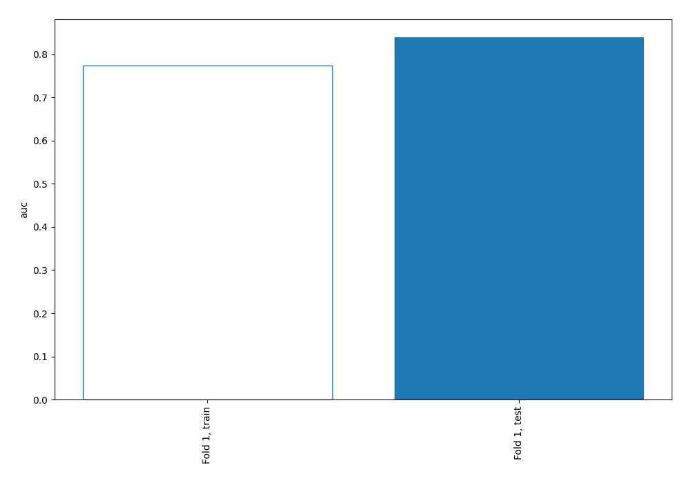
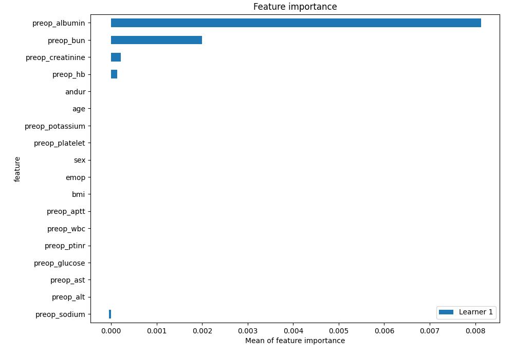
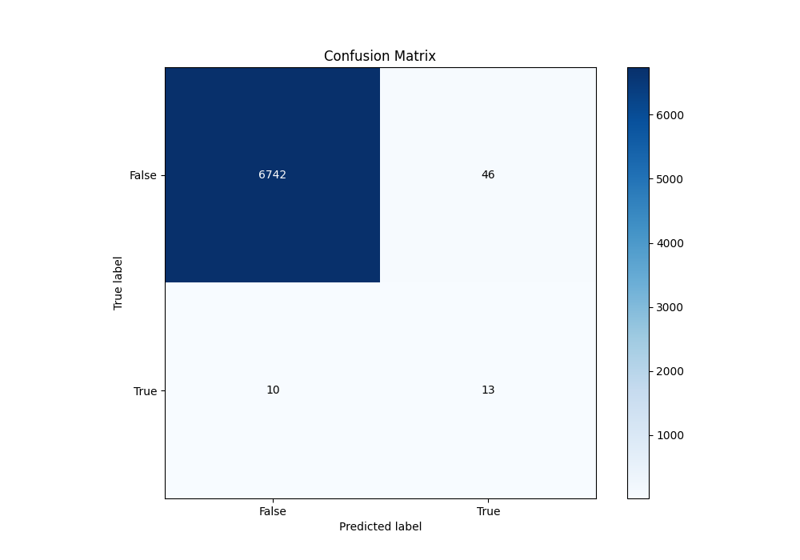
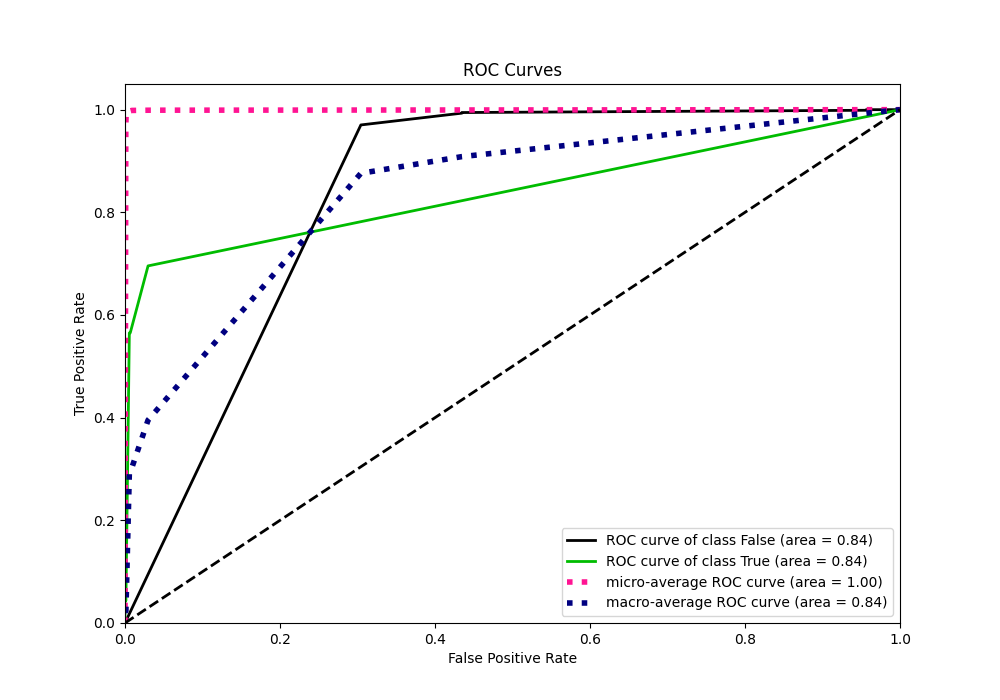
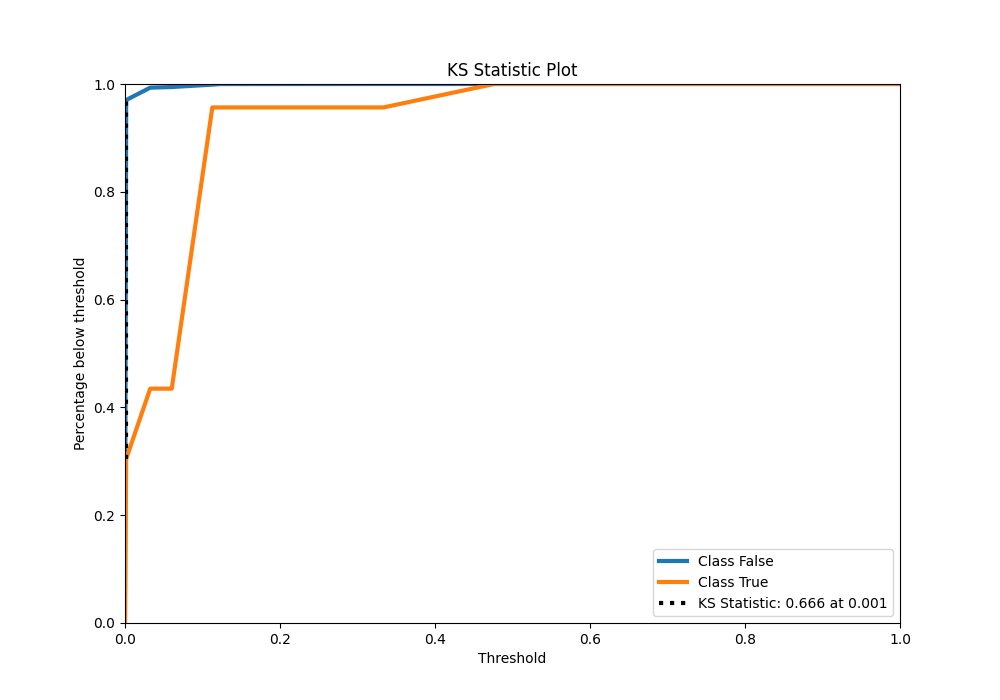
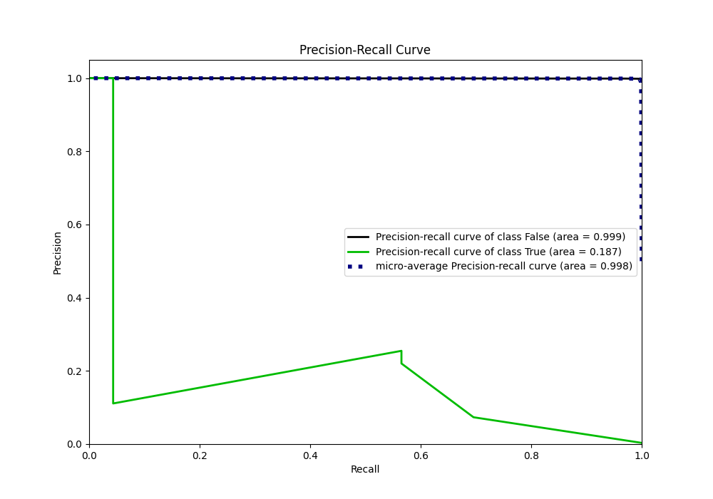
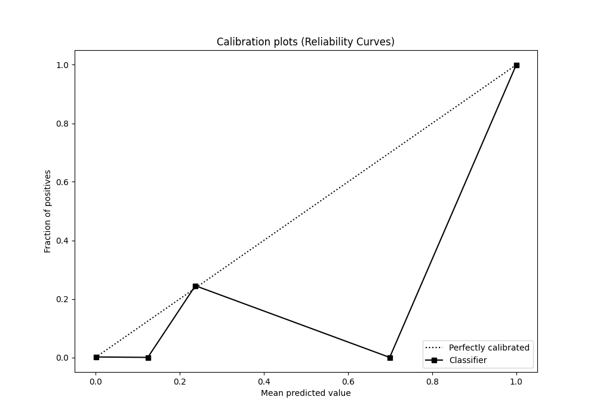
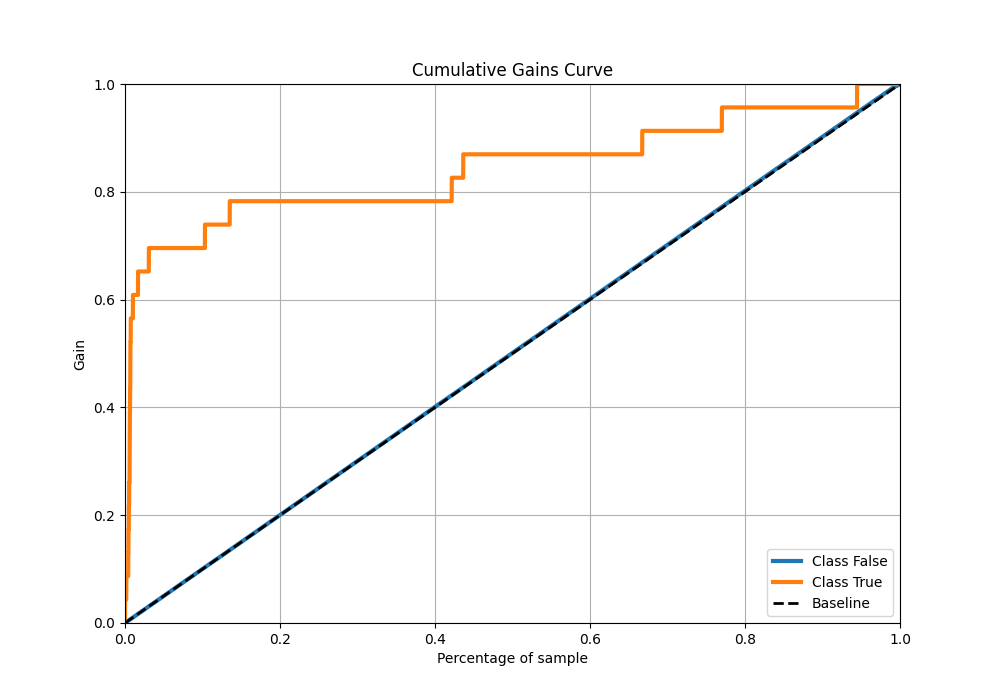
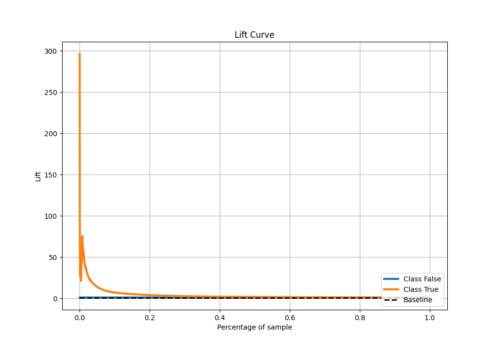

# Summary of 1_DecisionTree

[<< Go back](../README.md)

## Decision Tree
- **n_jobs**: -1
- **criterion**: gini
- **max_depth**: 3
- **explain_level**: 2

## Validation
 - **validation_type**: split
 - **train_ratio**: 0.9
 - **shuffle**: True
 - **stratify**: True

## Optimized metric
auc

## Training time

16.5 seconds

## Metric details
|           |     score |    threshold |
|:----------|----------:|-------------:|
| logloss   | 0.0151449 | nan          |
| auc       | 0.839147  | nan          |
| f1        | 0.317073  |   0.0325365  |
| accuracy  | 0.991778  |   0.0325365  |
| precision | 0.220339  |   0.0325365  |
| recall    | 1         |   0.00133698 |
| mcc       | 0.349599  |   0.0325365  |

## Metric details with threshold from accuracy metric
|           |     score |   threshold |
|:----------|----------:|------------:|
| logloss   | 0.0151449 | nan         |
| auc       | 0.839147  | nan         |
| f1        | 0.317073  |   0.0325365 |
| accuracy  | 0.991778  |   0.0325365 |
| precision | 0.220339  |   0.0325365 |
| recall    | 0.565217  |   0.0325365 |
| mcc       | 0.349599  |   0.0325365 |

## Confusion matrix (at threshold=0.032537)
|              |   Predicted as 0 |   Predicted as 1 |
|:-------------|-----------------:|-----------------:|
| Labeled as 0 |             6742 |               46 |
| Labeled as 1 |               10 |               13 |

## Learning curves

## Permutation-based Importance

## Confusion Matrix

## Normalized Confusion Matrix

## ROC Curve

## Kolmogorov-Smirnov Statistic

## Precision-Recall Curve

## Calibration Curve

## Cumulative Gains Curve

## Lift Curve

[<< Go back](../README.md)
