# Summary of 23_LightGBM

[<< Go back](../README.md)

## LightGBM
- **n_jobs**: -1
- **objective**: binary
- **num_leaves**: 95
- **learning_rate**: 0.05
- **feature_fraction**: 1.0
- **bagging_fraction**: 1.0
- **min_data_in_leaf**: 10
- **metric**: auc
- **custom_eval_metric_name**: None
- **explain_level**: 2

## Validation
 - **validation_type**: split
 - **train_ratio**: 0.9
 - **shuffle**: True
 - **stratify**: True

## Optimized metric
auc

## Training time

25.9 seconds

## Metric details
|           |     score |     threshold |
|:----------|----------:|--------------:|
| logloss   | 0.0301271 | nan           |
| auc       | 0.972701  | nan           |
| f1        | 0.29703   |   4.55424e-05 |
| accuracy  | 0.989576  |   4.55424e-05 |
| precision | 0.192308  |   4.55424e-05 |
| recall    | 1         |   6.34913e-10 |
| mcc       | 0.350527  |   4.55424e-05 |

## Metric details with threshold from accuracy metric
|           |     score |     threshold |
|:----------|----------:|--------------:|
| logloss   | 0.0301271 | nan           |
| auc       | 0.972701  | nan           |
| f1        | 0.29703   |   4.55424e-05 |
| accuracy  | 0.989576  |   4.55424e-05 |
| precision | 0.192308  |   4.55424e-05 |
| recall    | 0.652174  |   4.55424e-05 |
| mcc       | 0.350527  |   4.55424e-05 |

## Confusion matrix (at threshold=4.6e-05)
|              |   Predicted as 0 |   Predicted as 1 |
|:-------------|-----------------:|-----------------:|
| Labeled as 0 |             6725 |               63 |
| Labeled as 1 |                8 |               15 |

## Learning curves
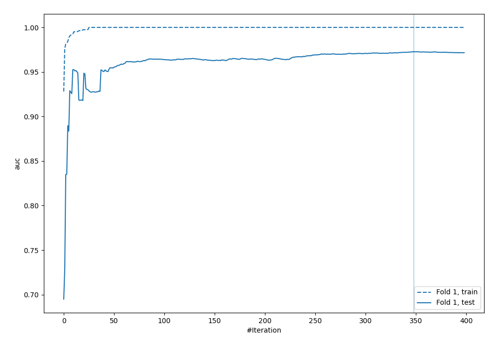

## Permutation-based Importance
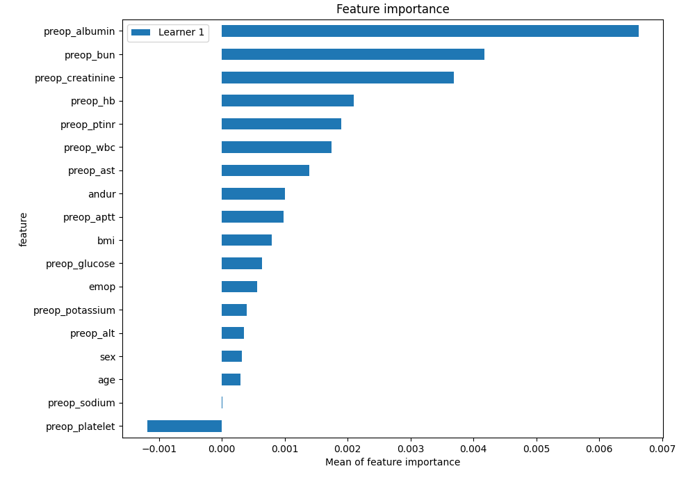
## Confusion Matrix

## Normalized Confusion Matrix

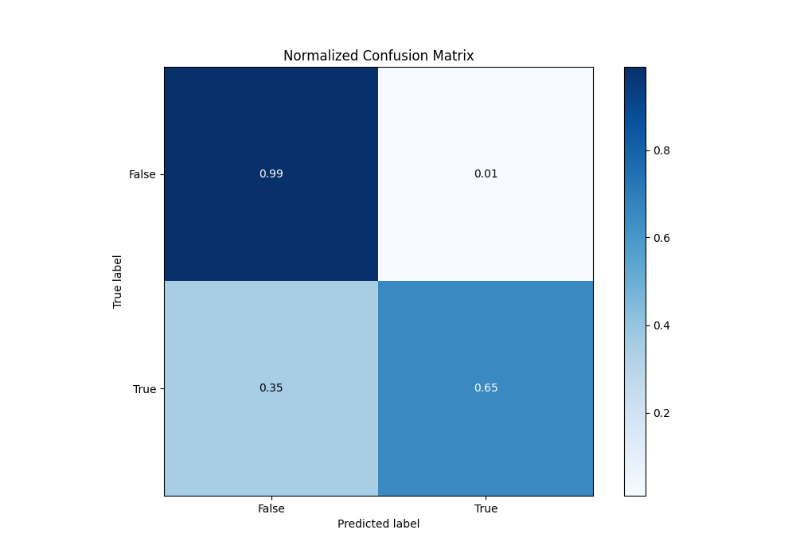

## ROC Curve

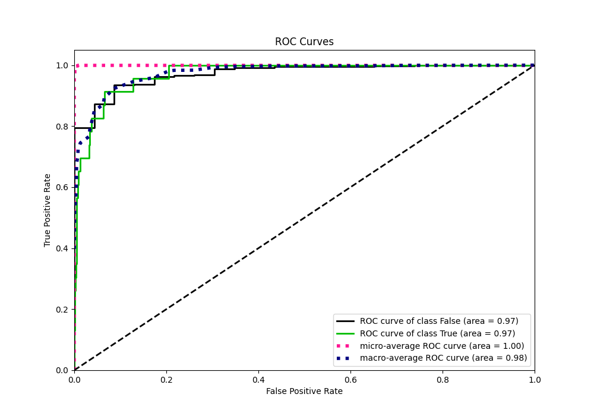

## Kolmogorov-Smirnov Statistic

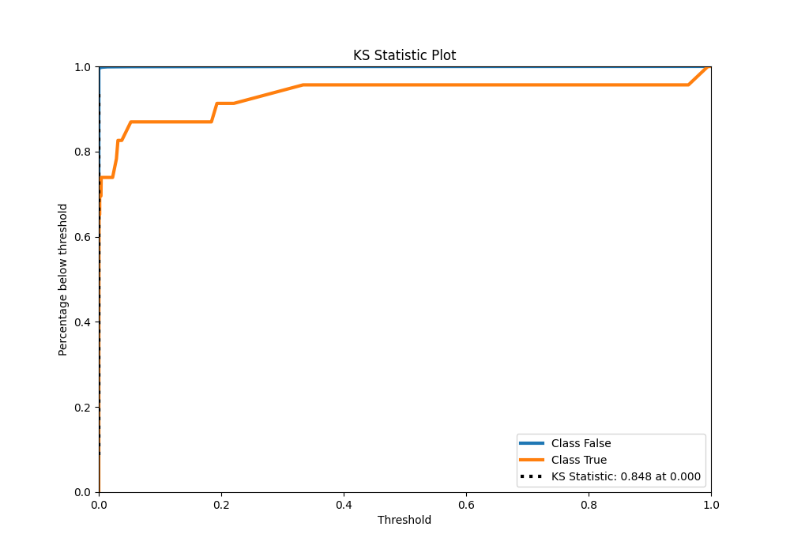

## Precision-Recall Curve

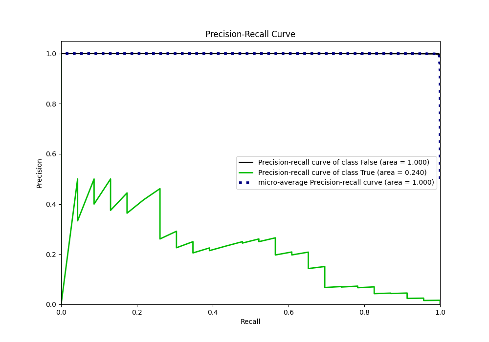

## Calibration Curve

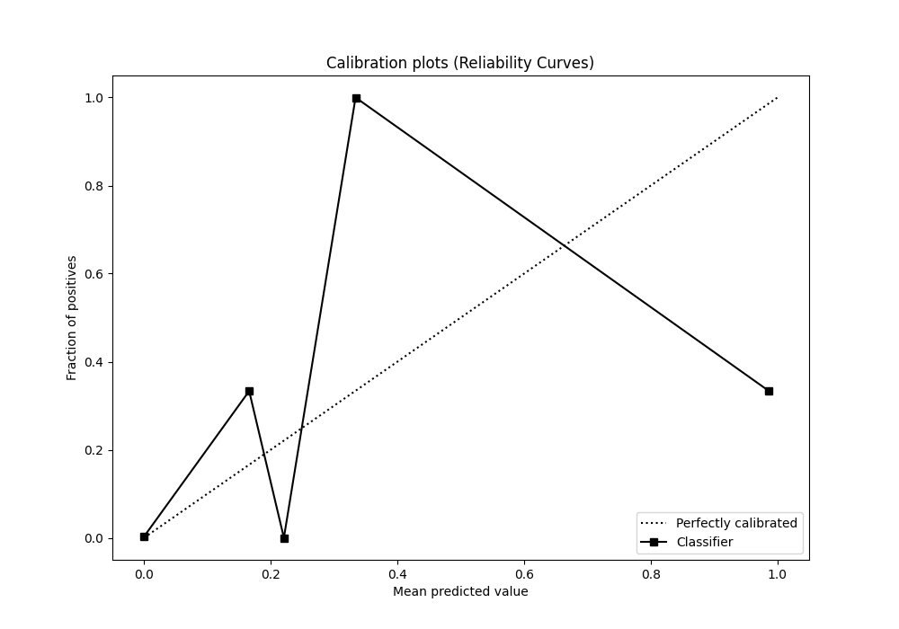

## Cumulative Gains Curve

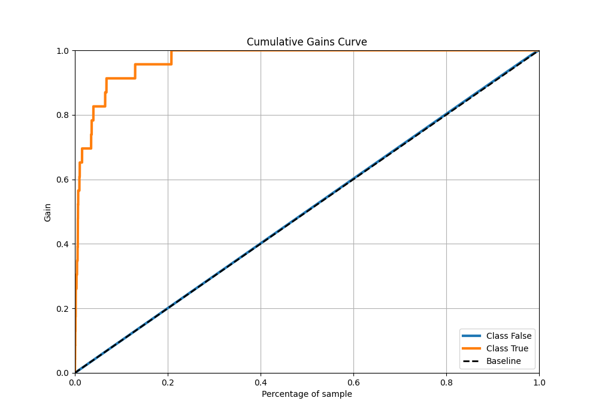

## Lift Curve

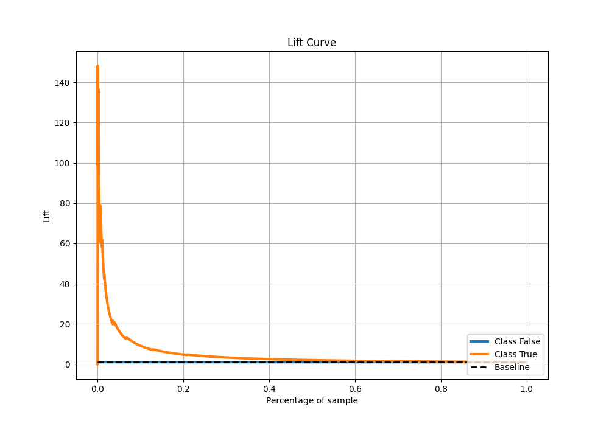

## SHAP Importance
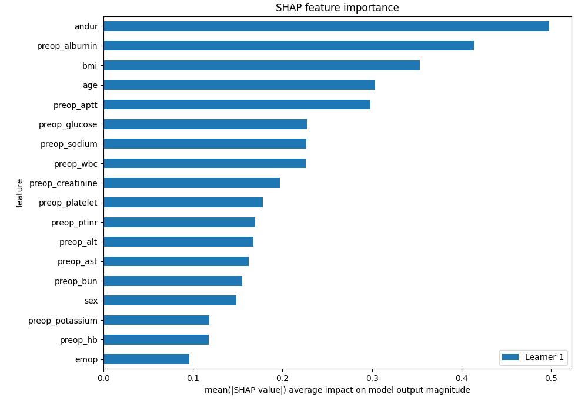

## SHAP Dependence plots

### Dependence (Fold 1)
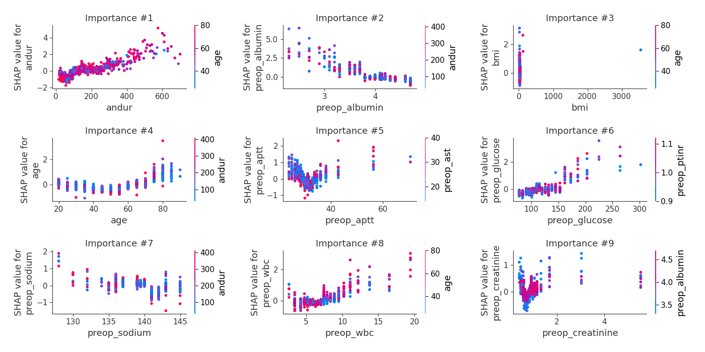

## SHAP Decision plots

[<< Go back](../README.md)
