# Summary of 27_LightGBM

[<< Go back](../README.md)

## LightGBM
- **n_jobs**: -1
- **objective**: binary
- **num_leaves**: 31
- **learning_rate**: 0.1
- **feature_fraction**: 0.8
- **bagging_fraction**: 0.8
- **min_data_in_leaf**: 5
- **metric**: auc
- **custom_eval_metric_name**: None
- **explain_level**: 2

## Validation
 - **validation_type**: split
 - **train_ratio**: 0.9
 - **shuffle**: True
 - **stratify**: True

## Optimized metric
auc

## Training time

7.4 seconds

## Metric details
|           |     score |    threshold |
|:----------|----------:|-------------:|
| logloss   | 0.0334557 | nan          |
| auc       | 0.753481  | nan          |
| f1        | 0.289157  |   0.00632455 |
| accuracy  | 0.991338  |   0.00632455 |
| precision | 0.2       |   0.00632455 |
| recall    | 1         |   0.00273697 |
| mcc       | 0.319523  |   0.00632455 |

## Metric details with threshold from accuracy metric
|           |     score |    threshold |
|:----------|----------:|-------------:|
| logloss   | 0.0334557 | nan          |
| auc       | 0.753481  | nan          |
| f1        | 0.289157  |   0.00632455 |
| accuracy  | 0.991338  |   0.00632455 |
| precision | 0.2       |   0.00632455 |
| recall    | 0.521739  |   0.00632455 |
| mcc       | 0.319523  |   0.00632455 |

## Confusion matrix (at threshold=0.006325)
|              |   Predicted as 0 |   Predicted as 1 |
|:-------------|-----------------:|-----------------:|
| Labeled as 0 |             6740 |               48 |
| Labeled as 1 |               11 |               12 |

## Learning curves
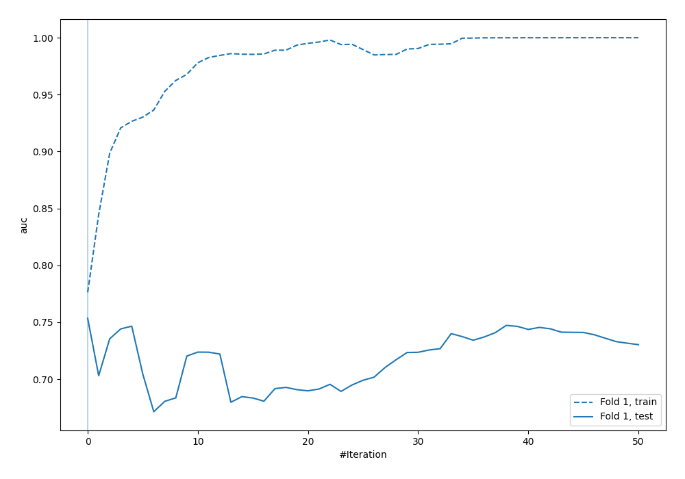

## Permutation-based Importance
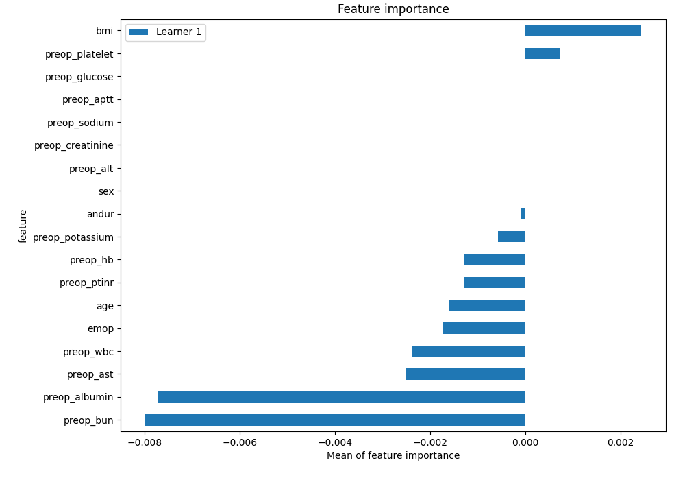
## Confusion Matrix

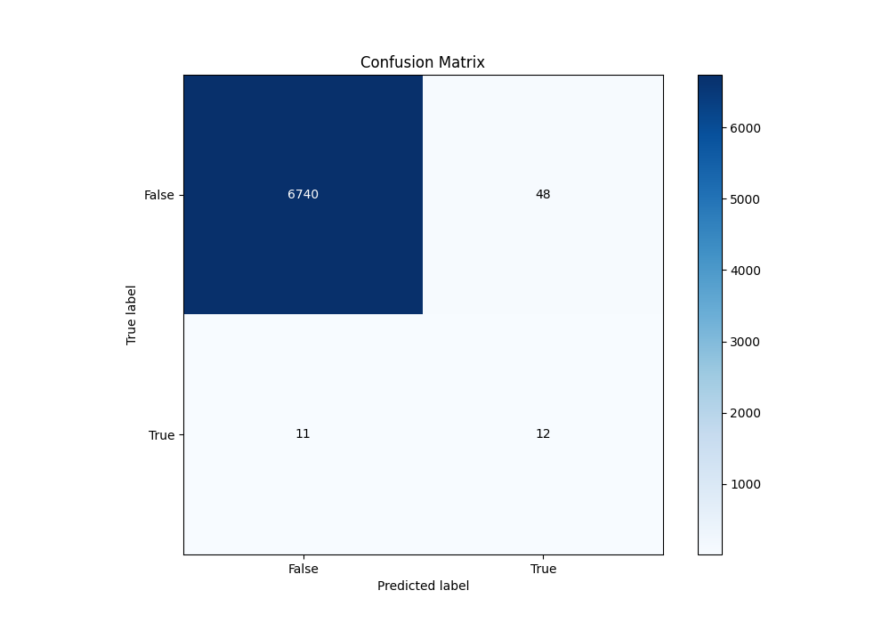

## Normalized Confusion Matrix

## ROC Curve

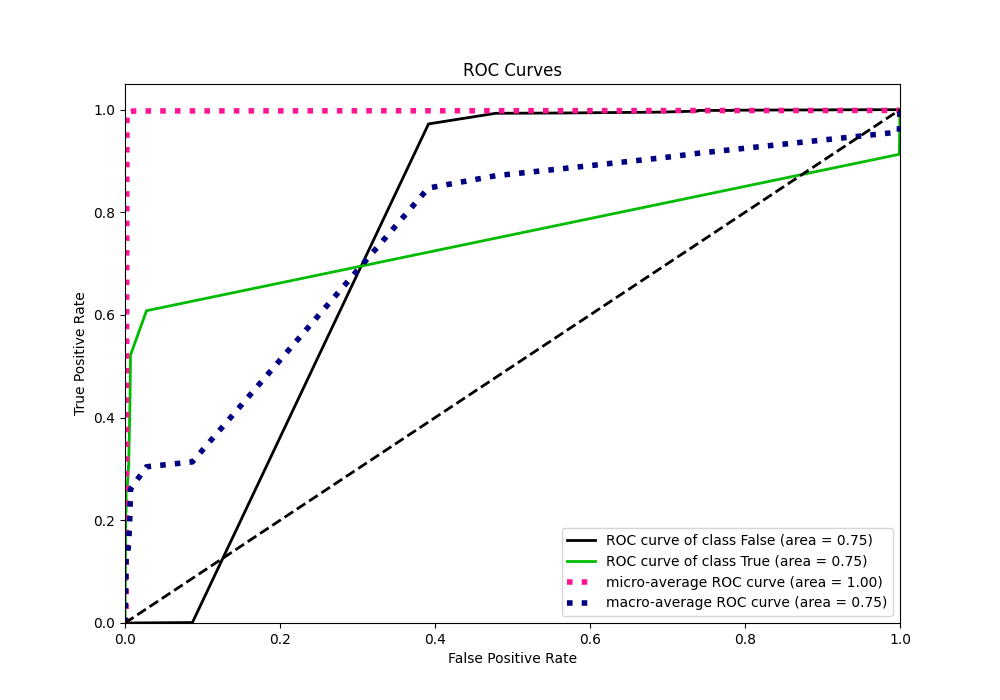

## Kolmogorov-Smirnov Statistic

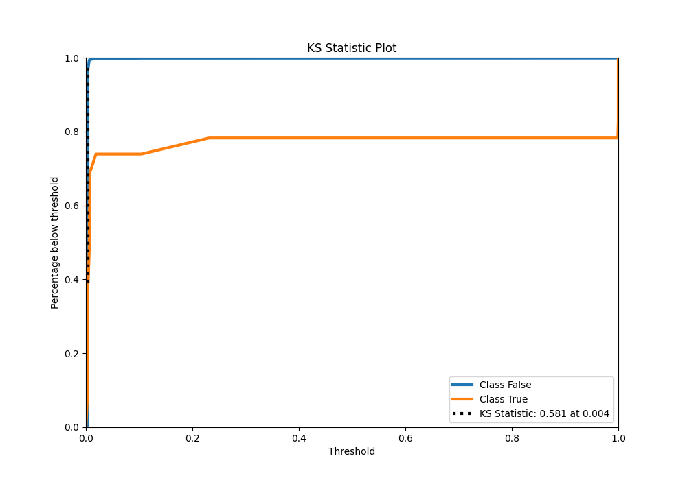

## Precision-Recall Curve

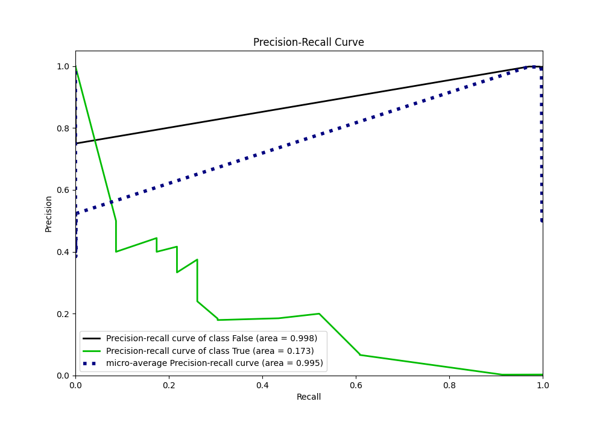

## Calibration Curve

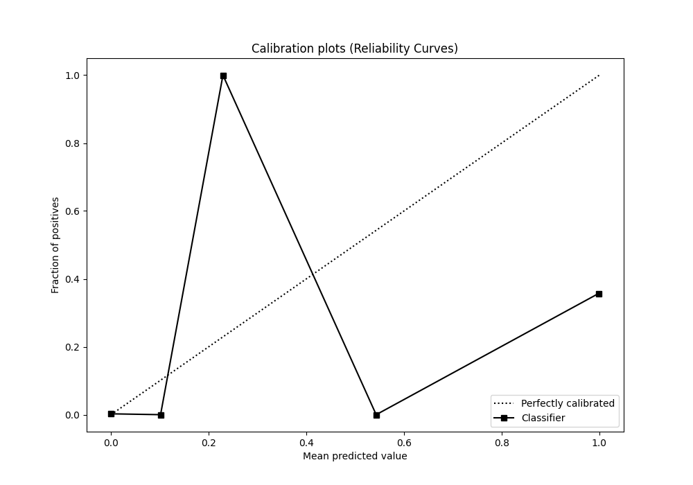

## Cumulative Gains Curve

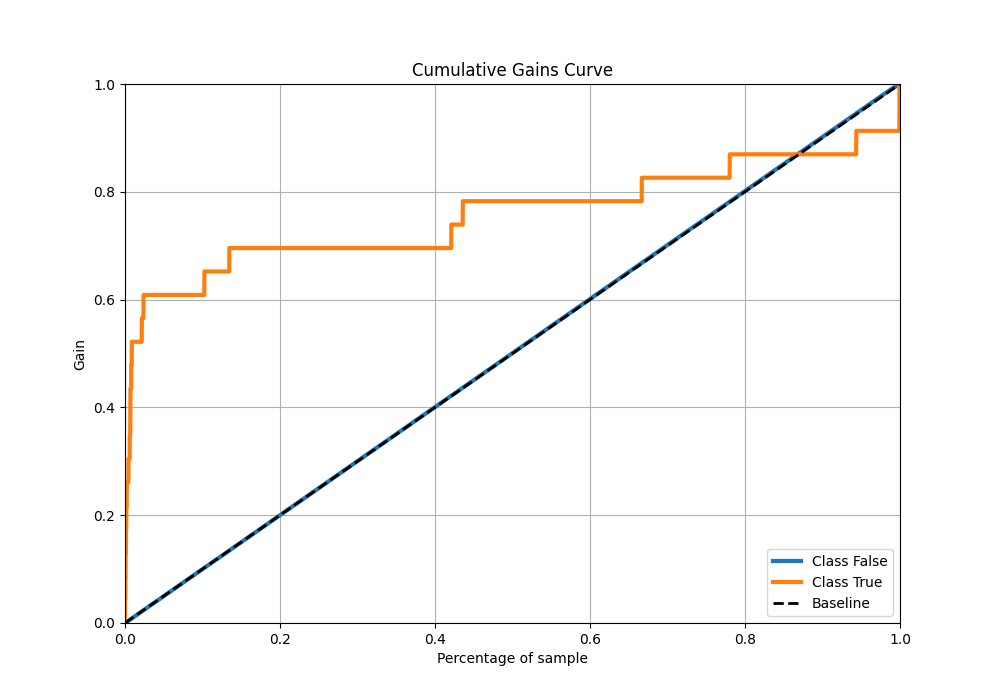

## Lift Curve

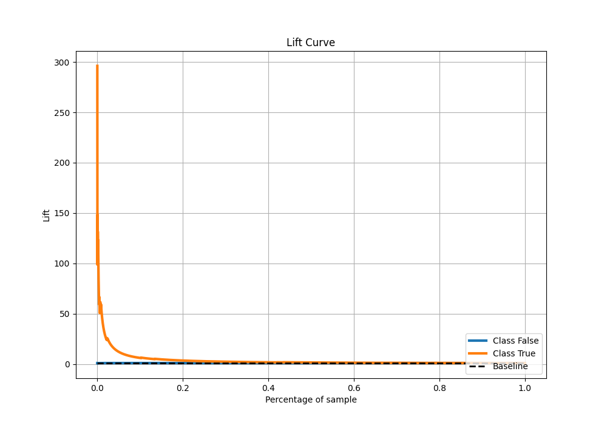

## SHAP Importance
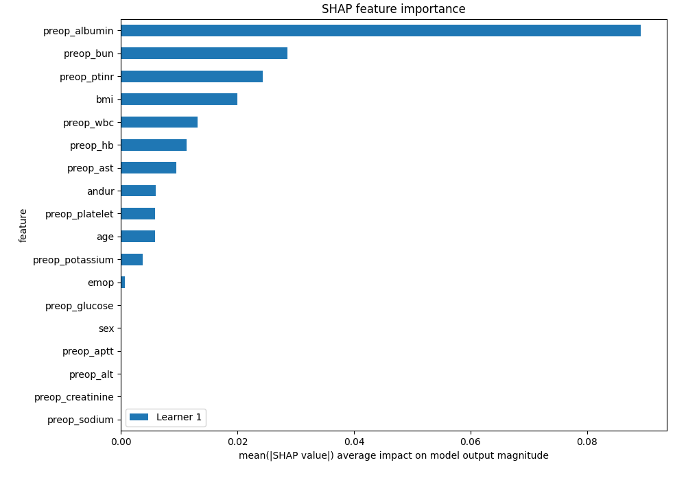

## SHAP Dependence plots

### Dependence (Fold 1)
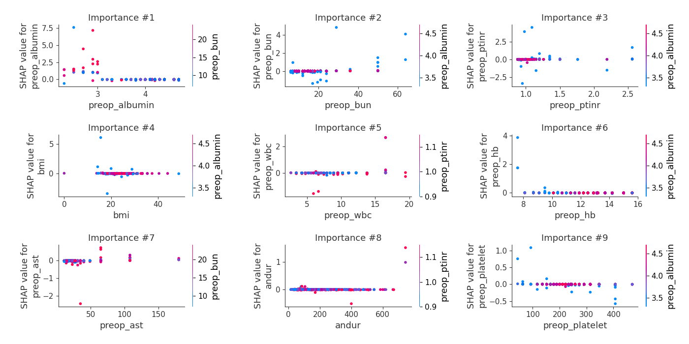

## SHAP Decision plots

[<< Go back](../README.md)
