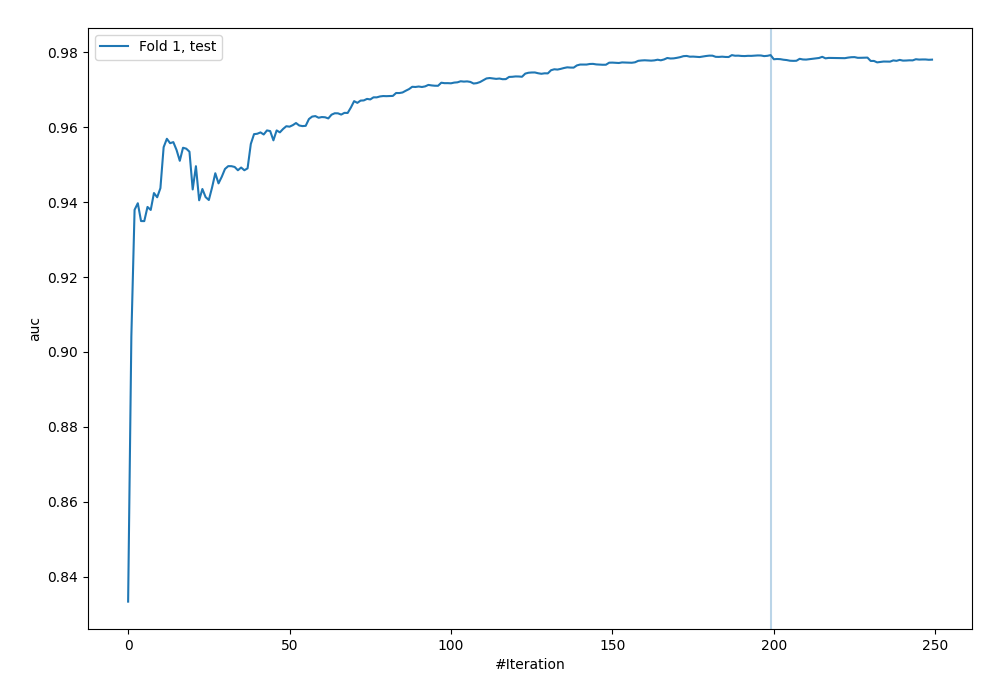
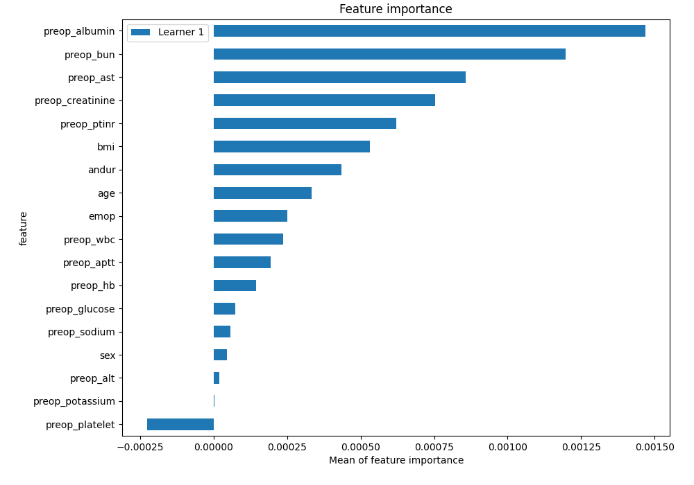
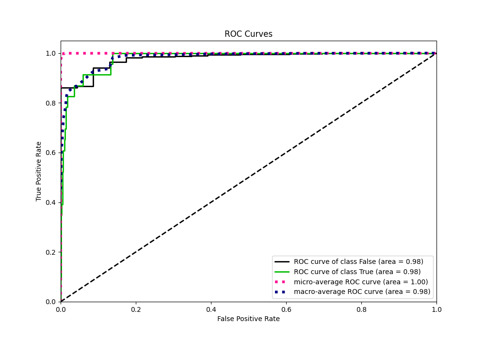
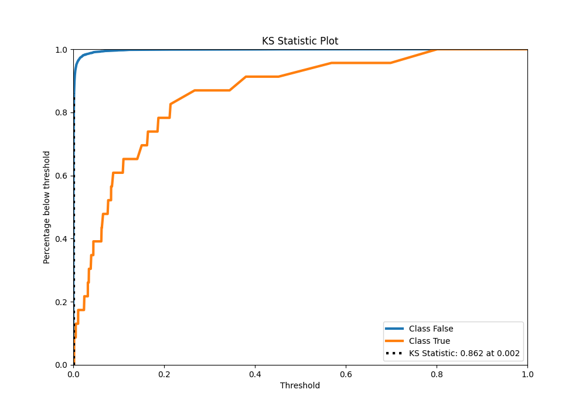
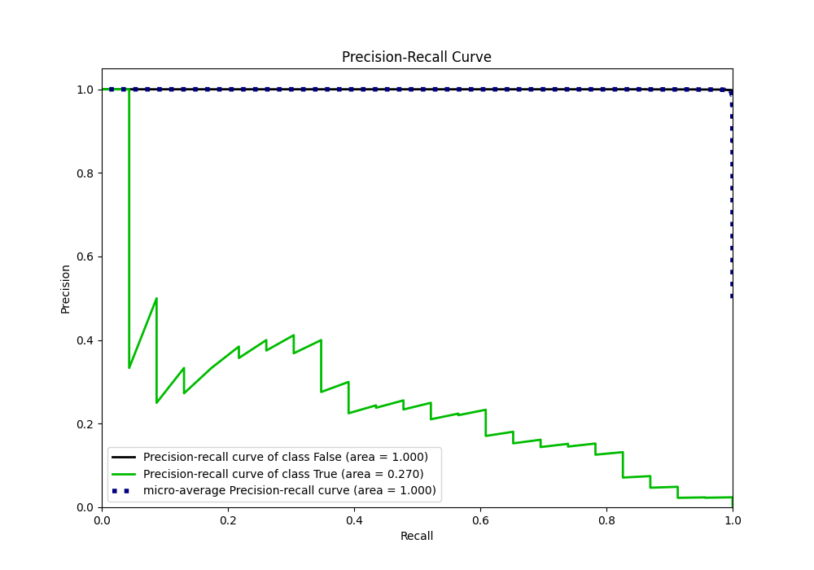
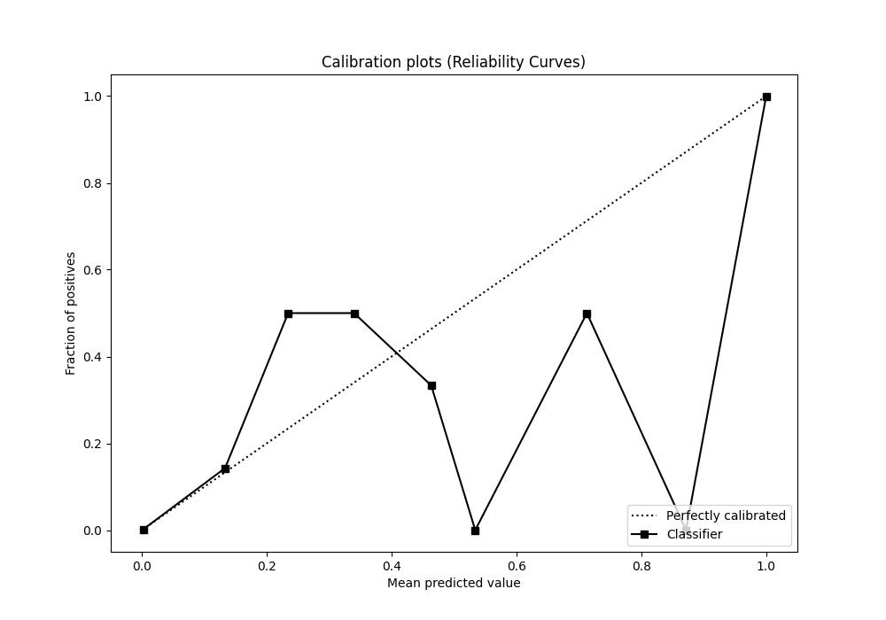
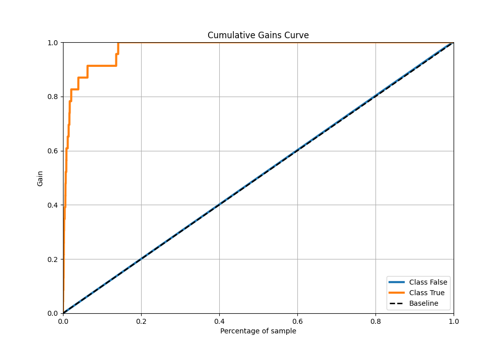
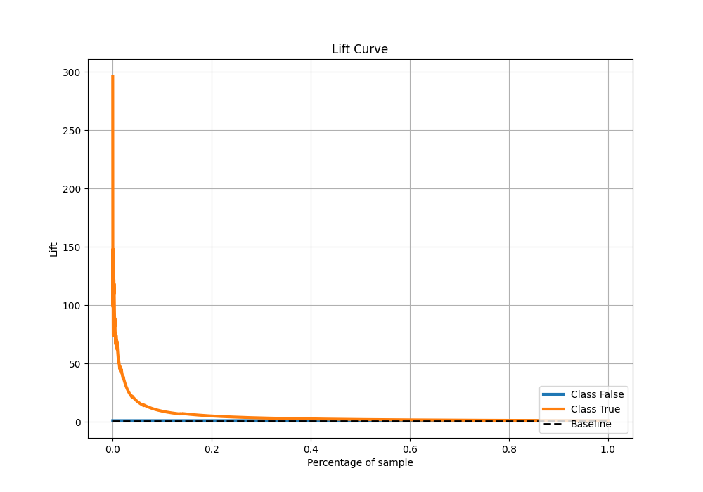

# Summary of 33_CatBoost

[<< Go back](../README.md)

## CatBoost
- **n_jobs**: -1
- **learning_rate**: 0.1
- **depth**: 6
- **rsm**: 0.7
- **loss_function**: Logloss
- **eval_metric**: AUC
- **explain_level**: 2

## Validation
 - **validation_type**: split
 - **train_ratio**: 0.9
 - **shuffle**: True
 - **stratify**: True

## Optimized metric
auc

## Training time

6.0 seconds

## Metric details
|           |     score |     threshold |
|:----------|----------:|--------------:|
| logloss   | 0.0123014 | nan           |
| auc       | 0.97926   | nan           |
| f1        | 0.277228  |   0.0455822   |
| accuracy  | 0.989282  |   0.0455822   |
| precision | 0.179487  |   0.0455822   |
| recall    | 1         |   2.12593e-05 |
| mcc       | 0.326741  |   0.0455822   |

## Metric details with threshold from accuracy metric
|           |     score |   threshold |
|:----------|----------:|------------:|
| logloss   | 0.0123014 | nan         |
| auc       | 0.97926   | nan         |
| f1        | 0.277228  |   0.0455822 |
| accuracy  | 0.989282  |   0.0455822 |
| precision | 0.179487  |   0.0455822 |
| recall    | 0.608696  |   0.0455822 |
| mcc       | 0.326741  |   0.0455822 |

## Confusion matrix (at threshold=0.045582)
|              |   Predicted as 0 |   Predicted as 1 |
|:-------------|-----------------:|-----------------:|
| Labeled as 0 |             6724 |               64 |
| Labeled as 1 |                9 |               14 |

## Learning curves

## Permutation-based Importance

## Confusion Matrix

## Normalized Confusion Matrix

## ROC Curve

## Kolmogorov-Smirnov Statistic

## Precision-Recall Curve

## Calibration Curve

## Cumulative Gains Curve

## Lift Curve

[<< Go back](../README.md)
