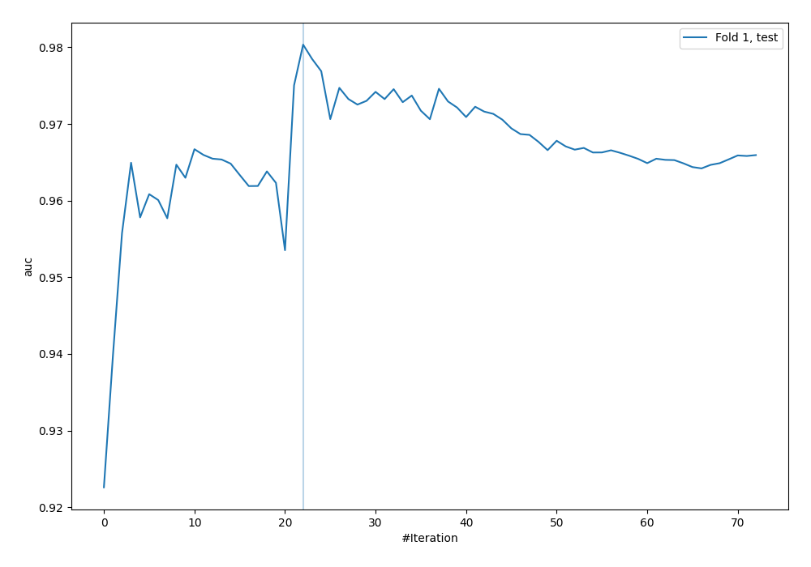
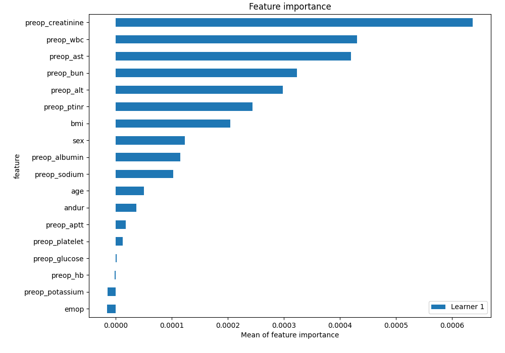
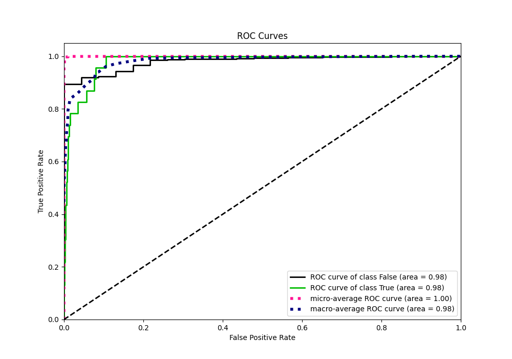
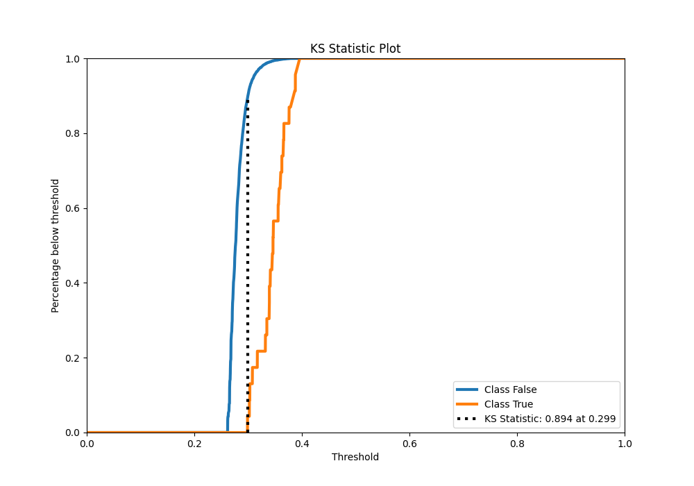
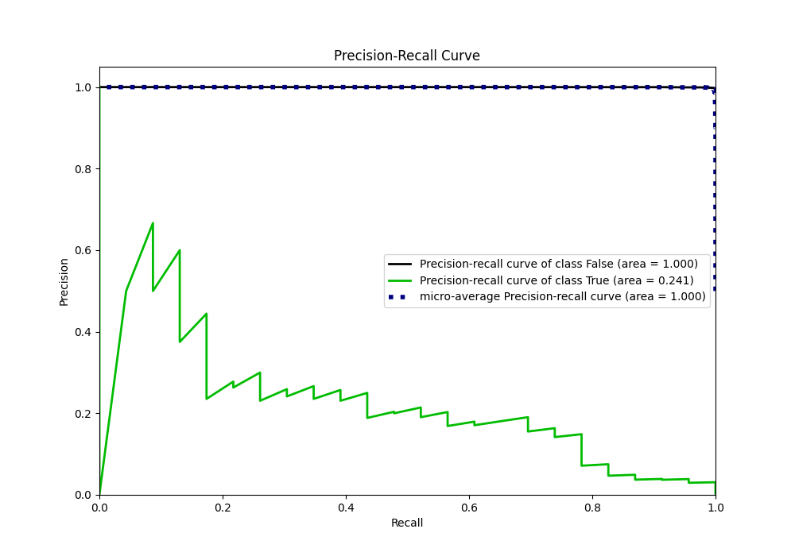
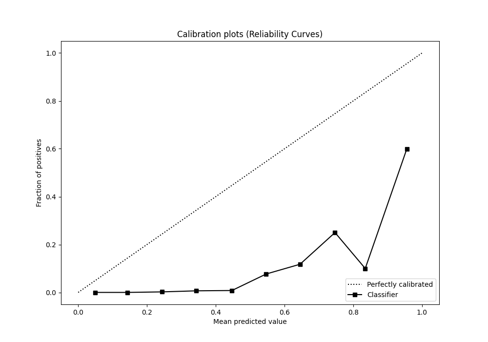
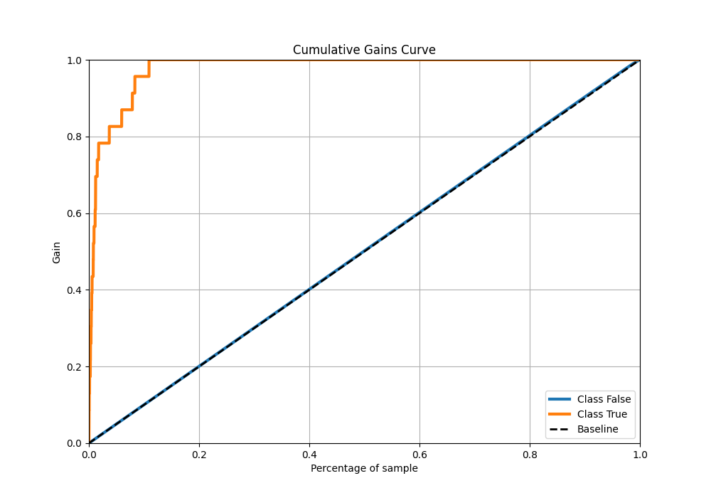
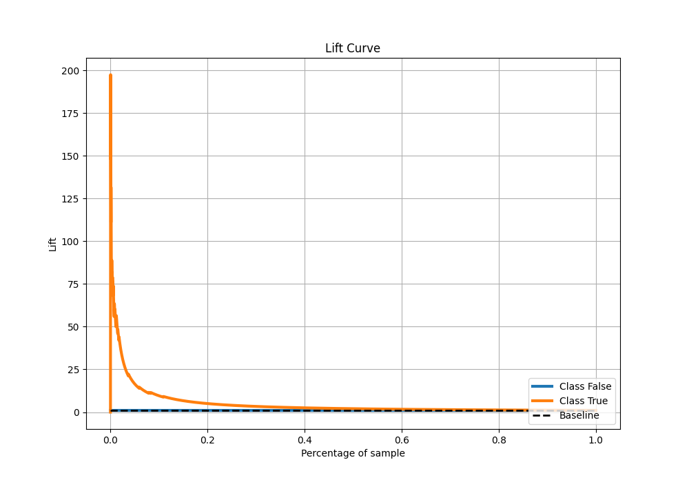

# Summary of 37_CatBoost

[<< Go back](../README.md)

## CatBoost
- **n_jobs**: -1
- **learning_rate**: 0.025
- **depth**: 7
- **rsm**: 0.7
- **loss_function**: Logloss
- **eval_metric**: AUC
- **explain_level**: 2

## Validation
 - **validation_type**: split
 - **train_ratio**: 0.9
 - **shuffle**: True
 - **stratify**: True

## Optimized metric
auc

## Training time

5.3 seconds

## Metric details
|           |    score |   threshold |
|:----------|---------:|------------:|
| logloss   | 0.331488 |  nan        |
| auc       | 0.980355 |  nan        |
| f1        | 0.277228 |    0.341193 |
| accuracy  | 0.989282 |    0.341193 |
| precision | 0.179487 |    0.341193 |
| recall    | 1        |    0.235671 |
| mcc       | 0.326741 |    0.341193 |

## Metric details with threshold from accuracy metric
|           |    score |   threshold |
|:----------|---------:|------------:|
| logloss   | 0.331488 |  nan        |
| auc       | 0.980355 |  nan        |
| f1        | 0.277228 |    0.341193 |
| accuracy  | 0.989282 |    0.341193 |
| precision | 0.179487 |    0.341193 |
| recall    | 0.608696 |    0.341193 |
| mcc       | 0.326741 |    0.341193 |

## Confusion matrix (at threshold=0.341193)
|              |   Predicted as 0 |   Predicted as 1 |
|:-------------|-----------------:|-----------------:|
| Labeled as 0 |             6724 |               64 |
| Labeled as 1 |                9 |               14 |

## Learning curves

## Permutation-based Importance

## Confusion Matrix

## Normalized Confusion Matrix

## ROC Curve

## Kolmogorov-Smirnov Statistic

## Precision-Recall Curve

## Calibration Curve

## Cumulative Gains Curve

## Lift Curve

[<< Go back](../README.md)
