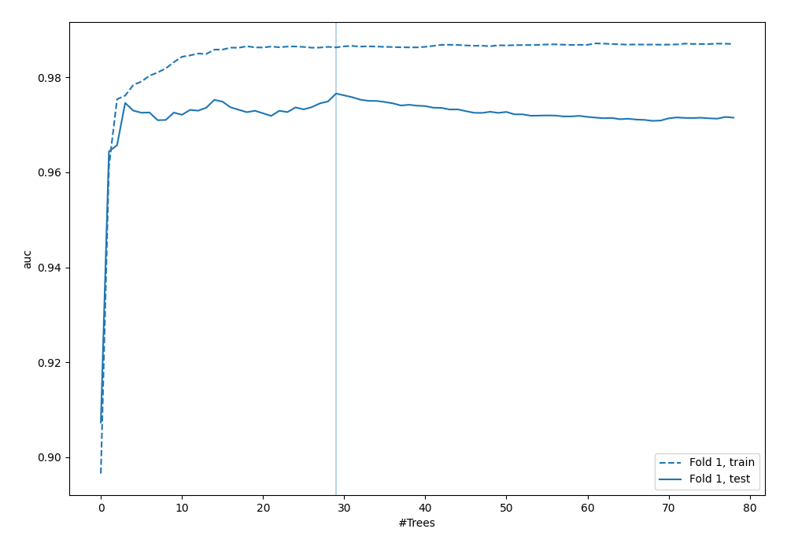
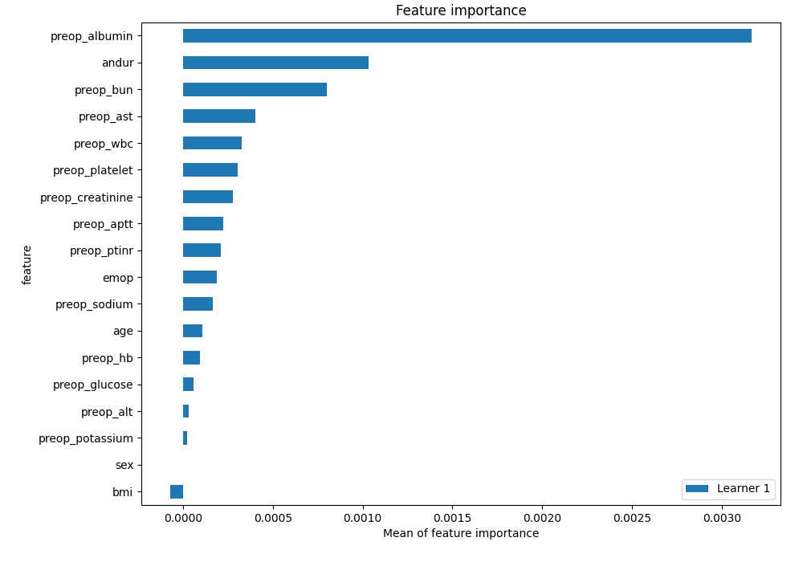
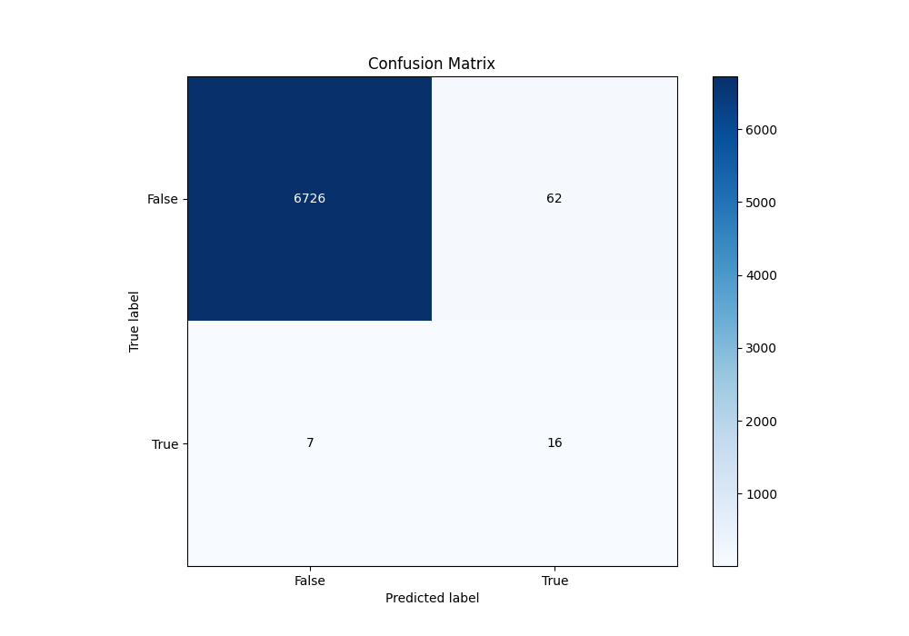
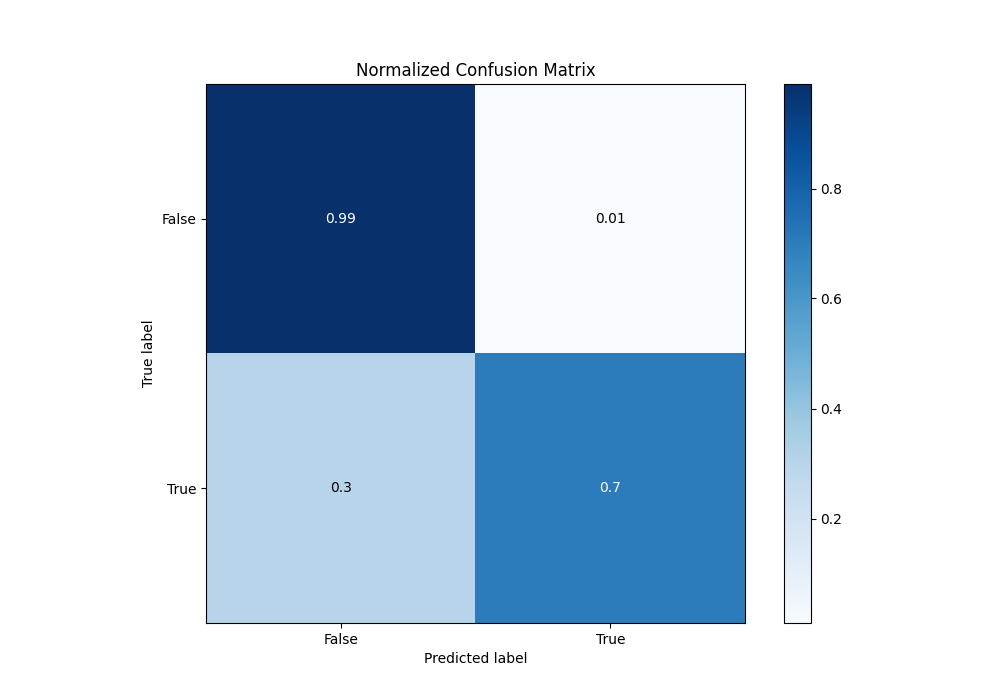
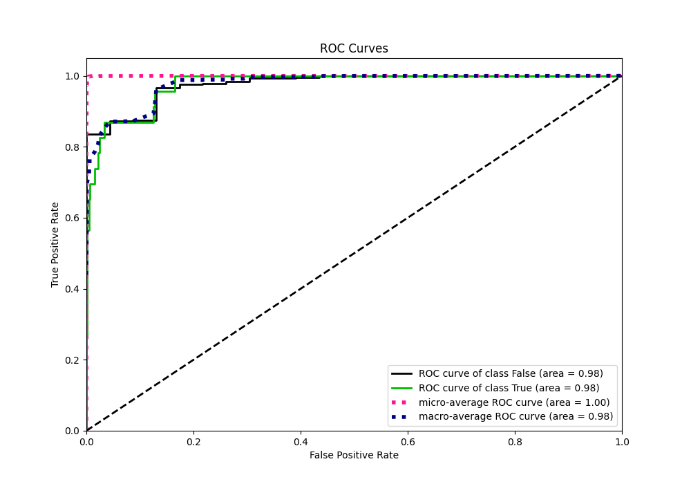
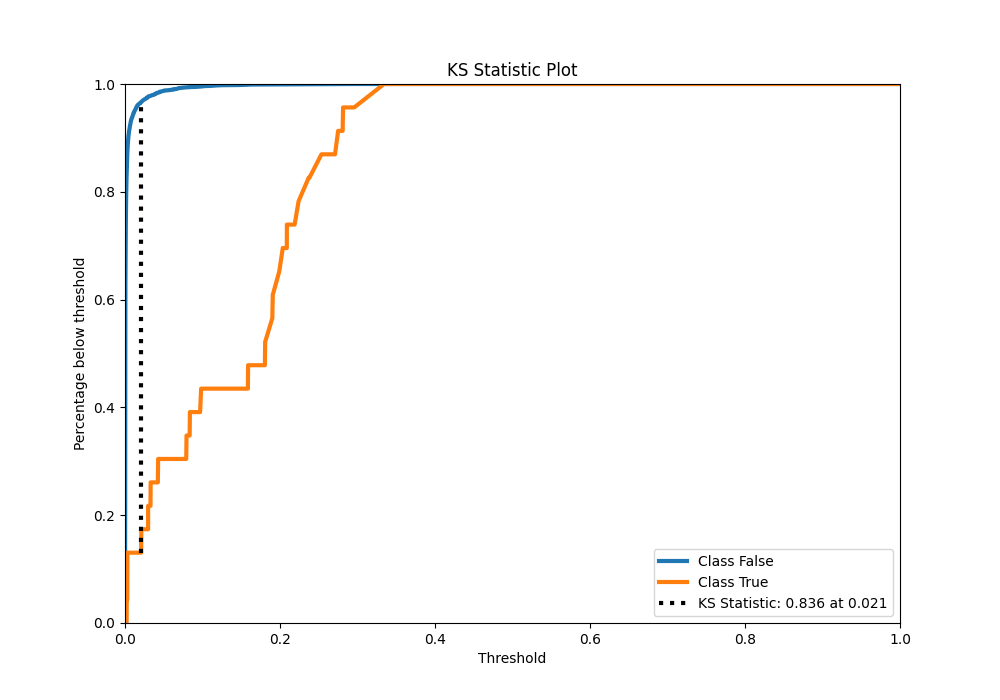
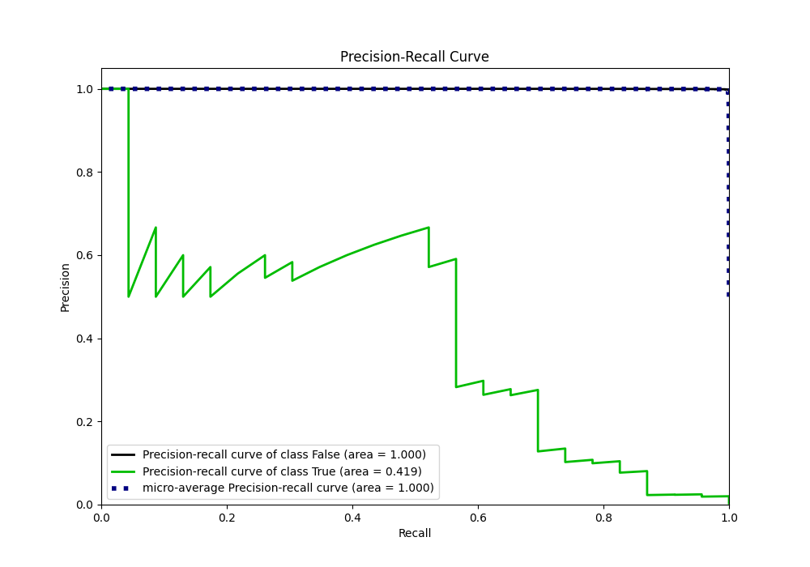
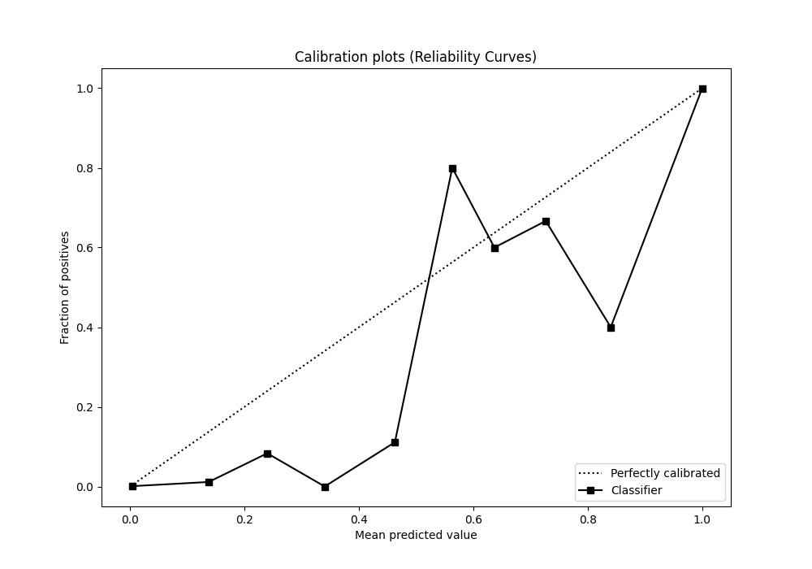
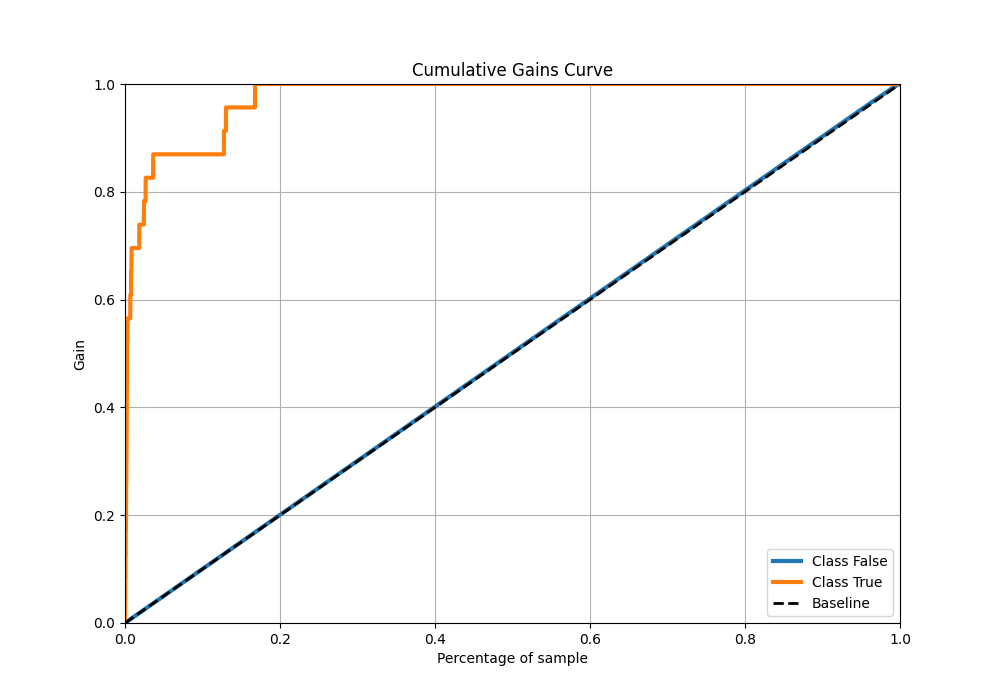
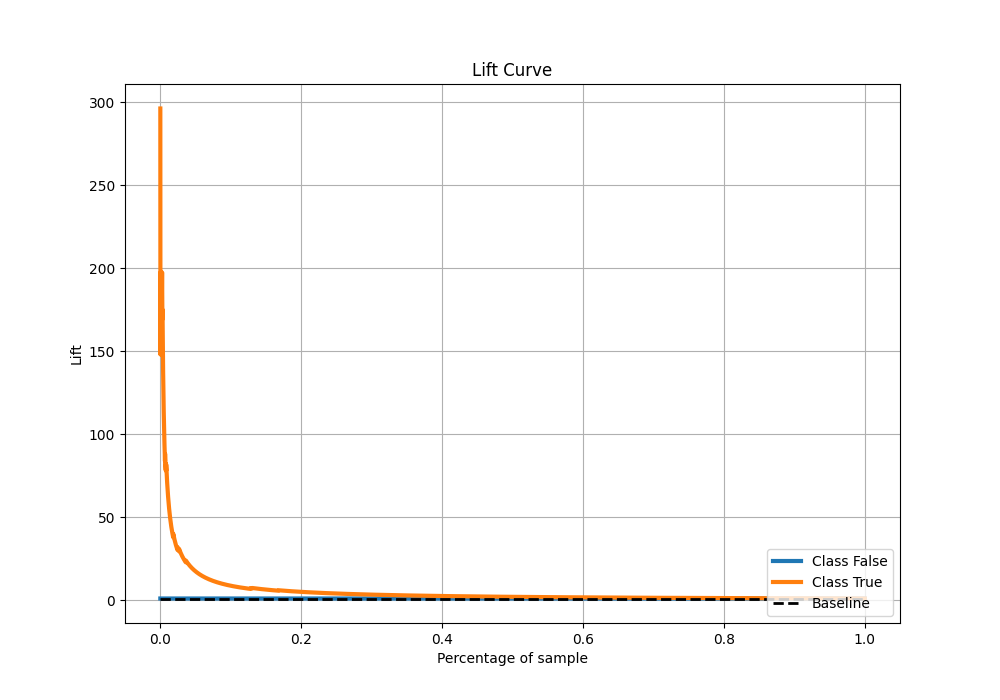

# Summary of 41_RandomForest

[<< Go back](../README.md)

## Random Forest
- **n_jobs**: -1
- **criterion**: entropy
- **max_features**: 0.6
- **min_samples_split**: 50
- **max_depth**: 6
- **eval_metric_name**: auc
- **explain_level**: 2

## Validation
 - **validation_type**: split
 - **train_ratio**: 0.9
 - **shuffle**: True
 - **stratify**: True

## Optimized metric
auc

## Training time

8.6 seconds

## Metric details
|           |     score |     threshold |
|:----------|----------:|--------------:|
| logloss   | 0.0118192 | nan           |
| auc       | 0.976583  | nan           |
| f1        | 0.316832  |   0.0666906   |
| accuracy  | 0.989869  |   0.0666906   |
| precision | 0.205128  |   0.0666906   |
| recall    | 1         |   4.51816e-05 |
| mcc       | 0.374313  |   0.0666906   |

## Metric details with threshold from accuracy metric
|           |     score |   threshold |
|:----------|----------:|------------:|
| logloss   | 0.0118192 | nan         |
| auc       | 0.976583  | nan         |
| f1        | 0.316832  |   0.0666906 |
| accuracy  | 0.989869  |   0.0666906 |
| precision | 0.205128  |   0.0666906 |
| recall    | 0.695652  |   0.0666906 |
| mcc       | 0.374313  |   0.0666906 |

## Confusion matrix (at threshold=0.066691)
|              |   Predicted as 0 |   Predicted as 1 |
|:-------------|-----------------:|-----------------:|
| Labeled as 0 |             6726 |               62 |
| Labeled as 1 |                7 |               16 |

## Learning curves

## Permutation-based Importance

## Confusion Matrix

## Normalized Confusion Matrix

## ROC Curve

## Kolmogorov-Smirnov Statistic

## Precision-Recall Curve

## Calibration Curve

## Cumulative Gains Curve

## Lift Curve

[<< Go back](../README.md)
