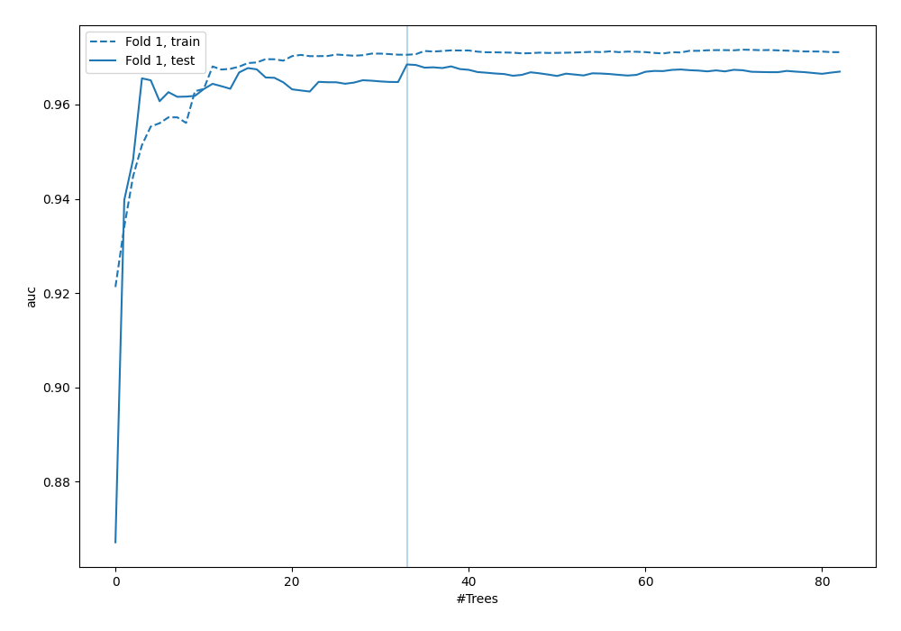
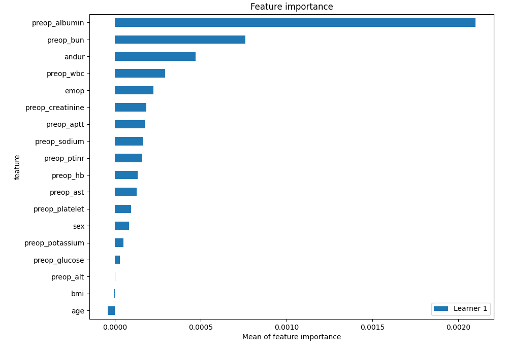
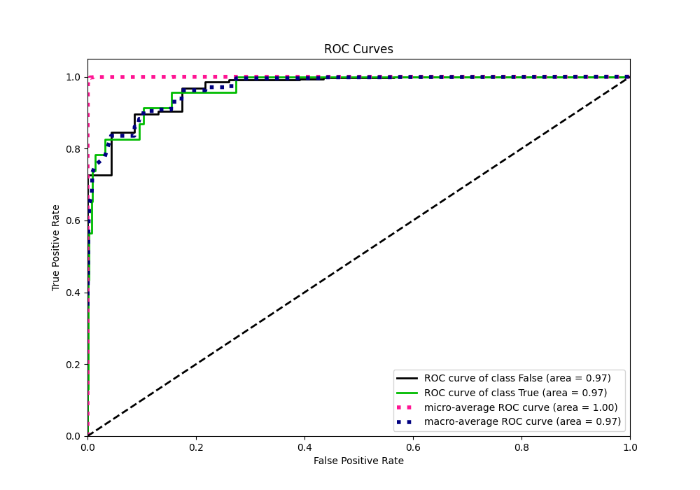
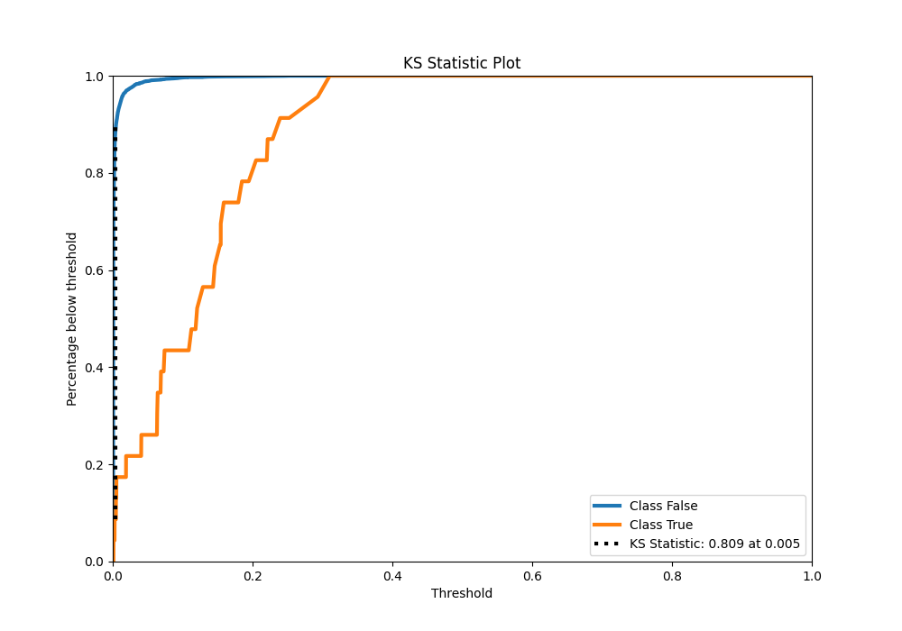
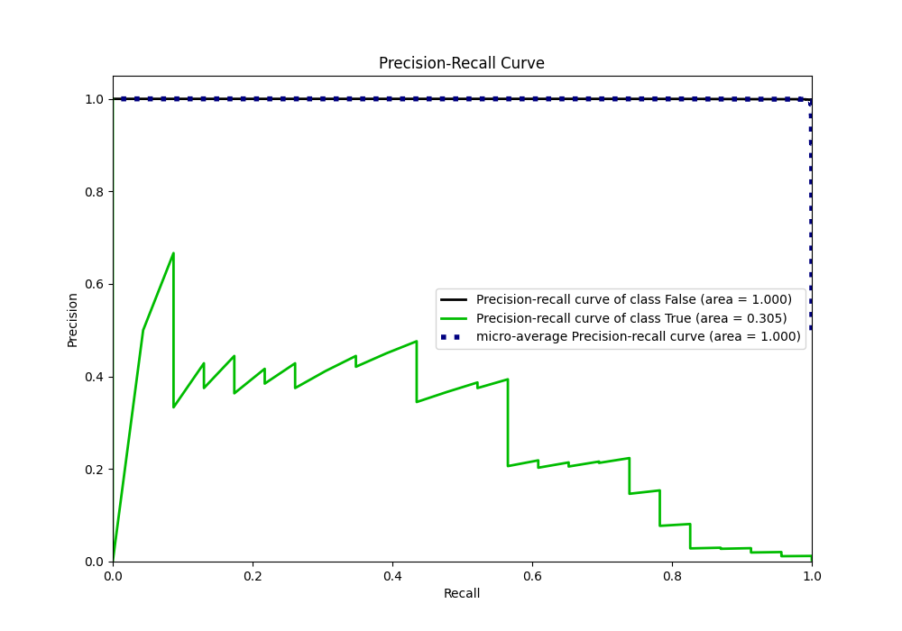
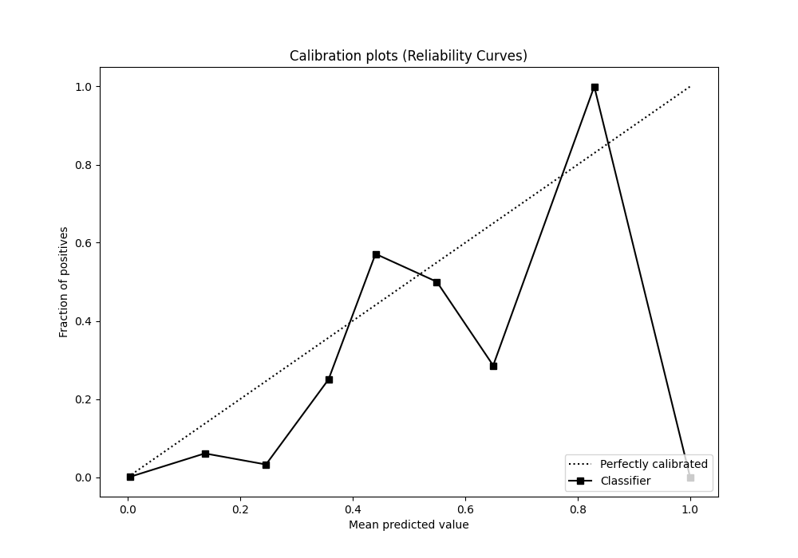
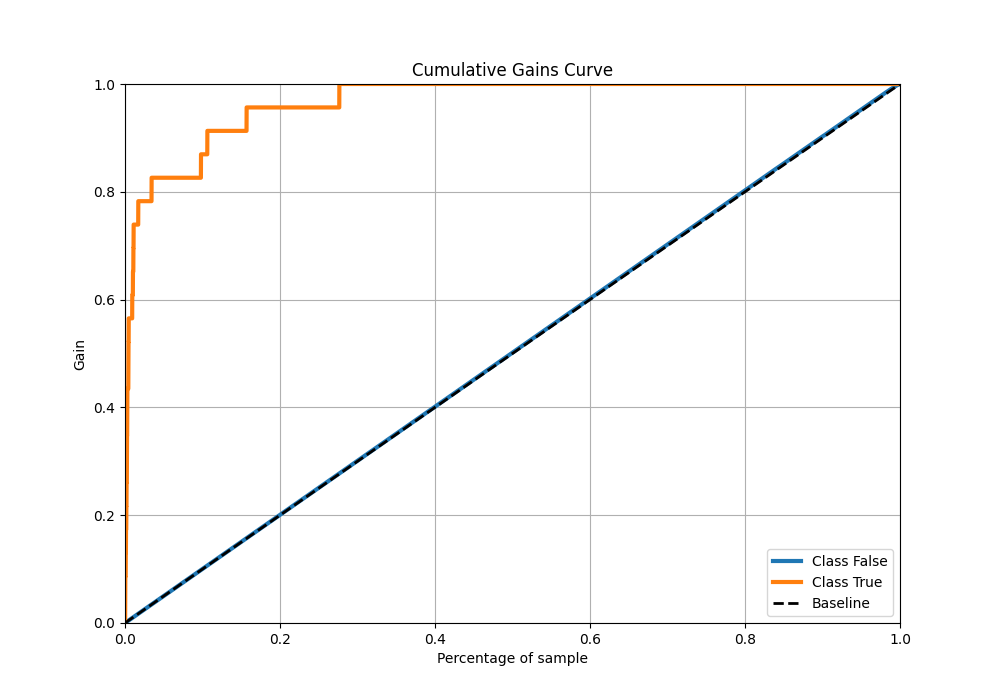
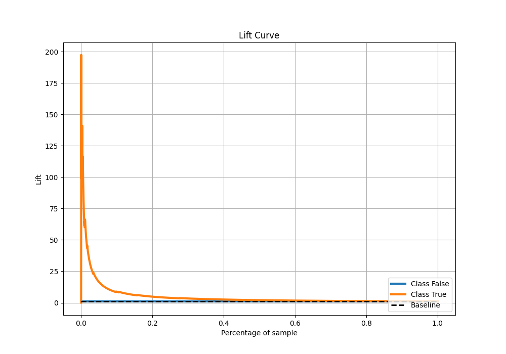

# Summary of 48_ExtraTrees

[<< Go back](../README.md)

## Extra Trees Classifier (Extra Trees)
- **n_jobs**: -1
- **criterion**: gini
- **max_features**: 0.7
- **min_samples_split**: 30
- **max_depth**: 7
- **eval_metric_name**: auc
- **explain_level**: 2

## Validation
 - **validation_type**: split
 - **train_ratio**: 0.9
 - **shuffle**: True
 - **stratify**: True

## Optimized metric
auc

## Training time

7.4 seconds

## Metric details
|           |     score |    threshold |
|:----------|----------:|-------------:|
| logloss   | 0.0127697 | nan          |
| auc       | 0.96848   | nan          |
| f1        | 0.336634  |   0.0595007  |
| accuracy  | 0.990163  |   0.0595007  |
| precision | 0.217949  |   0.0595007  |
| recall    | 1         |   0.00043629 |
| mcc       | 0.3981    |   0.0595007  |

## Metric details with threshold from accuracy metric
|           |     score |   threshold |
|:----------|----------:|------------:|
| logloss   | 0.0127697 | nan         |
| auc       | 0.96848   | nan         |
| f1        | 0.336634  |   0.0595007 |
| accuracy  | 0.990163  |   0.0595007 |
| precision | 0.217949  |   0.0595007 |
| recall    | 0.73913   |   0.0595007 |
| mcc       | 0.3981    |   0.0595007 |

## Confusion matrix (at threshold=0.059501)
|              |   Predicted as 0 |   Predicted as 1 |
|:-------------|-----------------:|-----------------:|
| Labeled as 0 |             6727 |               61 |
| Labeled as 1 |                6 |               17 |

## Learning curves

## Permutation-based Importance

## Confusion Matrix

## Normalized Confusion Matrix

## ROC Curve

## Kolmogorov-Smirnov Statistic

## Precision-Recall Curve

## Calibration Curve

## Cumulative Gains Curve

## Lift Curve

[<< Go back](../README.md)
