# Summary of 4_Default_LightGBM_SelectedFeatures

[<< Go back](../README.md)

## LightGBM
- **n_jobs**: -1
- **objective**: binary
- **num_leaves**: 63
- **learning_rate**: 0.05
- **feature_fraction**: 0.9
- **bagging_fraction**: 0.9
- **min_data_in_leaf**: 10
- **metric**: auc
- **custom_eval_metric_name**: None
- **explain_level**: 2

## Validation
 - **validation_type**: split
 - **train_ratio**: 0.9
 - **shuffle**: True
 - **stratify**: True

## Optimized metric
auc

## Training time

10.8 seconds

## Metric details
|           |    score |     threshold |
|:----------|---------:|--------------:|
| logloss   | 0.018175 | nan           |
| auc       | 0.960422 | nan           |
| f1        | 0.178218 |   0.00656629  |
| accuracy  | 0.987814 |   0.00656629  |
| precision | 0.115385 |   0.00656629  |
| recall    | 1        |   3.41033e-06 |
| mcc       | 0.221638 |   0.00116531  |

## Metric details with threshold from accuracy metric
|           |    score |    threshold |
|:----------|---------:|-------------:|
| logloss   | 0.018175 | nan          |
| auc       | 0.960422 | nan          |
| f1        | 0.178218 |   0.00656629 |
| accuracy  | 0.987814 |   0.00656629 |
| precision | 0.115385 |   0.00656629 |
| recall    | 0.391304 |   0.00656629 |
| mcc       | 0.20781  |   0.00656629 |

## Confusion matrix (at threshold=0.006566)
|              |   Predicted as 0 |   Predicted as 1 |
|:-------------|-----------------:|-----------------:|
| Labeled as 0 |             6719 |               69 |
| Labeled as 1 |               14 |                9 |

## Learning curves
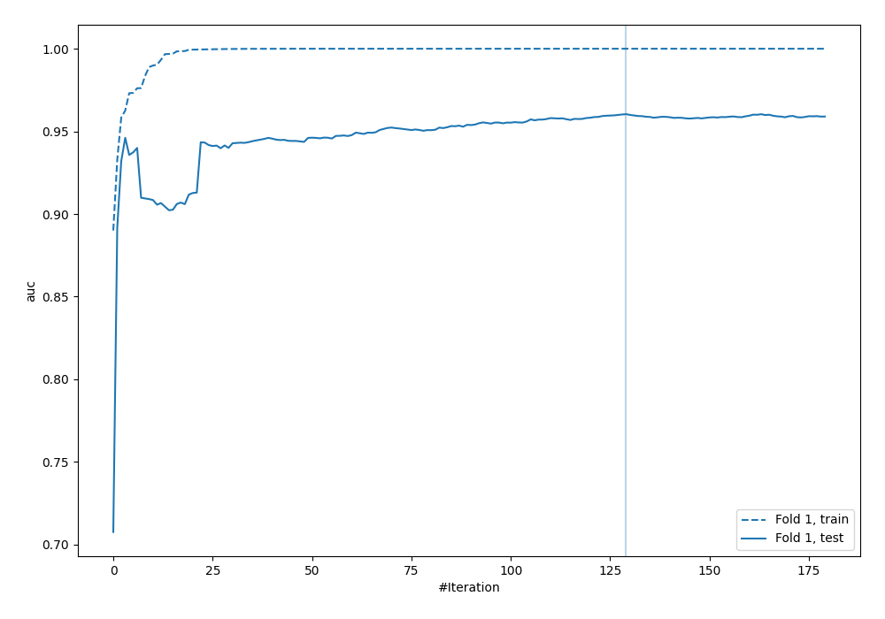

## Permutation-based Importance
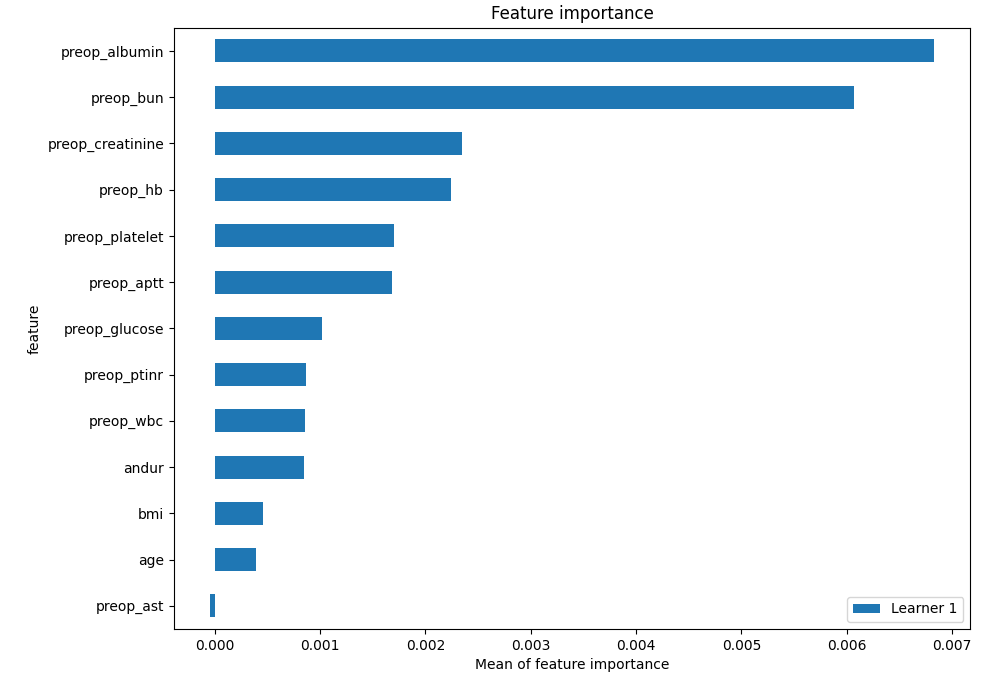
## Confusion Matrix

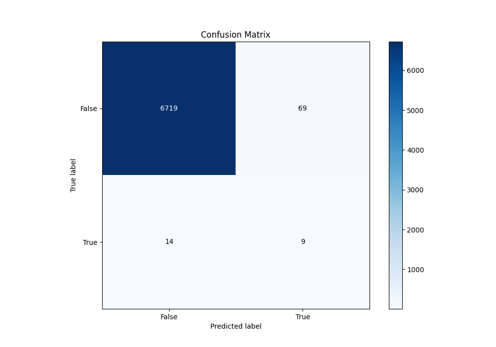

## Normalized Confusion Matrix

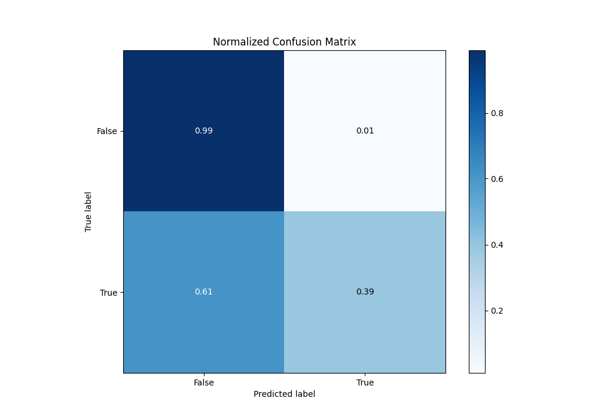

## ROC Curve

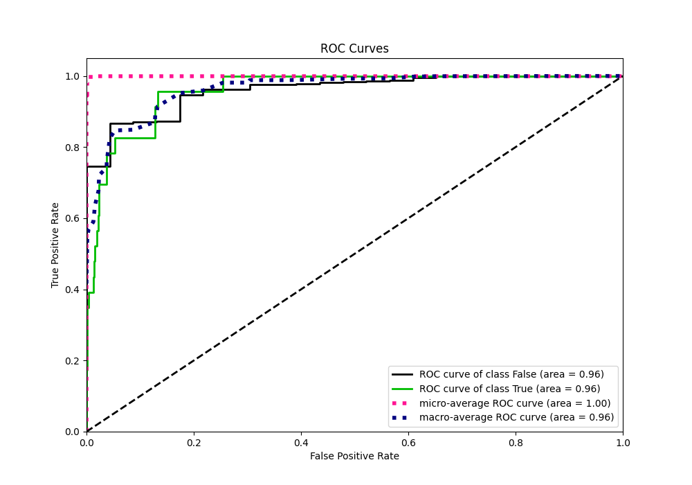

## Kolmogorov-Smirnov Statistic

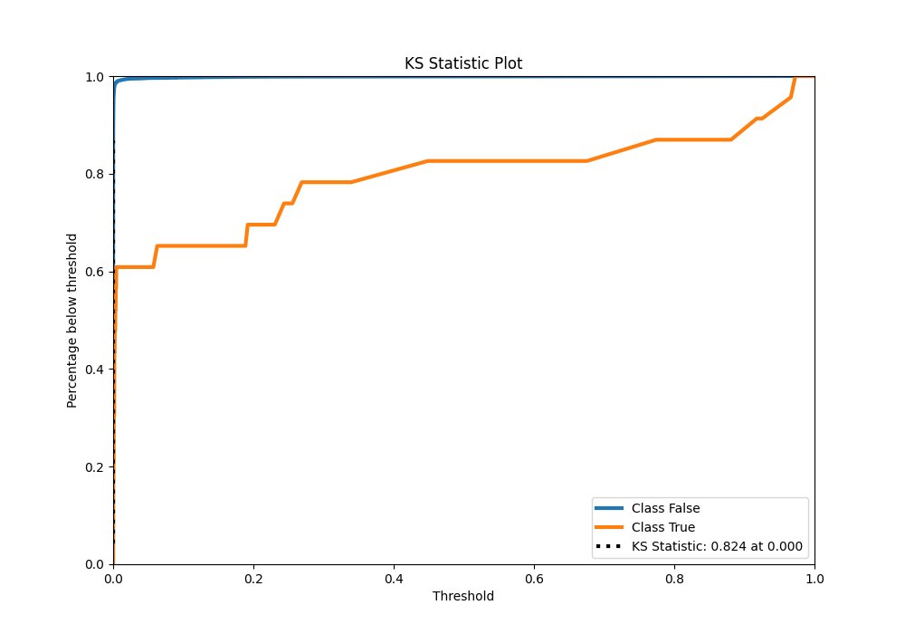

## Precision-Recall Curve

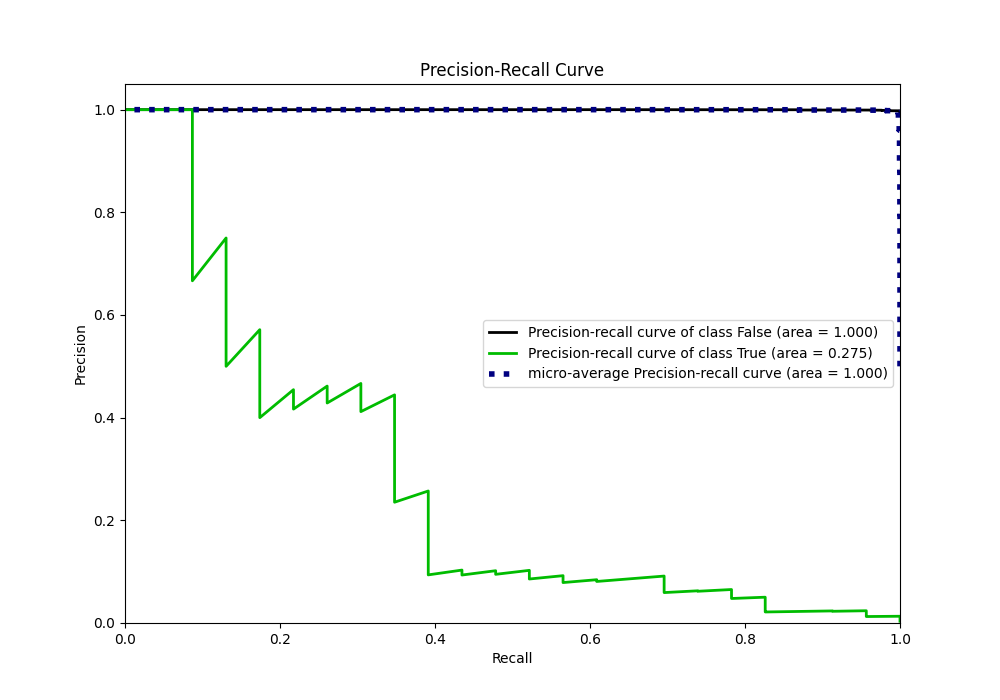

## Calibration Curve

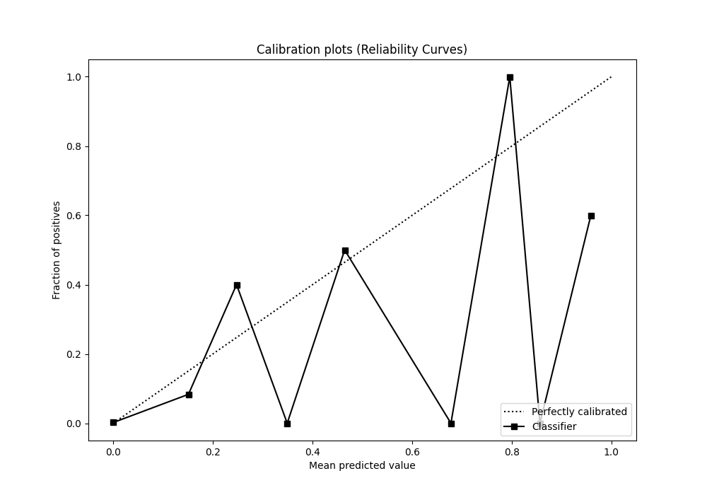

## Cumulative Gains Curve

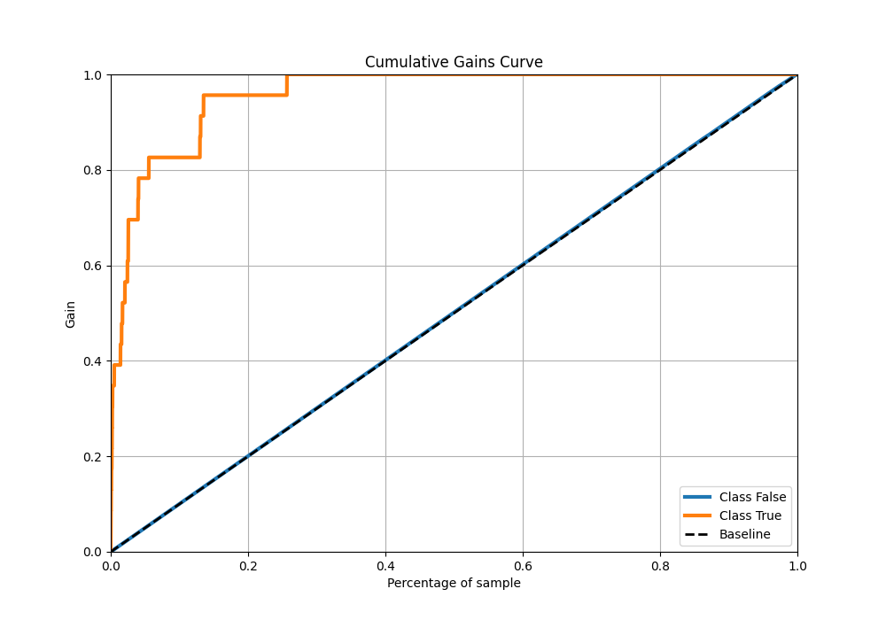

## Lift Curve

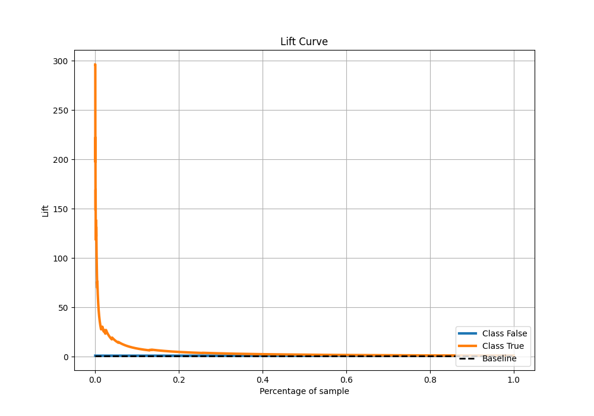

## SHAP Importance
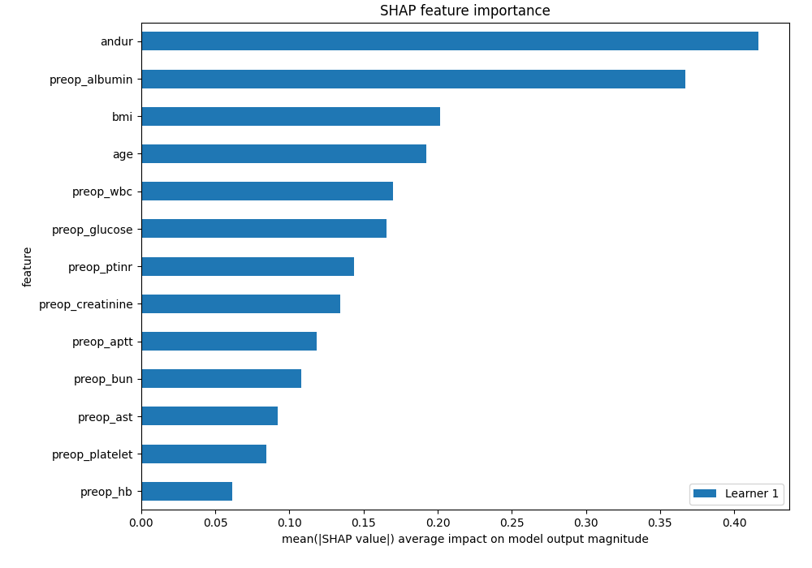

## SHAP Dependence plots

### Dependence (Fold 1)
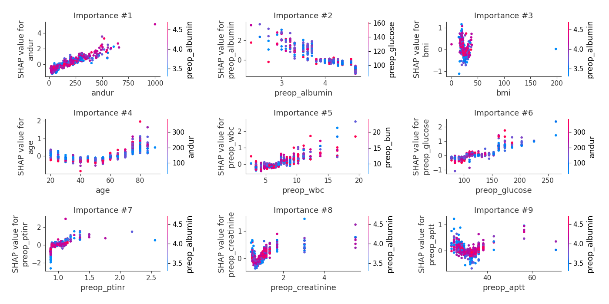

## SHAP Decision plots

[<< Go back](../README.md)
