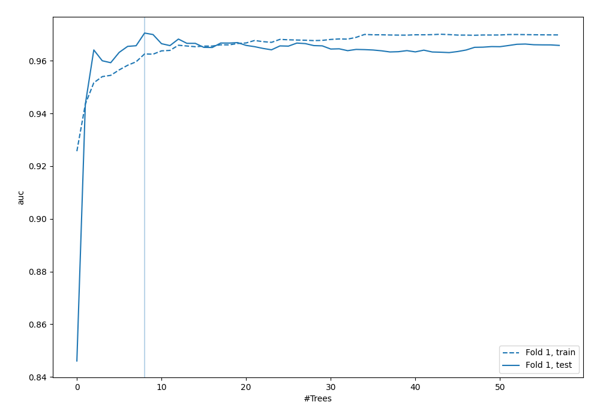
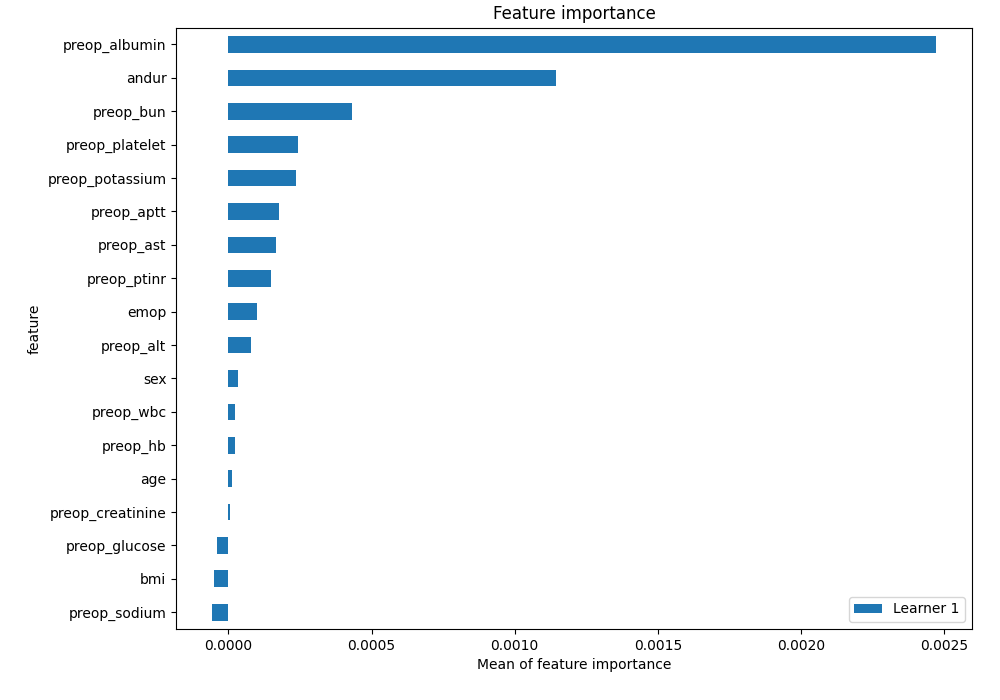
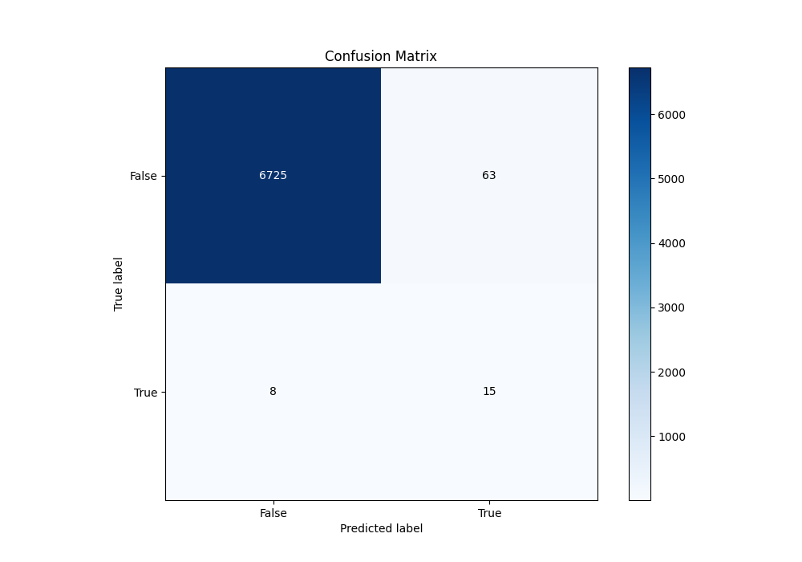
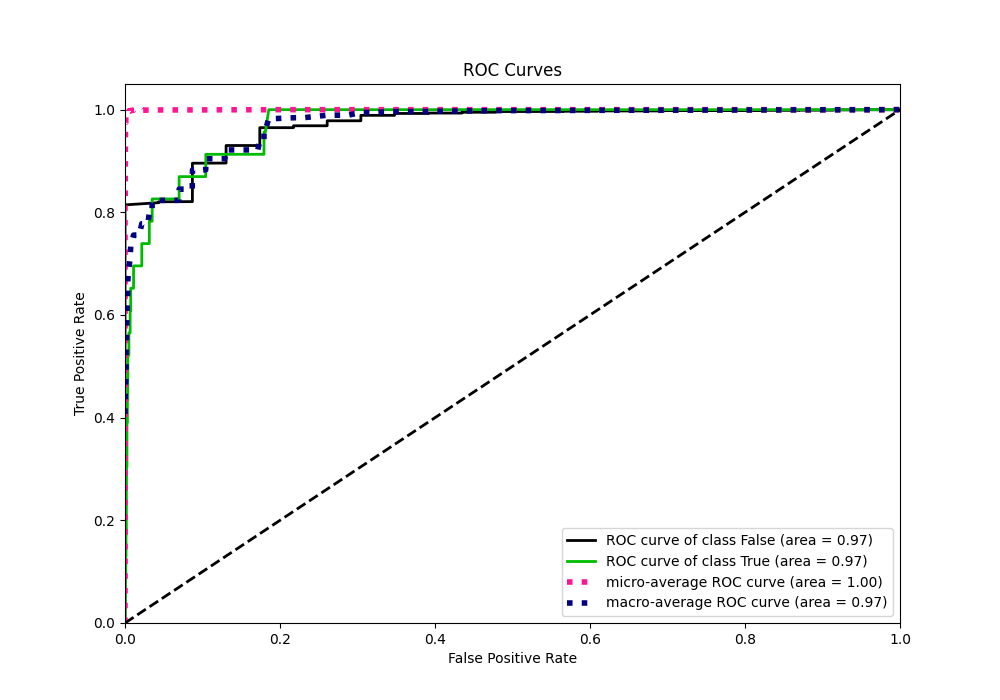
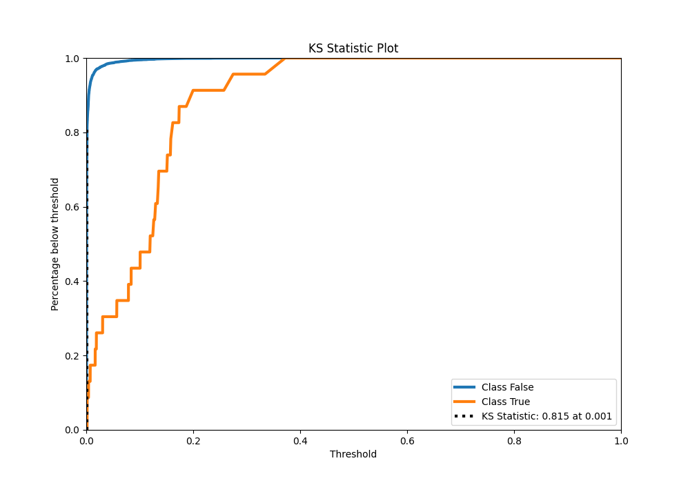
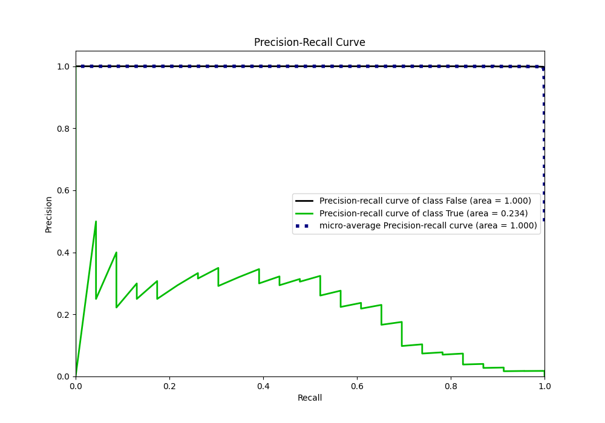
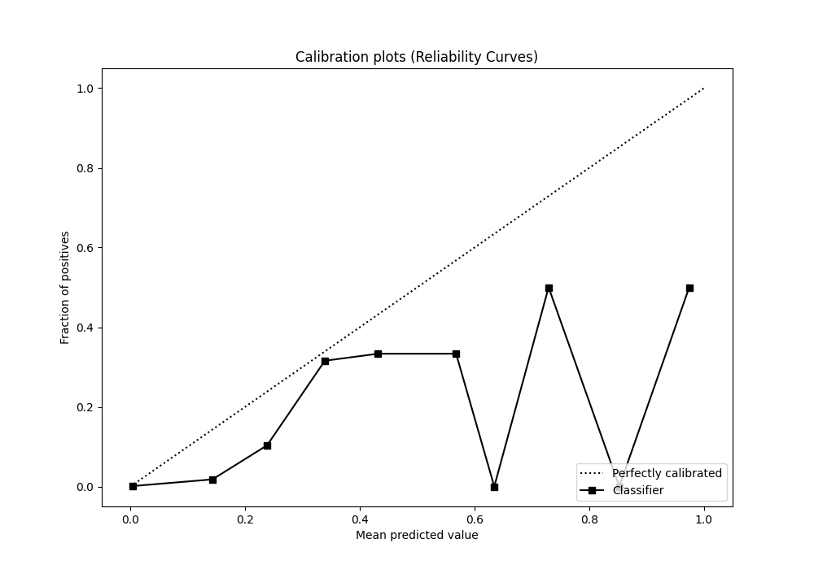
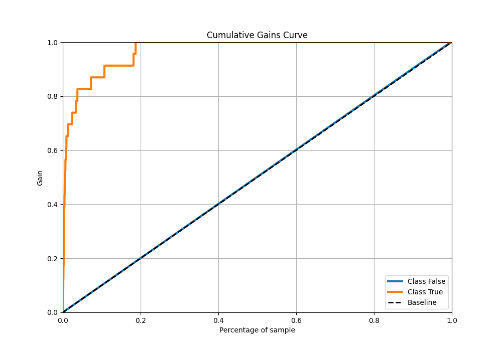
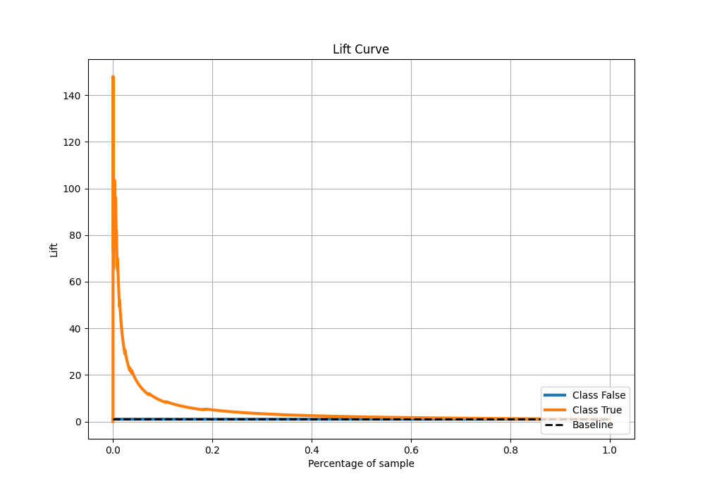

# Summary of 52_ExtraTrees

[<< Go back](../README.md)

## Extra Trees Classifier (Extra Trees)
- **n_jobs**: -1
- **criterion**: gini
- **max_features**: 1.0
- **min_samples_split**: 40
- **max_depth**: 7
- **eval_metric_name**: auc
- **explain_level**: 2

## Validation
 - **validation_type**: split
 - **train_ratio**: 0.9
 - **shuffle**: True
 - **stratify**: True

## Optimized metric
auc

## Training time

7.2 seconds

## Metric details
|           |    score |     threshold |
|:----------|---------:|--------------:|
| logloss   | 0.013204 | nan           |
| auc       | 0.970495 | nan           |
| f1        | 0.29703  |   0.0676448   |
| accuracy  | 0.989576 |   0.0676448   |
| precision | 0.192308 |   0.0676448   |
| recall    | 1        |   0.000324381 |
| mcc       | 0.350527 |   0.0676448   |

## Metric details with threshold from accuracy metric
|           |    score |   threshold |
|:----------|---------:|------------:|
| logloss   | 0.013204 | nan         |
| auc       | 0.970495 | nan         |
| f1        | 0.29703  |   0.0676448 |
| accuracy  | 0.989576 |   0.0676448 |
| precision | 0.192308 |   0.0676448 |
| recall    | 0.652174 |   0.0676448 |
| mcc       | 0.350527 |   0.0676448 |

## Confusion matrix (at threshold=0.067645)
|              |   Predicted as 0 |   Predicted as 1 |
|:-------------|-----------------:|-----------------:|
| Labeled as 0 |             6725 |               63 |
| Labeled as 1 |                8 |               15 |

## Learning curves

## Permutation-based Importance

## Confusion Matrix

## Normalized Confusion Matrix

## ROC Curve

## Kolmogorov-Smirnov Statistic

## Precision-Recall Curve

## Calibration Curve

## Cumulative Gains Curve

## Lift Curve

[<< Go back](../README.md)
