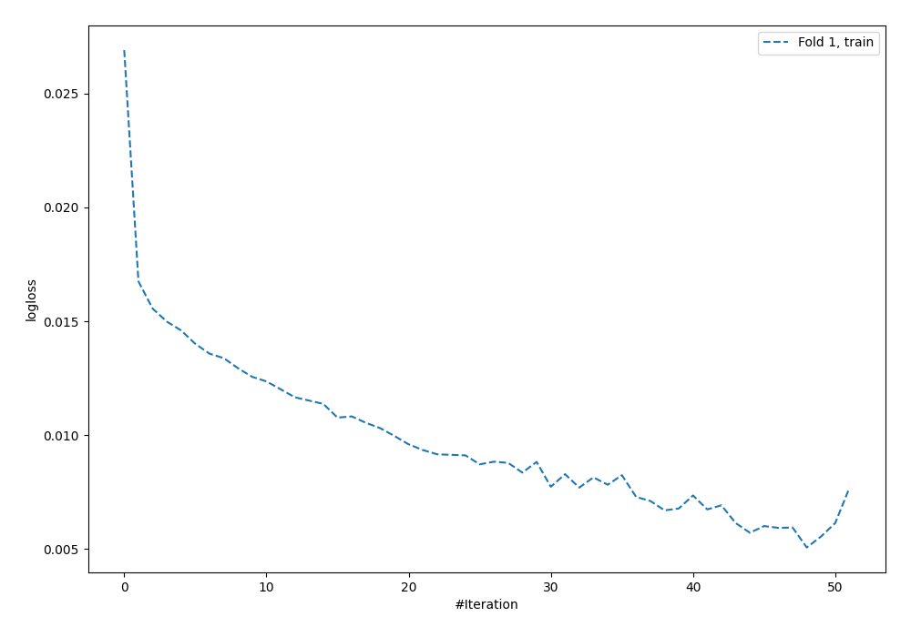
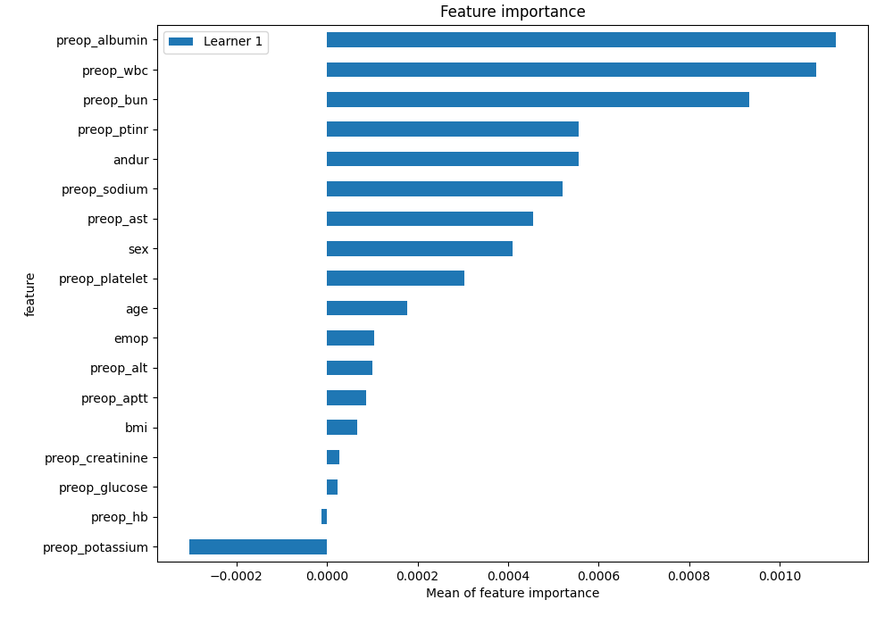
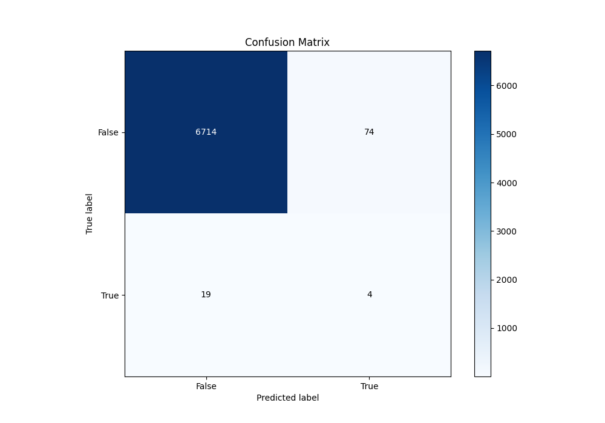
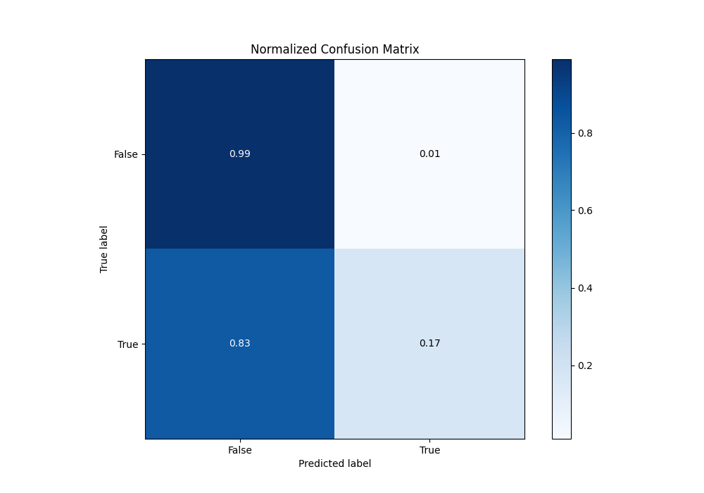
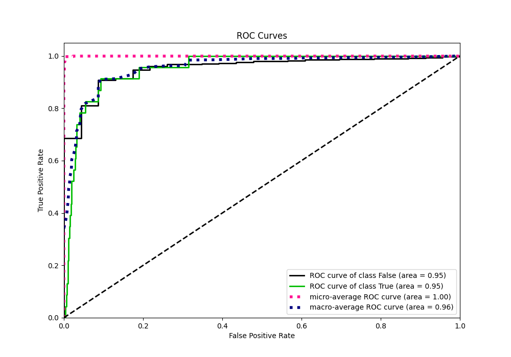
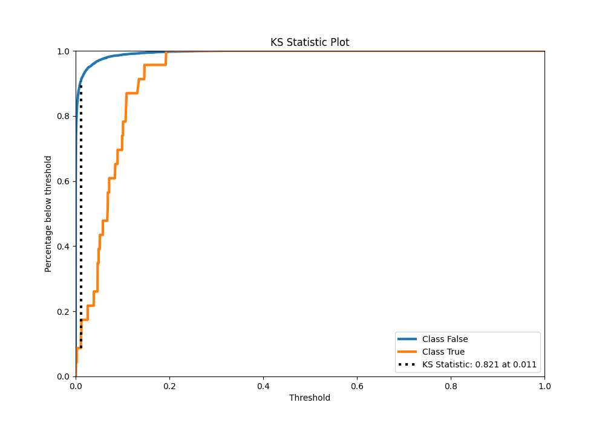
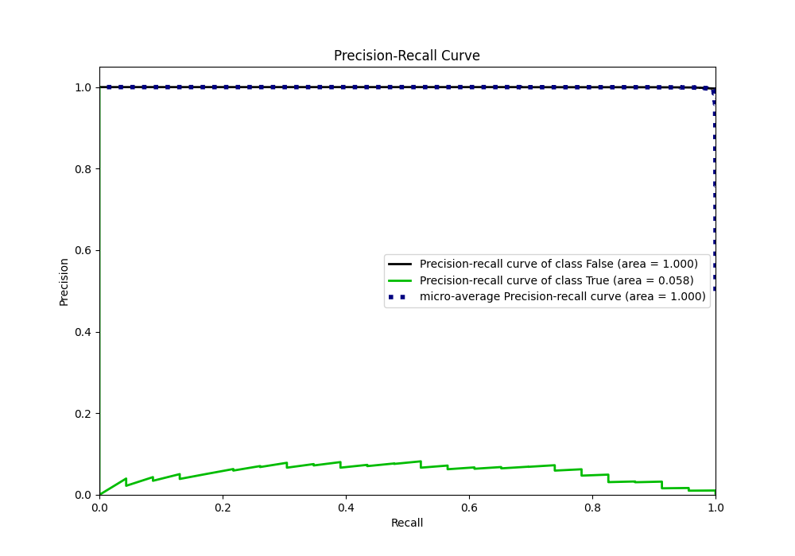
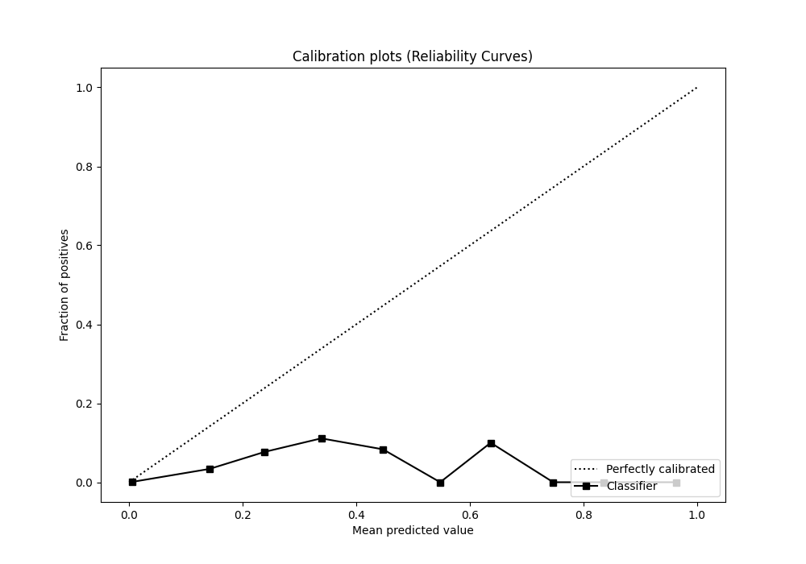
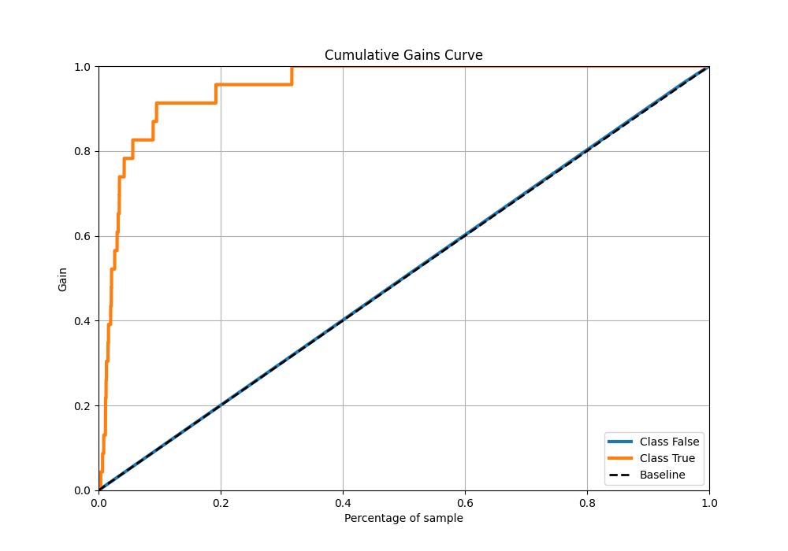
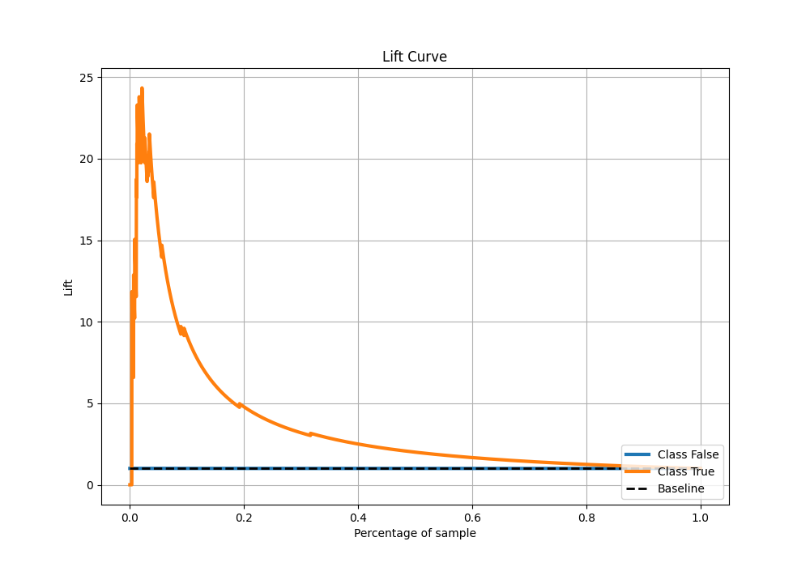

# Summary of 57_NeuralNetwork

[<< Go back](../README.md)

## Neural Network
- **n_jobs**: -1
- **dense_1_size**: 64
- **dense_2_size**: 16
- **learning_rate**: 0.01
- **explain_level**: 2

## Validation
 - **validation_type**: split
 - **train_ratio**: 0.9
 - **shuffle**: True
 - **stratify**: True

## Optimized metric
auc

## Training time

14.2 seconds

## Metric details
|           |     score |      threshold |
|:----------|----------:|---------------:|
| logloss   | 0.0163323 | nan            |
| auc       | 0.953255  | nan            |
| f1        | 0.142012  |   0.0679576    |
| accuracy  | 0.986346  |   0.108093     |
| precision | 0.0821918 |   0.0679576    |
| recall    | 1         |   4.79962e-134 |
| mcc       | 0.203864  |   0.0393636    |

## Metric details with threshold from accuracy metric
|           |     score |   threshold |
|:----------|----------:|------------:|
| logloss   | 0.0163323 |  nan        |
| auc       | 0.953255  |  nan        |
| f1        | 0.0792079 |    0.108093 |
| accuracy  | 0.986346  |    0.108093 |
| precision | 0.0512821 |    0.108093 |
| recall    | 0.173913  |    0.108093 |
| mcc       | 0.0888794 |    0.108093 |

## Confusion matrix (at threshold=0.108093)
|              |   Predicted as 0 |   Predicted as 1 |
|:-------------|-----------------:|-----------------:|
| Labeled as 0 |             6714 |               74 |
| Labeled as 1 |               19 |                4 |

## Learning curves

## Permutation-based Importance

## Confusion Matrix

## Normalized Confusion Matrix

## ROC Curve

## Kolmogorov-Smirnov Statistic

## Precision-Recall Curve

## Calibration Curve

## Cumulative Gains Curve

## Lift Curve

[<< Go back](../README.md)
