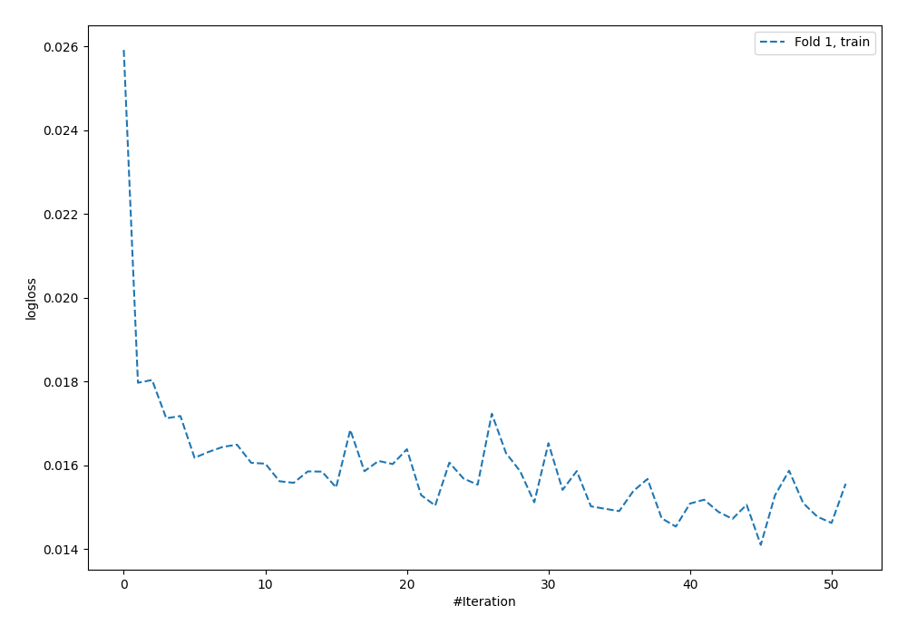
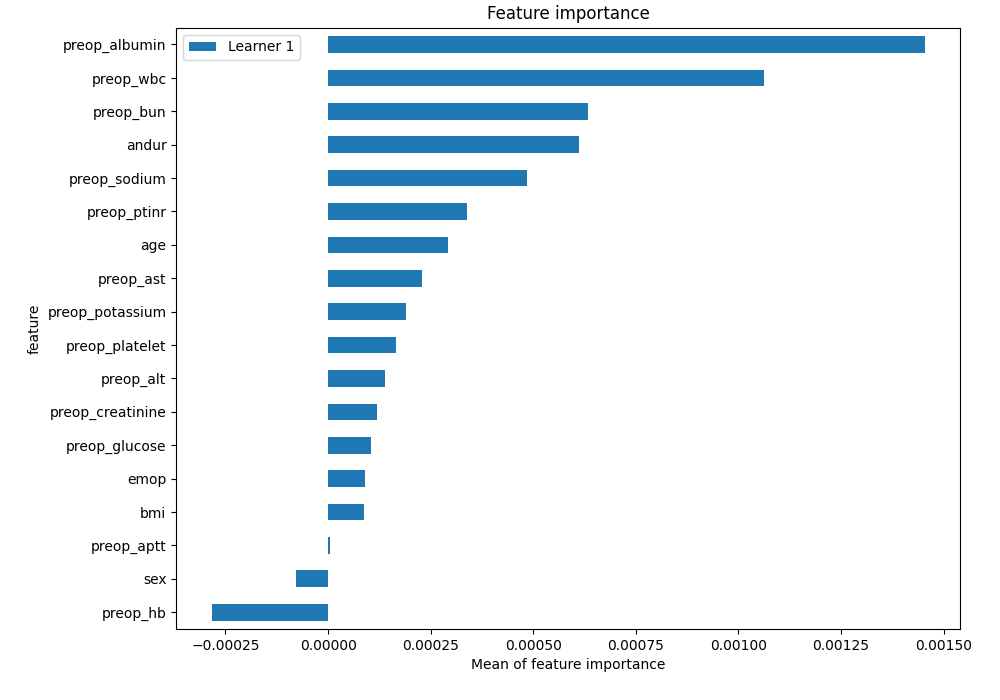
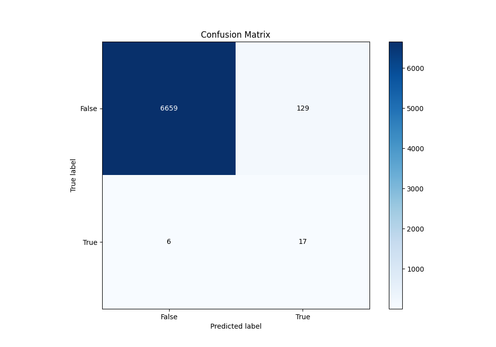
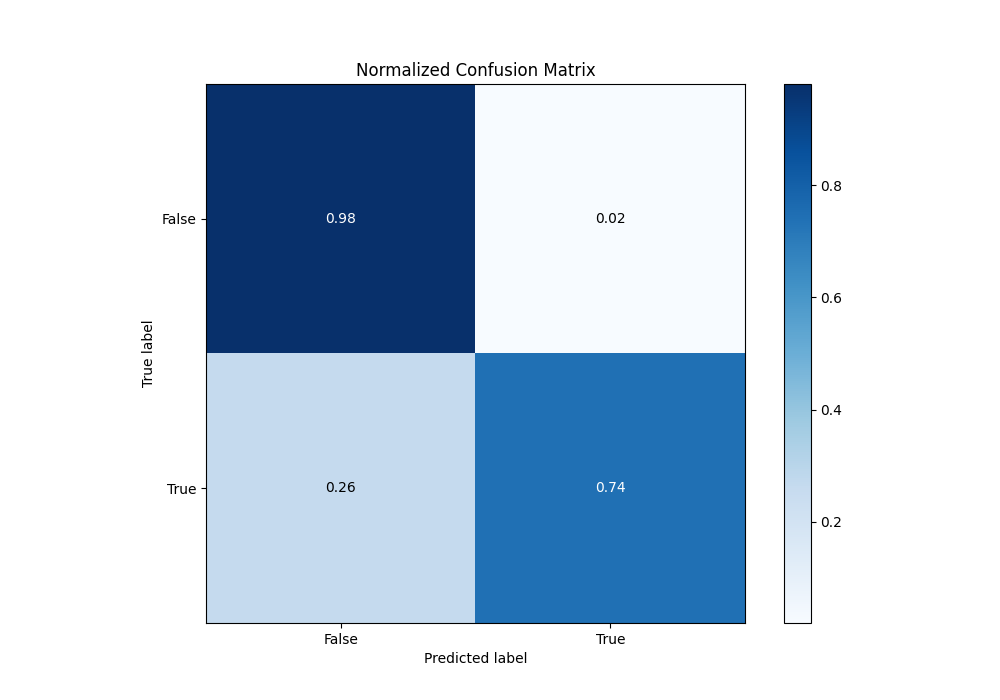
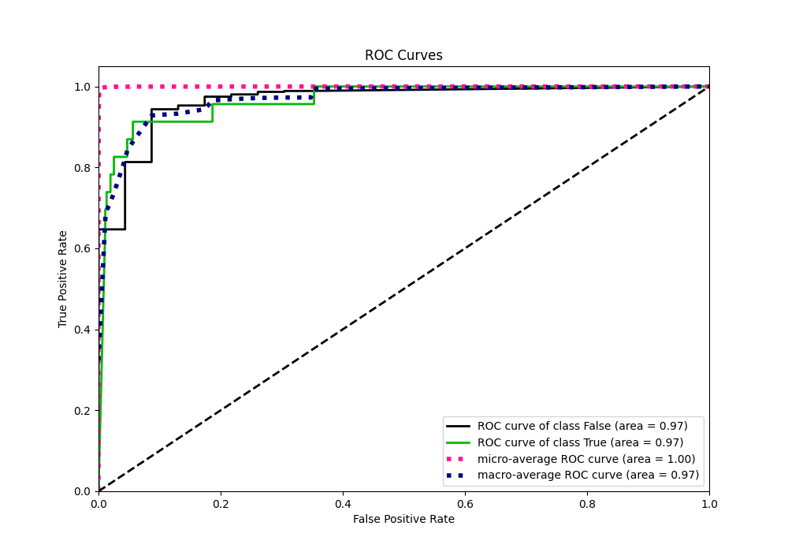
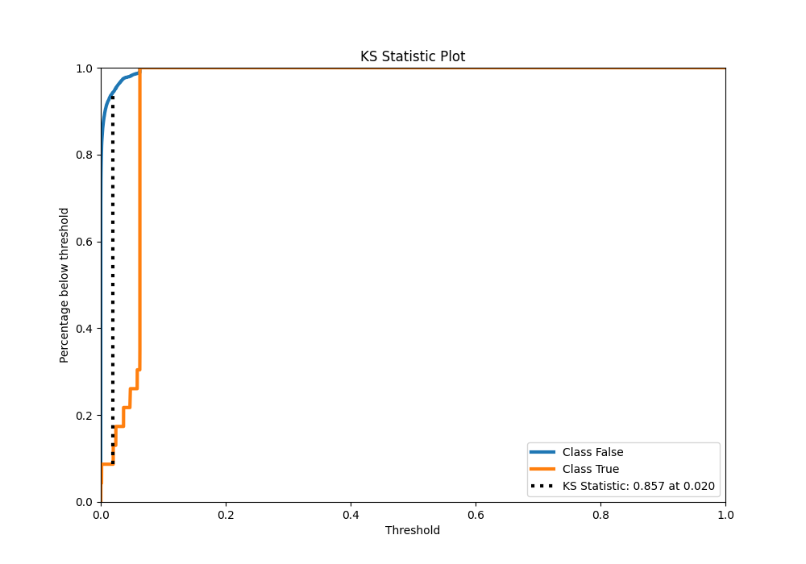
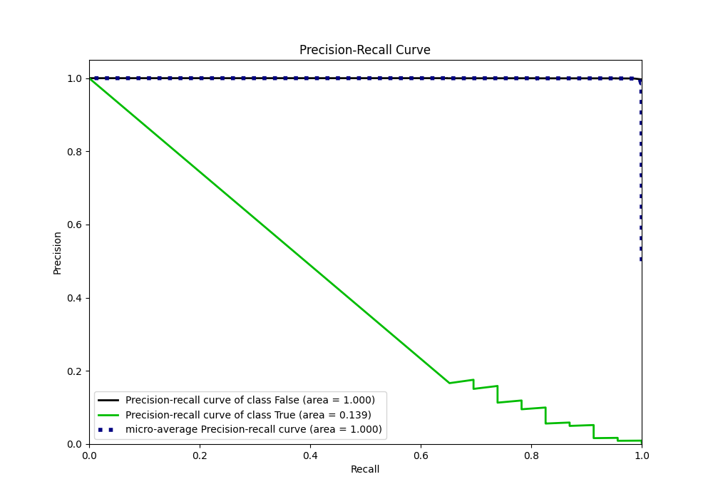
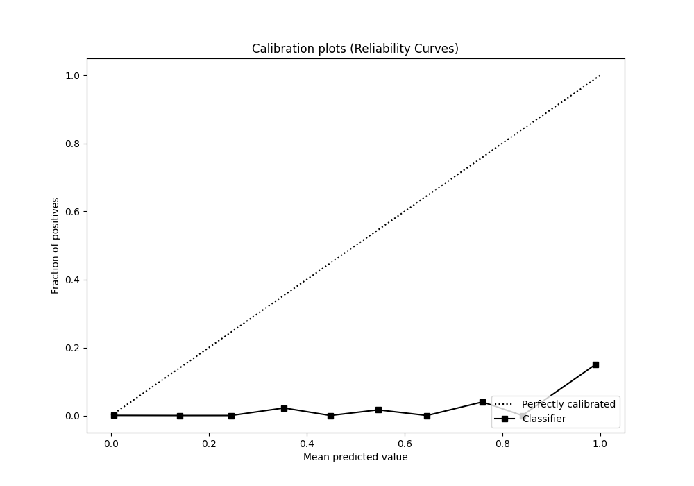
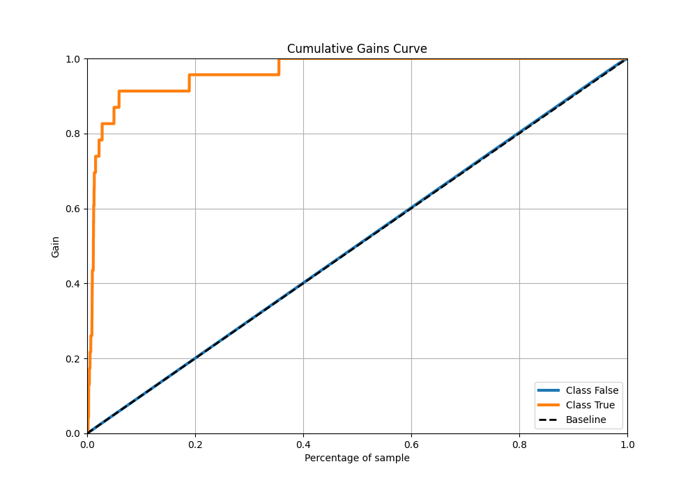
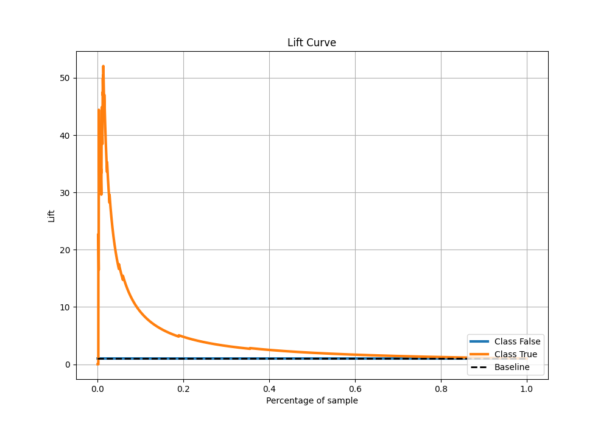

# Summary of 59_NeuralNetwork

[<< Go back](../README.md)

## Neural Network
- **n_jobs**: -1
- **dense_1_size**: 32
- **dense_2_size**: 32
- **learning_rate**: 0.05
- **explain_level**: 2

## Validation
 - **validation_type**: split
 - **train_ratio**: 0.9
 - **shuffle**: True
 - **stratify**: True

## Optimized metric
auc

## Training time

13.3 seconds

## Metric details
|           |     score |      threshold |
|:----------|----------:|---------------:|
| logloss   | 0.0145326 | nan            |
| auc       | 0.965441  | nan            |
| f1        | 0.201183  |   0.048473     |
| accuracy  | 0.980179  |   0.048473     |
| precision | 0.116438  |   0.048473     |
| recall    | 1         |   4.42006e-215 |
| mcc       | 0.288448  |   0.048473     |

## Metric details with threshold from accuracy metric
|           |     score |   threshold |
|:----------|----------:|------------:|
| logloss   | 0.0145326 |  nan        |
| auc       | 0.965441  |  nan        |
| f1        | 0.201183  |    0.048473 |
| accuracy  | 0.980179  |    0.048473 |
| precision | 0.116438  |    0.048473 |
| recall    | 0.73913   |    0.048473 |
| mcc       | 0.288448  |    0.048473 |

## Confusion matrix (at threshold=0.048473)
|              |   Predicted as 0 |   Predicted as 1 |
|:-------------|-----------------:|-----------------:|
| Labeled as 0 |             6659 |              129 |
| Labeled as 1 |                6 |               17 |

## Learning curves

## Permutation-based Importance

## Confusion Matrix

## Normalized Confusion Matrix

## ROC Curve

## Kolmogorov-Smirnov Statistic

## Precision-Recall Curve

## Calibration Curve

## Cumulative Gains Curve

## Lift Curve

[<< Go back](../README.md)
