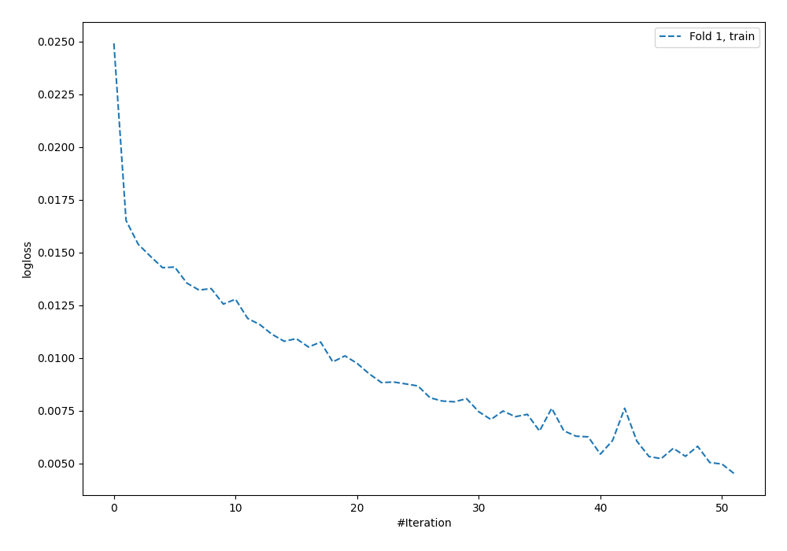
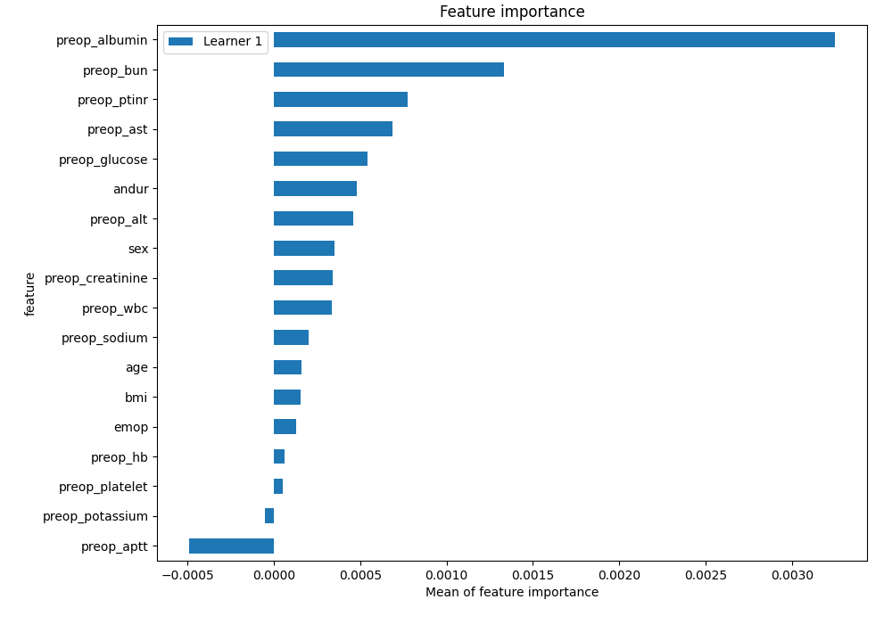
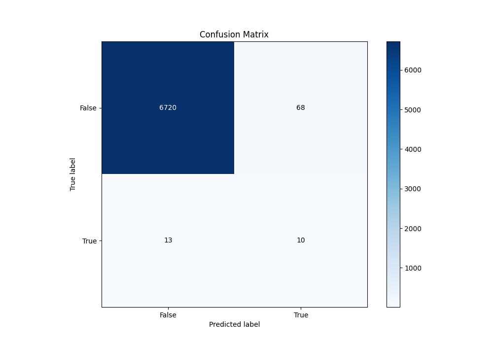
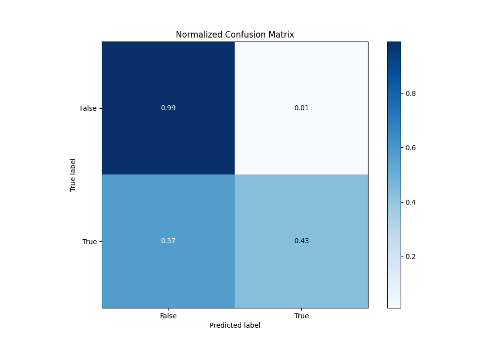
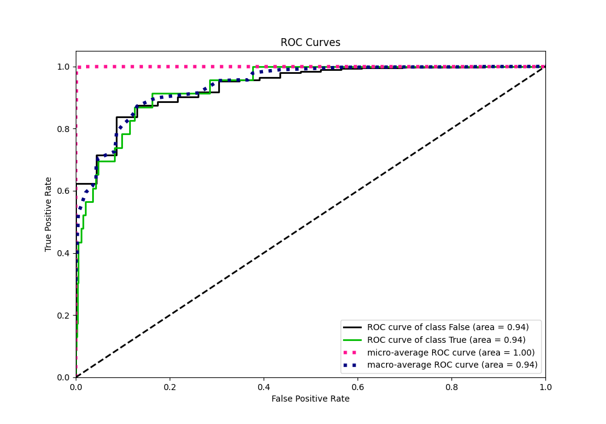
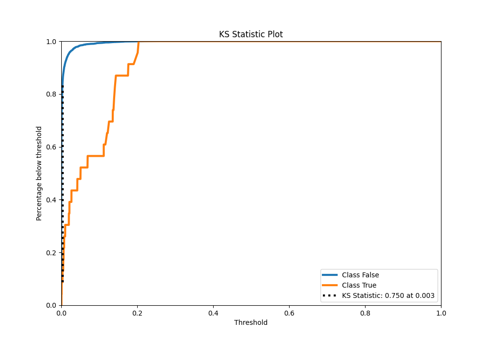
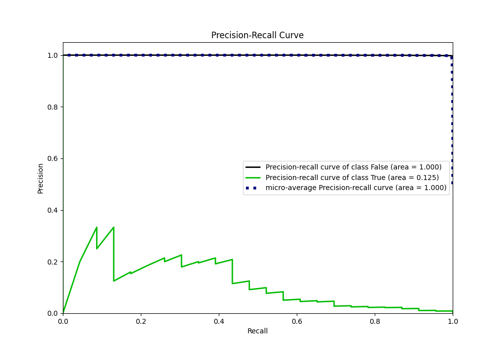
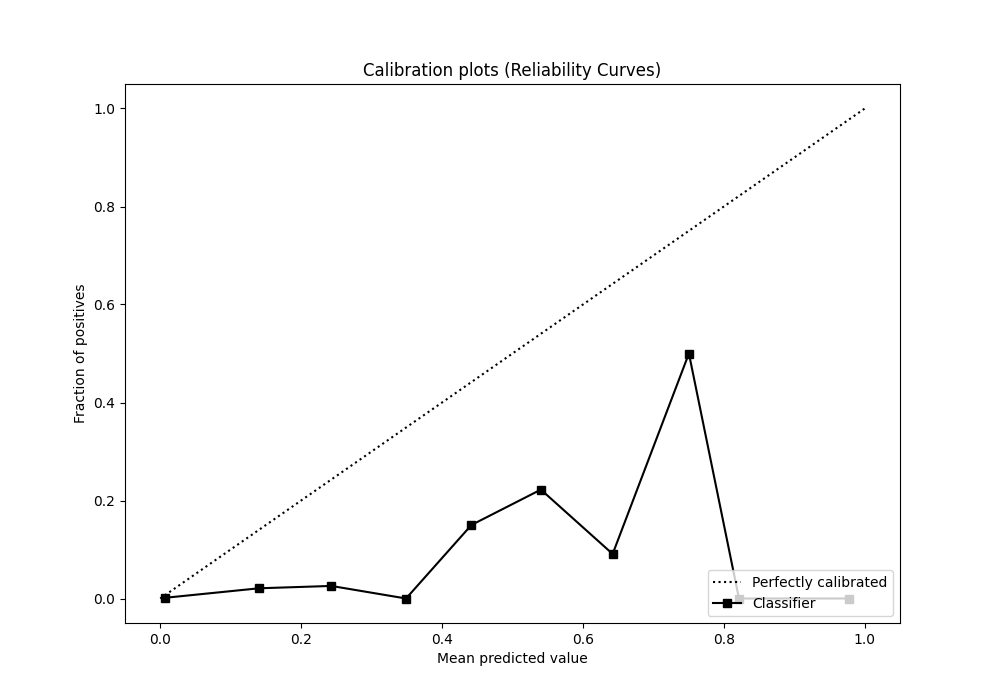
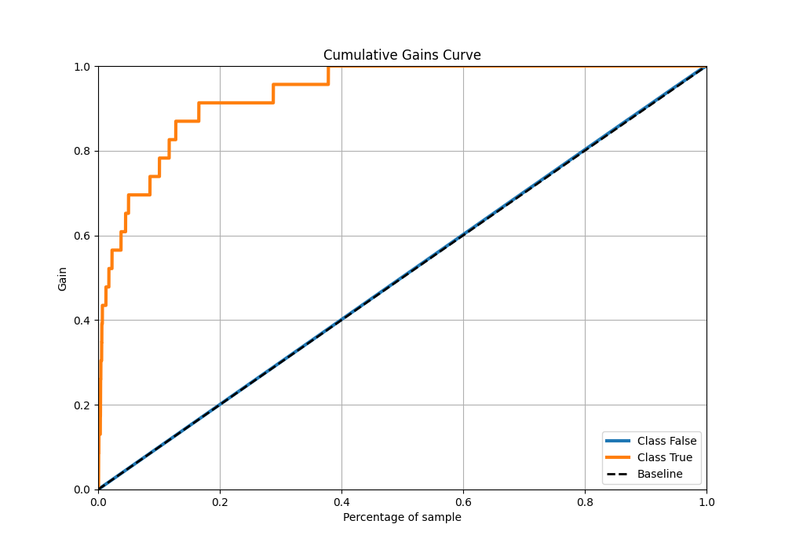
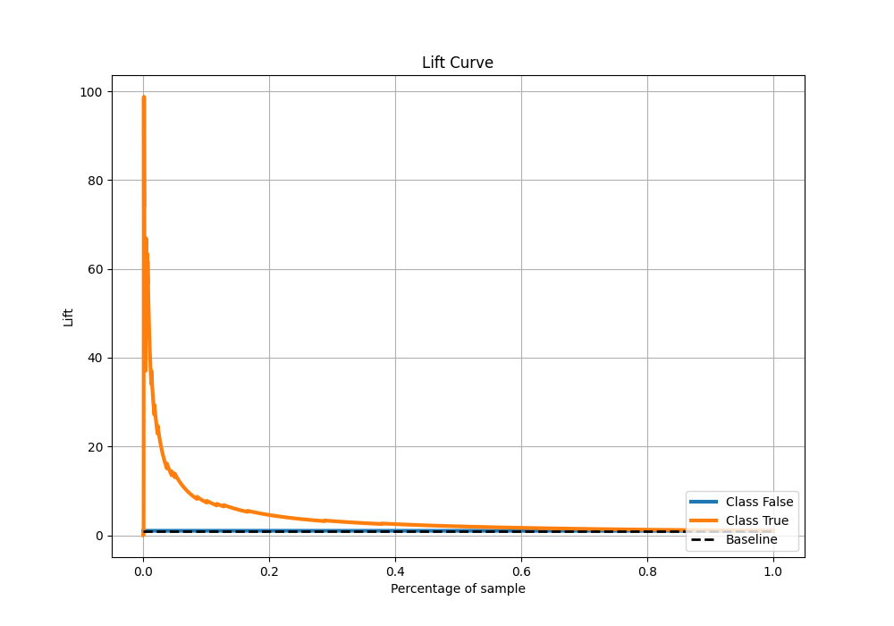

# Summary of 60_NeuralNetwork

[<< Go back](../README.md)

## Neural Network
- **n_jobs**: -1
- **dense_1_size**: 64
- **dense_2_size**: 16
- **learning_rate**: 0.01
- **explain_level**: 2

## Validation
 - **validation_type**: split
 - **train_ratio**: 0.9
 - **shuffle**: True
 - **stratify**: True

## Optimized metric
auc

## Training time

14.6 seconds

## Metric details
|           |     score |     threshold |
|:----------|----------:|--------------:|
| logloss   | 0.0157906 | nan           |
| auc       | 0.936858  | nan           |
| f1        | 0.19802   |   0.082279    |
| accuracy  | 0.988107  |   0.082279    |
| precision | 0.128205  |   0.082279    |
| recall    | 1         |   1.5586e-148 |
| mcc       | 0.231596  |   0.082279    |

## Metric details with threshold from accuracy metric
|           |     score |   threshold |
|:----------|----------:|------------:|
| logloss   | 0.0157906 |  nan        |
| auc       | 0.936858  |  nan        |
| f1        | 0.19802   |    0.082279 |
| accuracy  | 0.988107  |    0.082279 |
| precision | 0.128205  |    0.082279 |
| recall    | 0.434783  |    0.082279 |
| mcc       | 0.231596  |    0.082279 |

## Confusion matrix (at threshold=0.082279)
|              |   Predicted as 0 |   Predicted as 1 |
|:-------------|-----------------:|-----------------:|
| Labeled as 0 |             6720 |               68 |
| Labeled as 1 |               13 |               10 |

## Learning curves

## Permutation-based Importance

## Confusion Matrix

## Normalized Confusion Matrix

## ROC Curve

## Kolmogorov-Smirnov Statistic

## Precision-Recall Curve

## Calibration Curve

## Cumulative Gains Curve

## Lift Curve

[<< Go back](../README.md)
