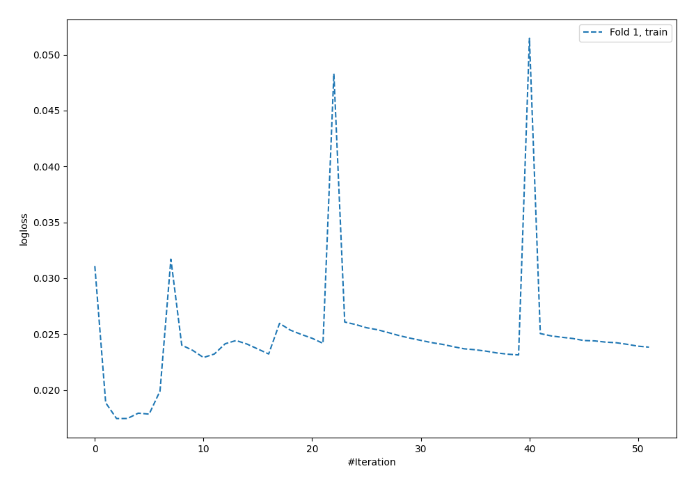
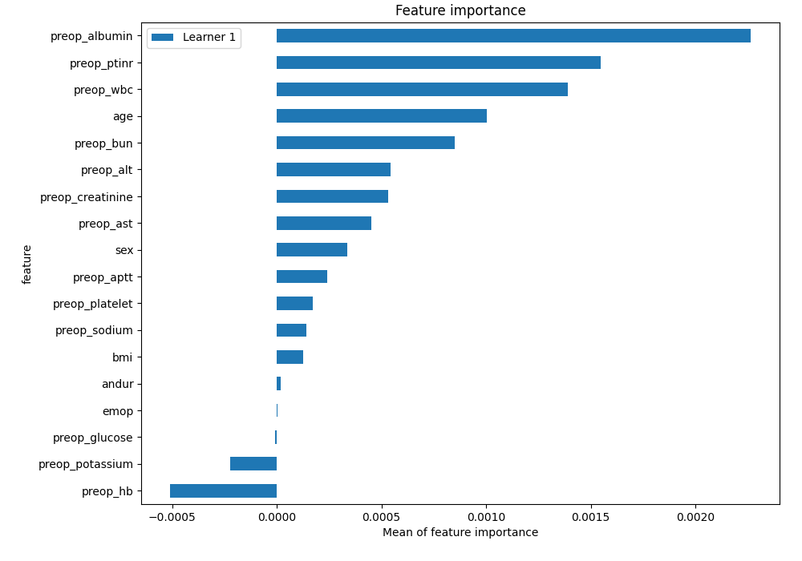
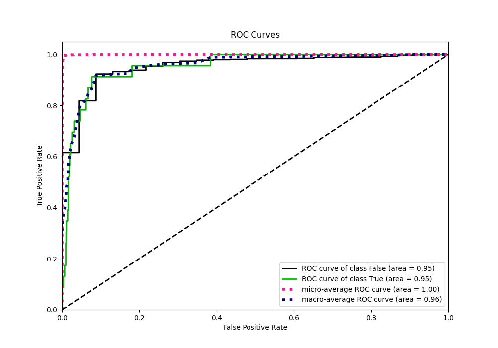
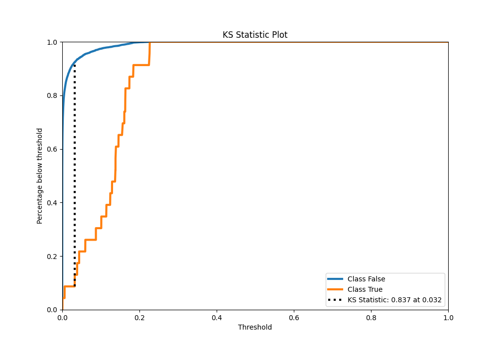
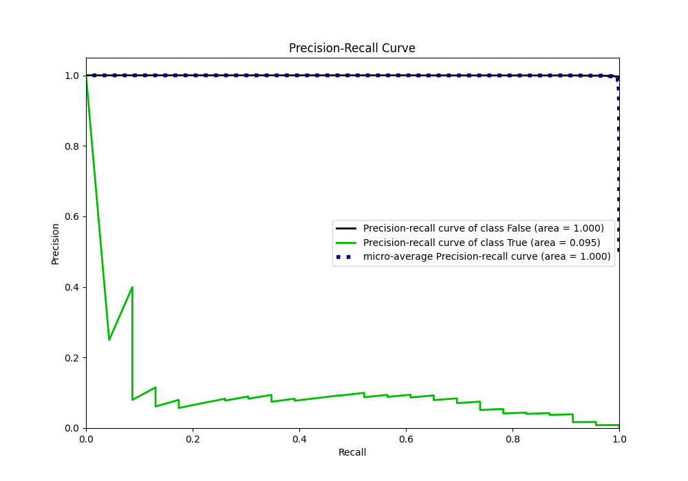
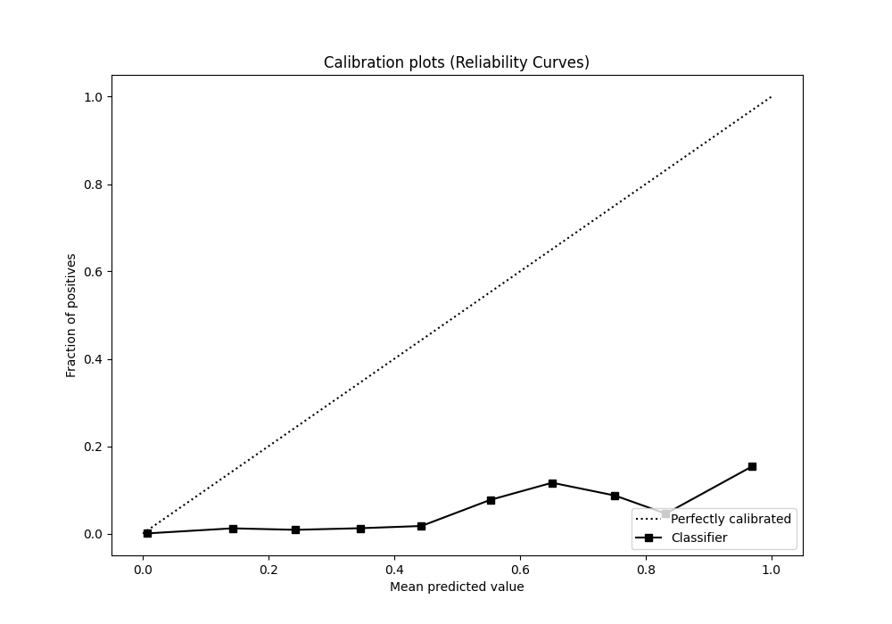
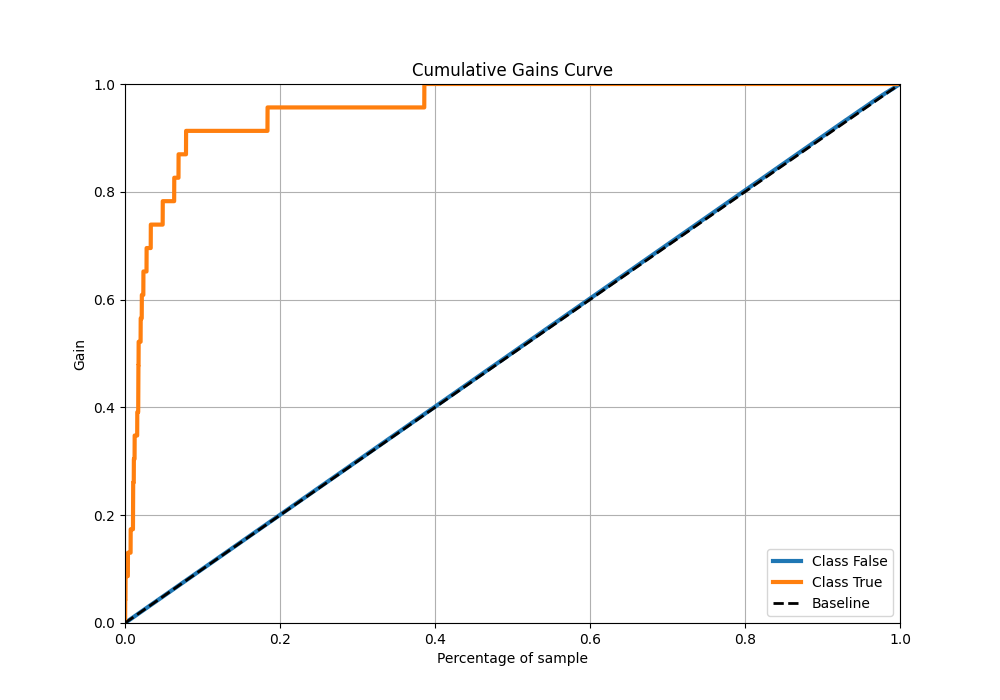
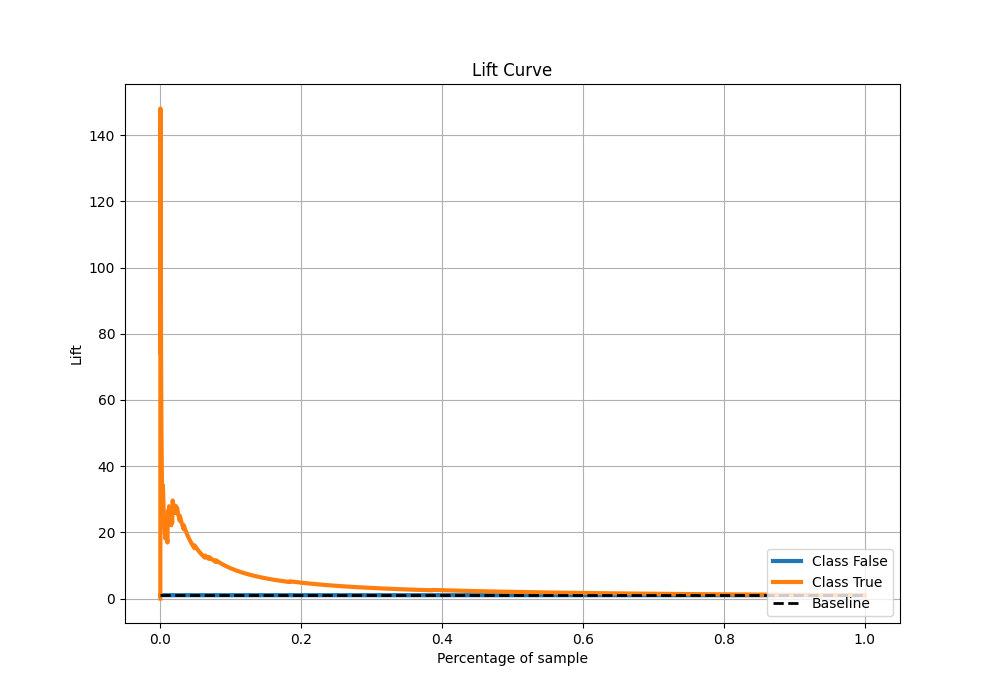

# Summary of 63_NeuralNetwork

[<< Go back](../README.md)

## Neural Network
- **n_jobs**: -1
- **dense_1_size**: 64
- **dense_2_size**: 8
- **learning_rate**: 0.1
- **explain_level**: 2

## Validation
 - **validation_type**: split
 - **train_ratio**: 0.9
 - **shuffle**: True
 - **stratify**: True

## Optimized metric
auc

## Training time

14.3 seconds

## Metric details
|           |     score |      threshold |
|:----------|----------:|---------------:|
| logloss   | 0.0178834 | nan            |
| auc       | 0.954533  | nan            |
| f1        | 0.153846  |   0.125525     |
| accuracy  | 0.987227  |   0.160782     |
| precision | 0.0897436 |   0.160782     |
| recall    | 1         |   5.86509e-224 |
| mcc       | 0.221638  |   0.0922759    |

## Metric details with threshold from accuracy metric
|           |     score |   threshold |
|:----------|----------:|------------:|
| logloss   | 0.0178834 |  nan        |
| auc       | 0.954533  |  nan        |
| f1        | 0.138614  |    0.160782 |
| accuracy  | 0.987227  |    0.160782 |
| precision | 0.0897436 |    0.160782 |
| recall    | 0.304348  |    0.160782 |
| mcc       | 0.160238  |    0.160782 |

## Confusion matrix (at threshold=0.160782)
|              |   Predicted as 0 |   Predicted as 1 |
|:-------------|-----------------:|-----------------:|
| Labeled as 0 |             6717 |               71 |
| Labeled as 1 |               16 |                7 |

## Learning curves

## Permutation-based Importance

## Confusion Matrix

## Normalized Confusion Matrix

## ROC Curve

## Kolmogorov-Smirnov Statistic

## Precision-Recall Curve

## Calibration Curve

## Cumulative Gains Curve

## Lift Curve

[<< Go back](../README.md)
