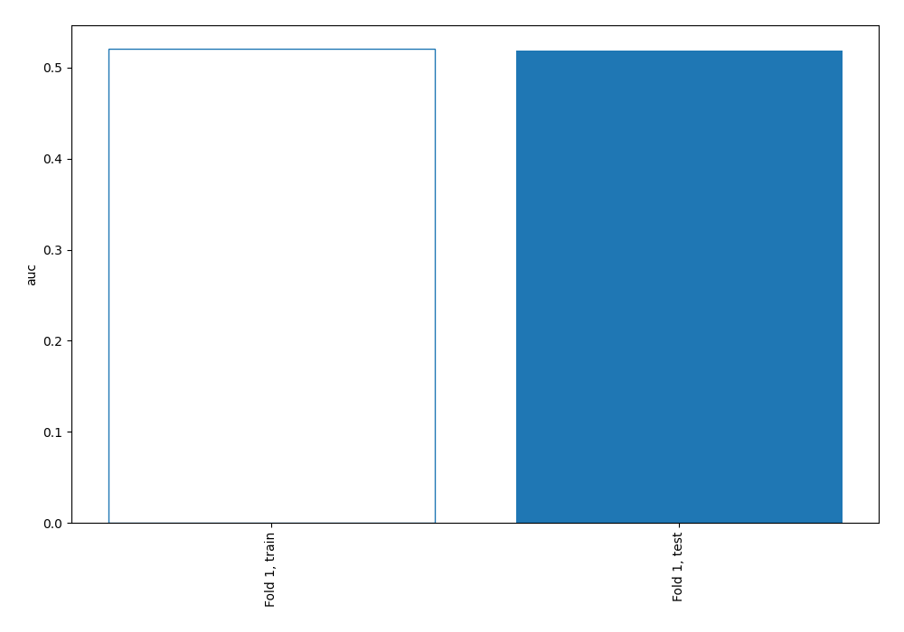
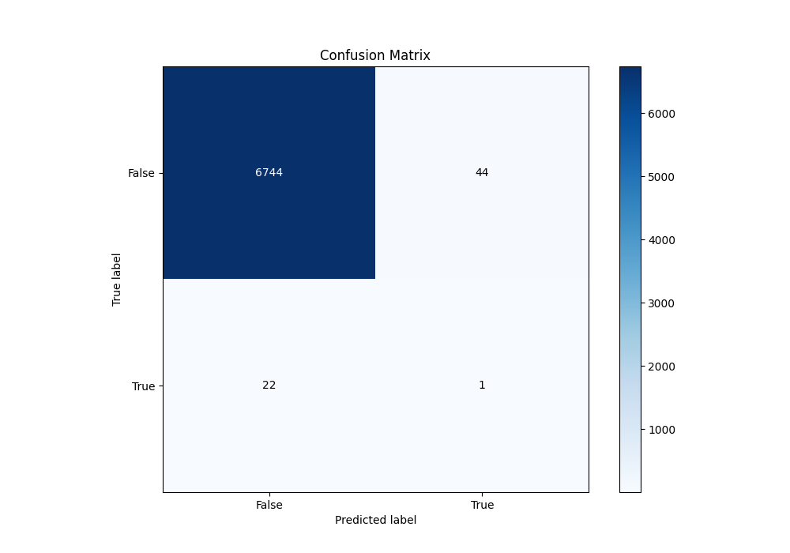
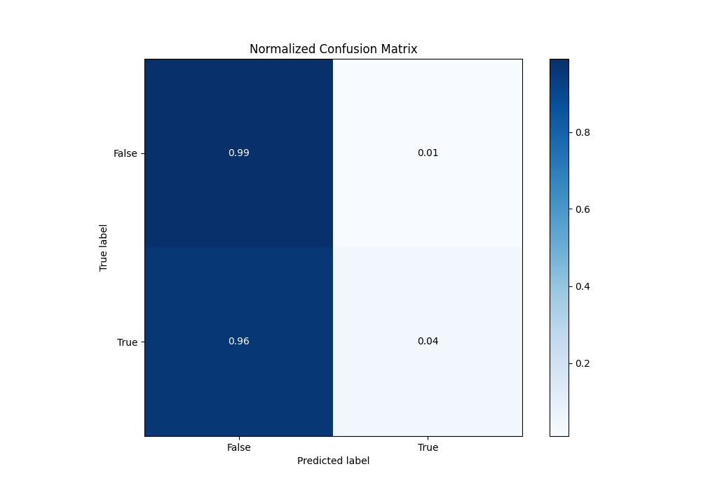
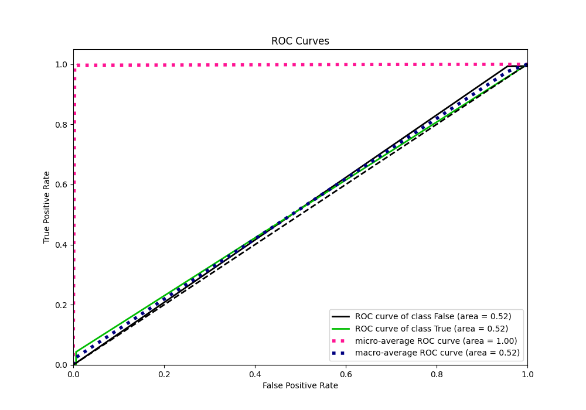
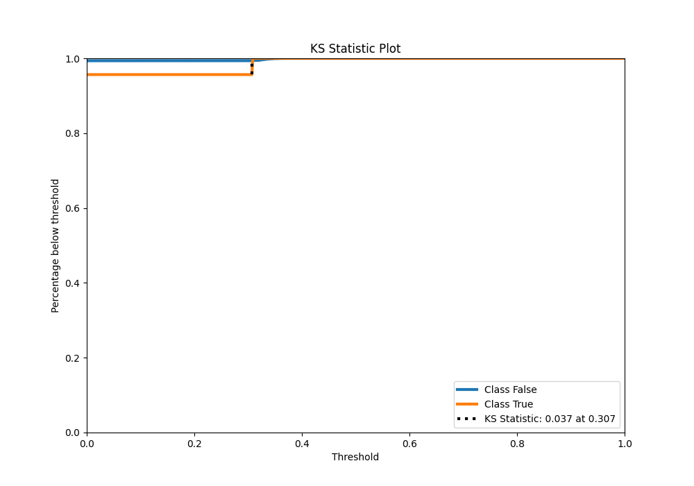
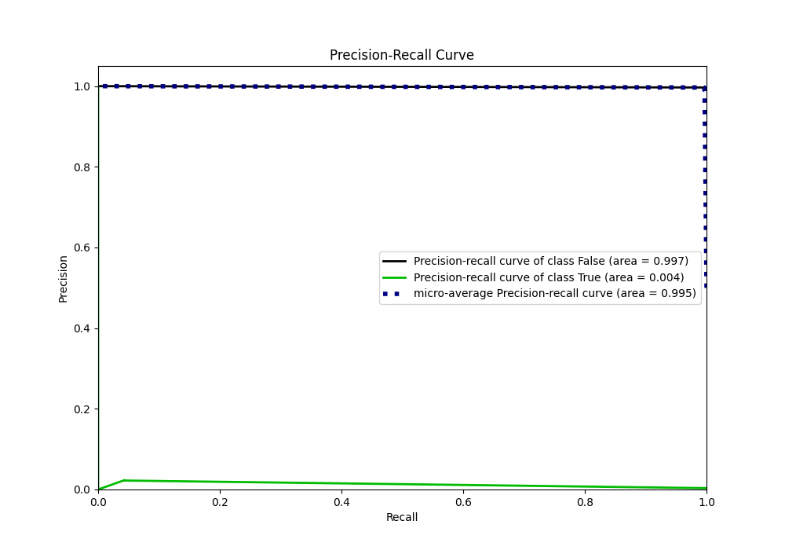
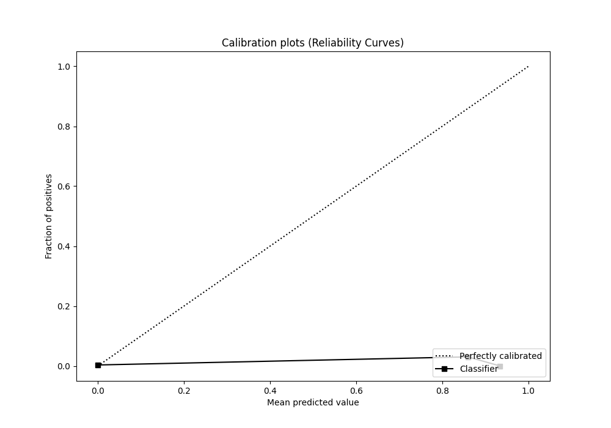
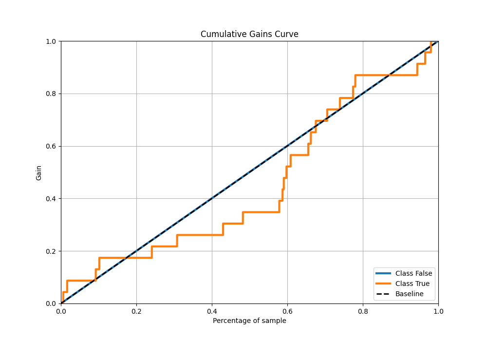
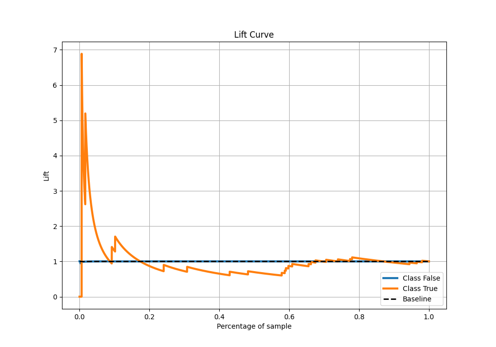

# Summary of 71_NearestNeighbors

[<< Go back](../README.md)

## k-Nearest Neighbors (Nearest Neighbors)
- **n_jobs**: -1
- **n_neighbors**: 3
- **weights**: distance
- **explain_level**: 2

## Validation
 - **validation_type**: split
 - **train_ratio**: 0.9
 - **shuffle**: True
 - **stratify**: True

## Optimized metric
auc

## Training time

5.0 seconds

## Metric details
|           |     score |   threshold |
|:----------|----------:|------------:|
| logloss   | 0.0542709 |         nan |
| auc       | 0.51837   |         nan |
| f1        | 0.0294118 |           0 |
| accuracy  | 0.99031   |           0 |
| precision | 0.0222222 |           0 |
| recall    | 0.0434783 |           0 |
| mcc       | 0.0264923 |           0 |

## Metric details with threshold from accuracy metric
|           |     score |   threshold |
|:----------|----------:|------------:|
| logloss   | 0.0542709 |         nan |
| auc       | 0.51837   |         nan |
| f1        | 0.0294118 |           0 |
| accuracy  | 0.99031   |           0 |
| precision | 0.0222222 |           0 |
| recall    | 0.0434783 |           0 |
| mcc       | 0.0264923 |           0 |

## Confusion matrix (at threshold=0.0)
|              |   Predicted as 0 |   Predicted as 1 |
|:-------------|-----------------:|-----------------:|
| Labeled as 0 |             6744 |               44 |
| Labeled as 1 |               22 |                1 |

## Learning curves

## Confusion Matrix

## Normalized Confusion Matrix

## ROC Curve

## Kolmogorov-Smirnov Statistic

## Precision-Recall Curve

## Calibration Curve

## Cumulative Gains Curve

## Lift Curve

[<< Go back](../README.md)
