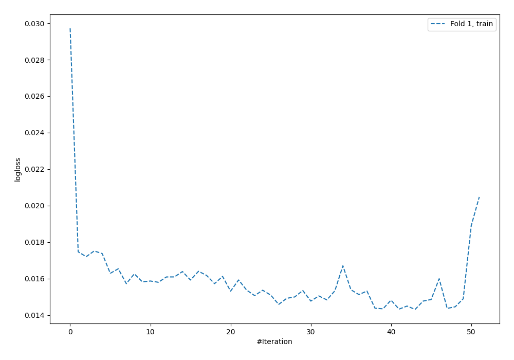
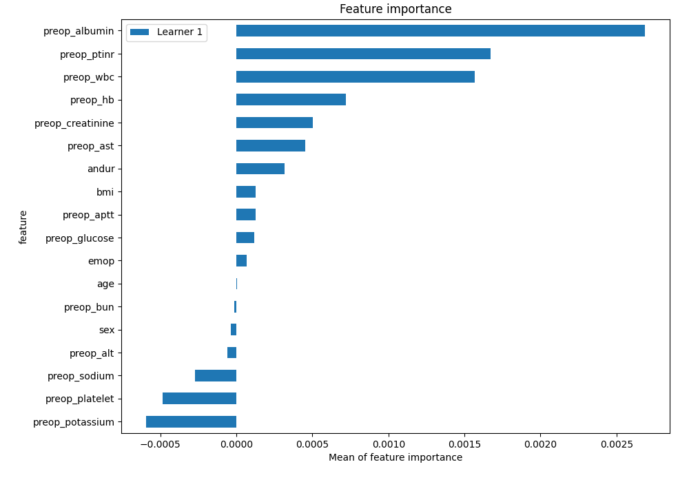
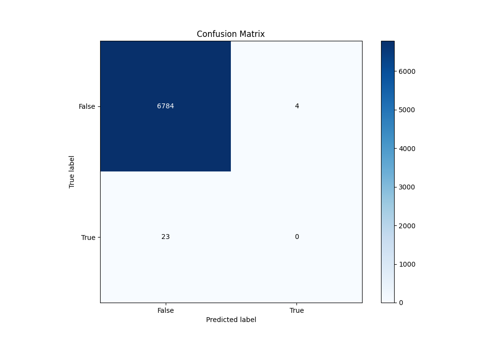
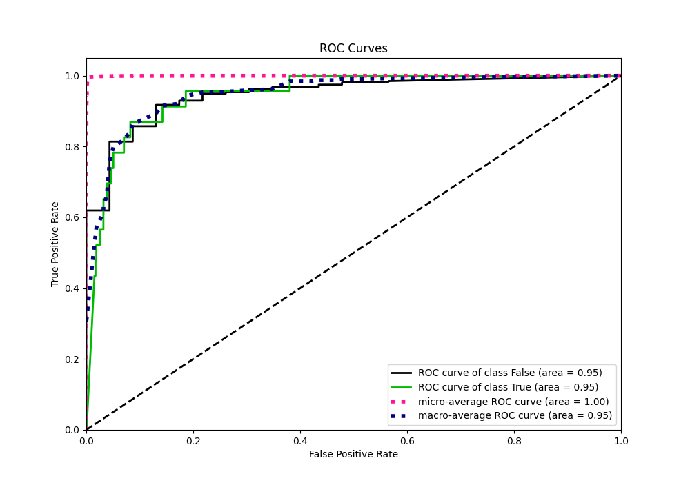
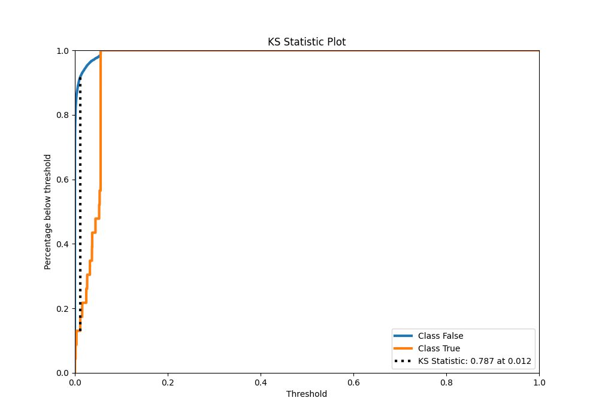
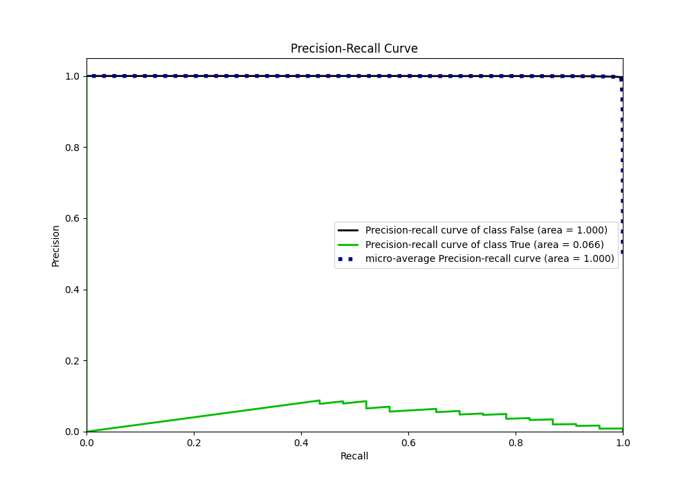
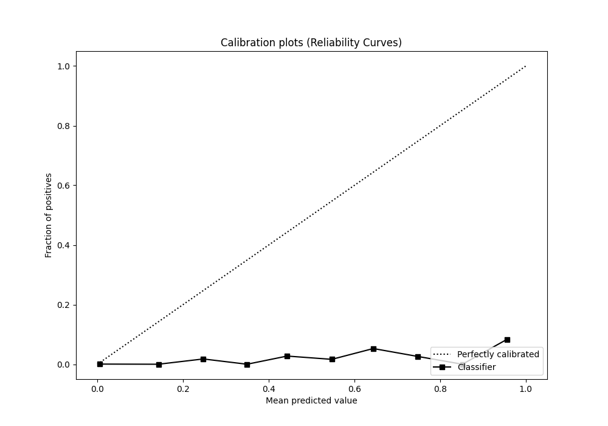
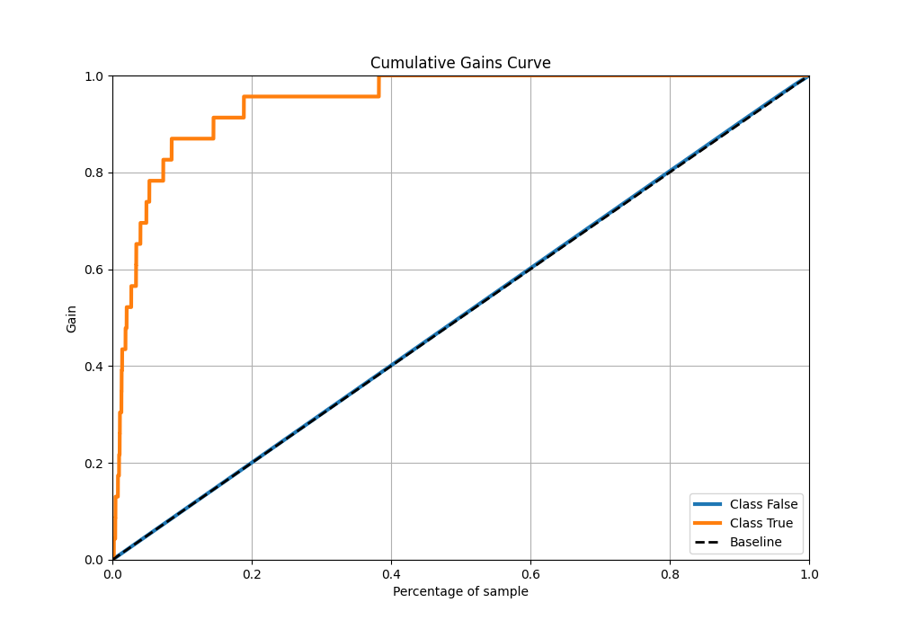
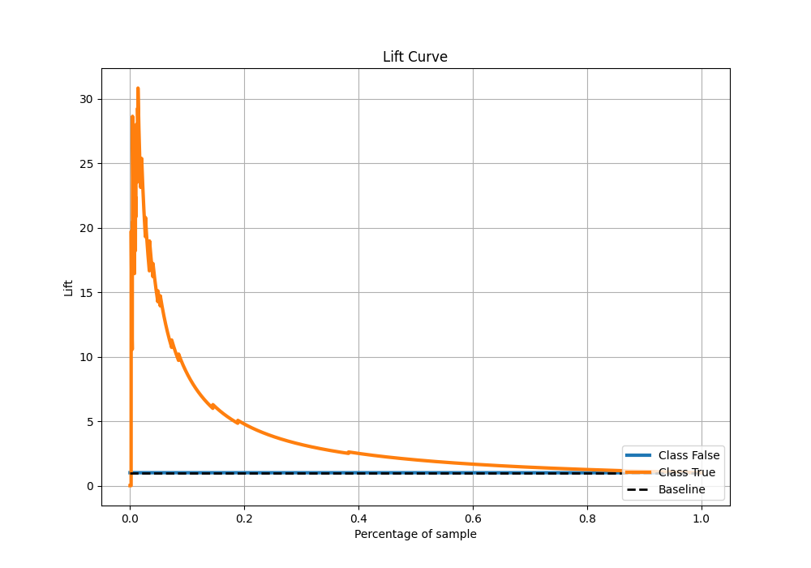

# Summary of 7_Default_NeuralNetwork

[<< Go back](../README.md)

## Neural Network
- **n_jobs**: -1
- **dense_1_size**: 32
- **dense_2_size**: 16
- **learning_rate**: 0.05
- **explain_level**: 2

## Validation
 - **validation_type**: split
 - **train_ratio**: 0.9
 - **shuffle**: True
 - **stratify**: True

## Optimized metric
auc

## Training time

12.4 seconds

## Metric details
|           |     score |      threshold |
|:----------|----------:|---------------:|
| logloss   | 0.0159674 | nan            |
| auc       | 0.947683  | nan            |
| f1        | 0.142012  |   0.0513879    |
| accuracy  | 0.996036  |   0.0555111    |
| precision | 0.0821918 |   0.0513879    |
| recall    | 1         |   6.36885e-244 |
| mcc       | 0.201076  |   0.0513879    |

## Metric details with threshold from accuracy metric
|           |       score |   threshold |
|:----------|------------:|------------:|
| logloss   |  0.0159674  | nan         |
| auc       |  0.947683   | nan         |
| f1        |  0          |   0.0555111 |
| accuracy  |  0.996036   |   0.0555111 |
| precision |  0          |   0.0555111 |
| recall    |  0          |   0.0555111 |
| mcc       | -0.00141106 |   0.0555111 |

## Confusion matrix (at threshold=0.055511)
|              |   Predicted as 0 |   Predicted as 1 |
|:-------------|-----------------:|-----------------:|
| Labeled as 0 |             6784 |                4 |
| Labeled as 1 |               23 |                0 |

## Learning curves

## Permutation-based Importance

## Confusion Matrix

## Normalized Confusion Matrix

## ROC Curve

## Kolmogorov-Smirnov Statistic

## Precision-Recall Curve

## Calibration Curve

## Cumulative Gains Curve

## Lift Curve

[<< Go back](../README.md)
