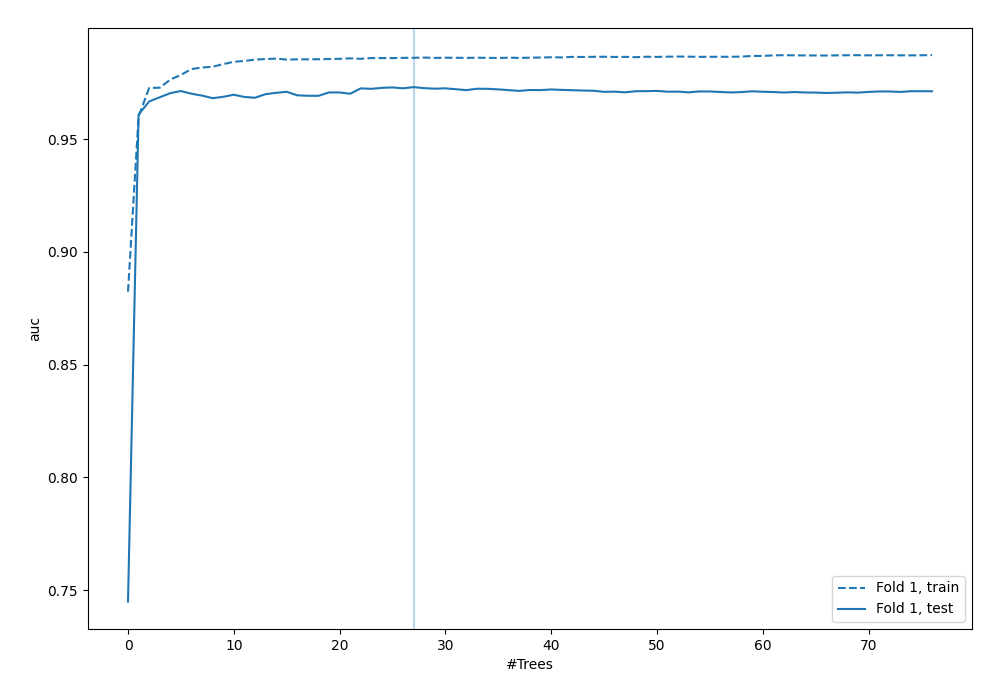
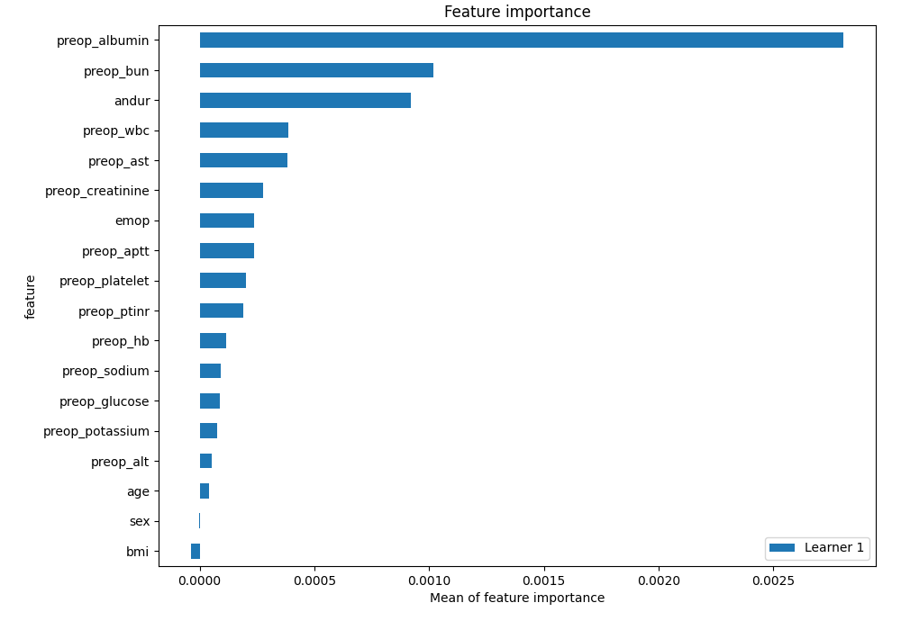
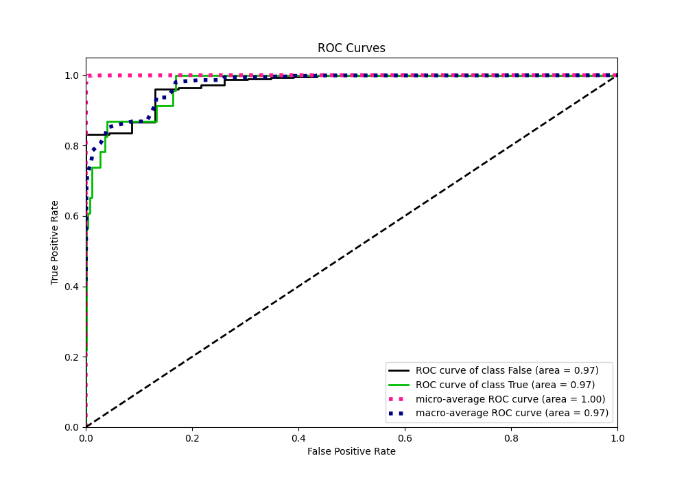
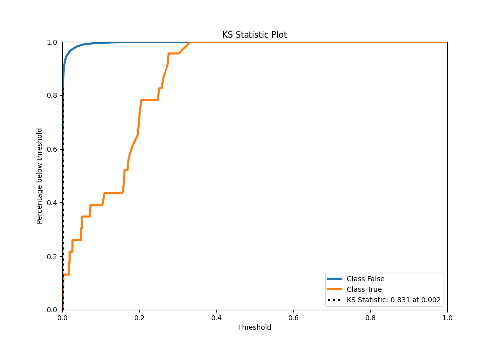
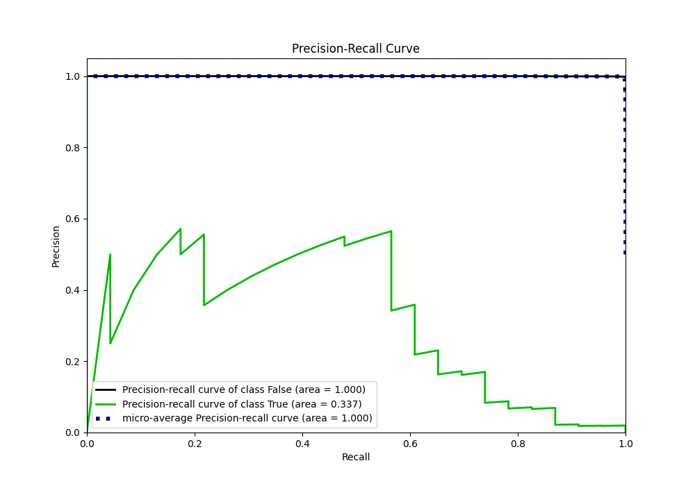
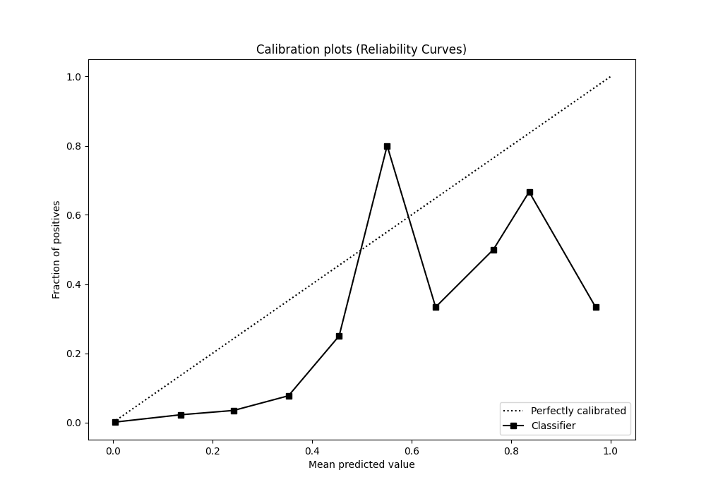
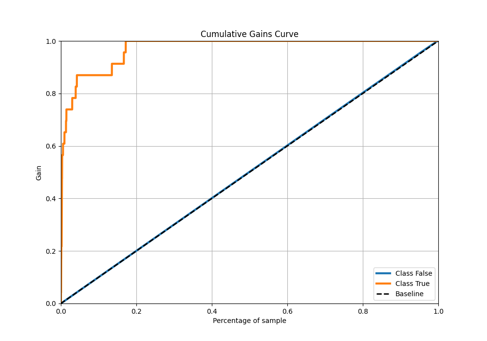
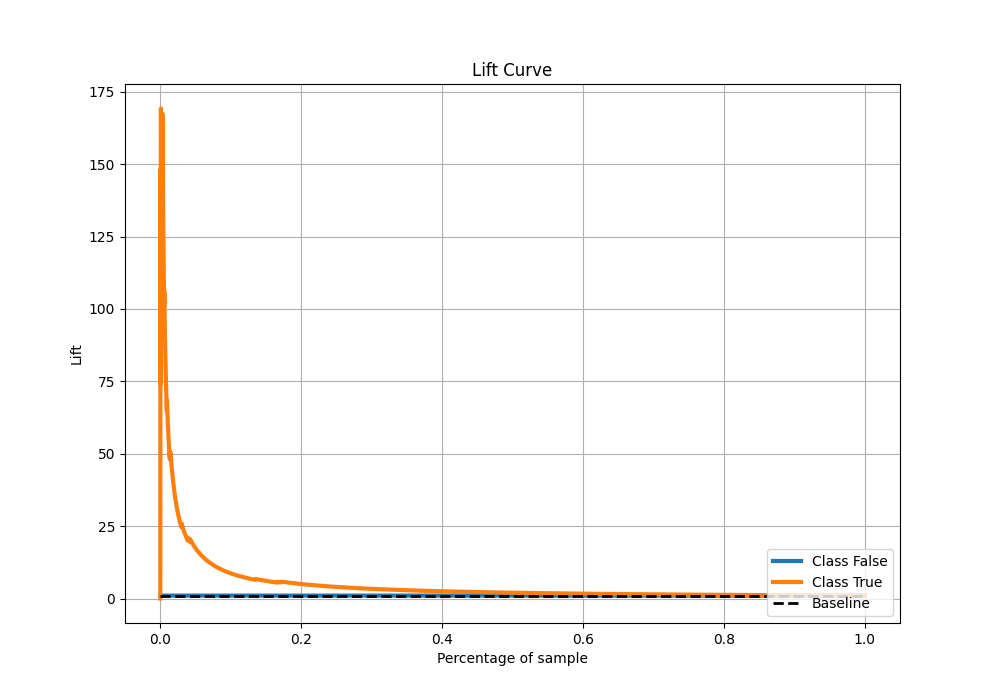

# Summary of 84_RandomForest

[<< Go back](../README.md)

## Random Forest
- **n_jobs**: -1
- **criterion**: entropy
- **max_features**: 0.6
- **min_samples_split**: 40
- **max_depth**: 6
- **eval_metric_name**: auc
- **explain_level**: 2

## Validation
 - **validation_type**: split
 - **train_ratio**: 0.9
 - **shuffle**: True
 - **stratify**: True

## Optimized metric
auc

## Training time

9.4 seconds

## Metric details
|           |     score |     threshold |
|:----------|----------:|--------------:|
| logloss   | 0.0121577 | nan           |
| auc       | 0.973156  | nan           |
| f1        | 0.29703   |   0.061224    |
| accuracy  | 0.989576  |   0.061224    |
| precision | 0.192308  |   0.061224    |
| recall    | 1         |   4.67705e-05 |
| mcc       | 0.350527  |   0.061224    |

## Metric details with threshold from accuracy metric
|           |     score |   threshold |
|:----------|----------:|------------:|
| logloss   | 0.0121577 |  nan        |
| auc       | 0.973156  |  nan        |
| f1        | 0.29703   |    0.061224 |
| accuracy  | 0.989576  |    0.061224 |
| precision | 0.192308  |    0.061224 |
| recall    | 0.652174  |    0.061224 |
| mcc       | 0.350527  |    0.061224 |

## Confusion matrix (at threshold=0.061224)
|              |   Predicted as 0 |   Predicted as 1 |
|:-------------|-----------------:|-----------------:|
| Labeled as 0 |             6725 |               63 |
| Labeled as 1 |                8 |               15 |

## Learning curves

## Permutation-based Importance

## Confusion Matrix

## Normalized Confusion Matrix

## ROC Curve

## Kolmogorov-Smirnov Statistic

## Precision-Recall Curve

## Calibration Curve

## Cumulative Gains Curve

## Lift Curve

[<< Go back](../README.md)
