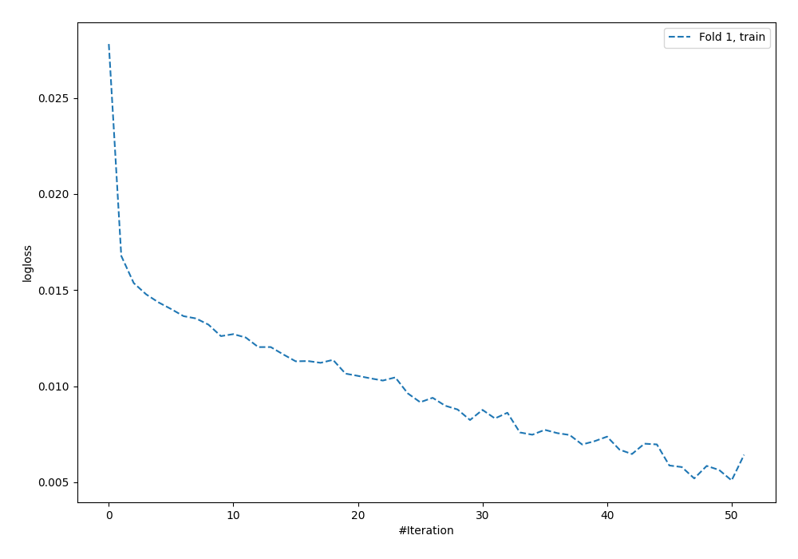
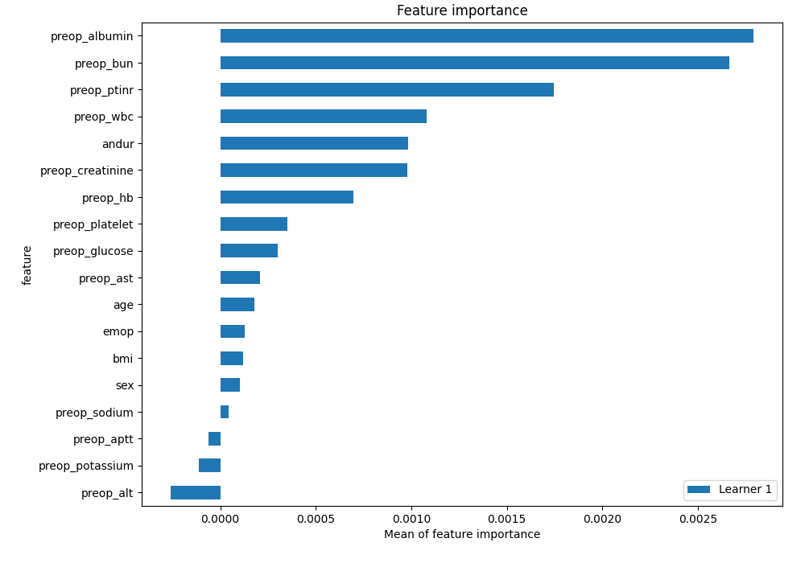
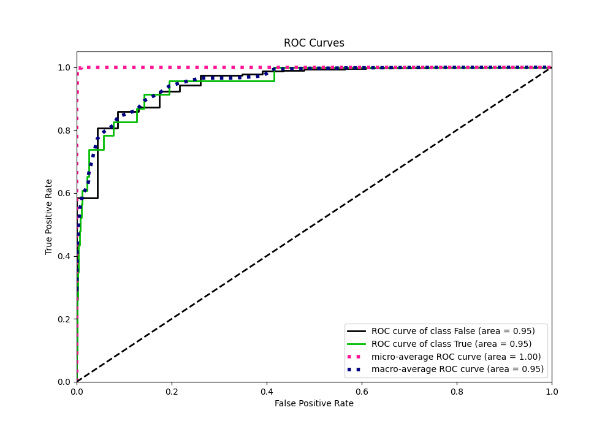
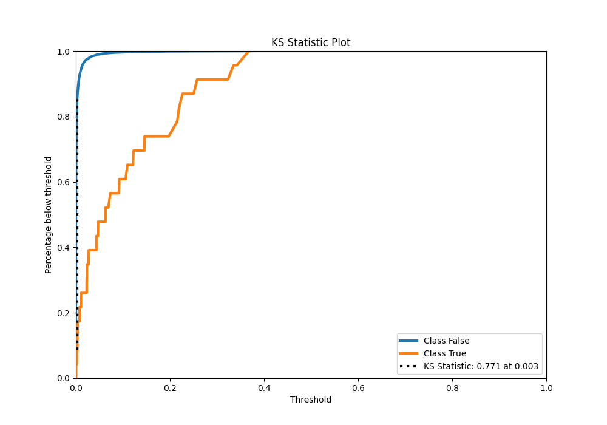
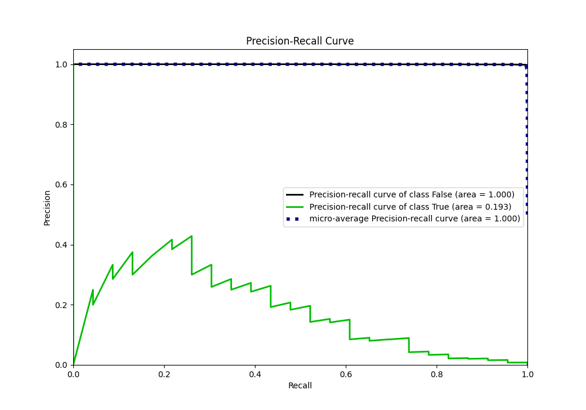
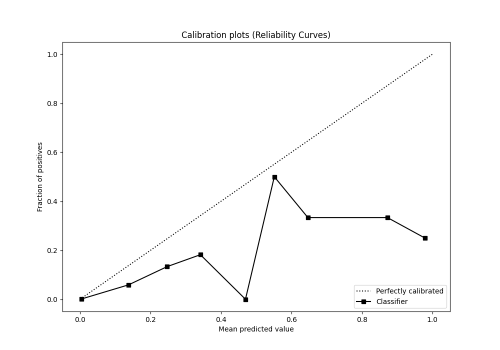
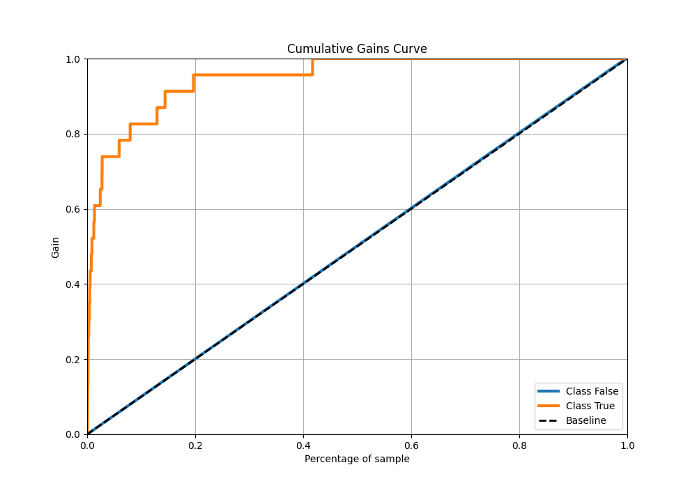
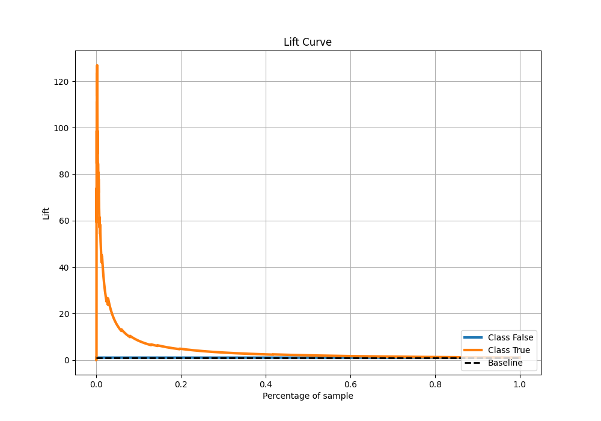

# Summary of 98_NeuralNetwork

[<< Go back](../README.md)

## Neural Network
- **n_jobs**: -1
- **dense_1_size**: 64
- **dense_2_size**: 8
- **learning_rate**: 0.01
- **explain_level**: 2

## Validation
 - **validation_type**: split
 - **train_ratio**: 0.9
 - **shuffle**: True
 - **stratify**: True

## Optimized metric
auc

## Training time

15.1 seconds

## Metric details
|           |     score |      threshold |
|:----------|----------:|---------------:|
| logloss   | 0.0140826 | nan            |
| auc       | 0.950475  | nan            |
| f1        | 0.237624  |   0.050861     |
| accuracy  | 0.988695  |   0.050861     |
| precision | 0.153846  |   0.050861     |
| recall    | 1         |   1.61787e-117 |
| mcc       | 0.279169  |   0.050861     |

## Metric details with threshold from accuracy metric
|           |     score |   threshold |
|:----------|----------:|------------:|
| logloss   | 0.0140826 |  nan        |
| auc       | 0.950475  |  nan        |
| f1        | 0.237624  |    0.050861 |
| accuracy  | 0.988695  |    0.050861 |
| precision | 0.153846  |    0.050861 |
| recall    | 0.521739  |    0.050861 |
| mcc       | 0.279169  |    0.050861 |

## Confusion matrix (at threshold=0.050861)
|              |   Predicted as 0 |   Predicted as 1 |
|:-------------|-----------------:|-----------------:|
| Labeled as 0 |             6722 |               66 |
| Labeled as 1 |               11 |               12 |

## Learning curves

## Permutation-based Importance

## Confusion Matrix

## Normalized Confusion Matrix

## ROC Curve

## Kolmogorov-Smirnov Statistic

## Precision-Recall Curve

## Calibration Curve

## Cumulative Gains Curve

## Lift Curve

[<< Go back](../README.md)
