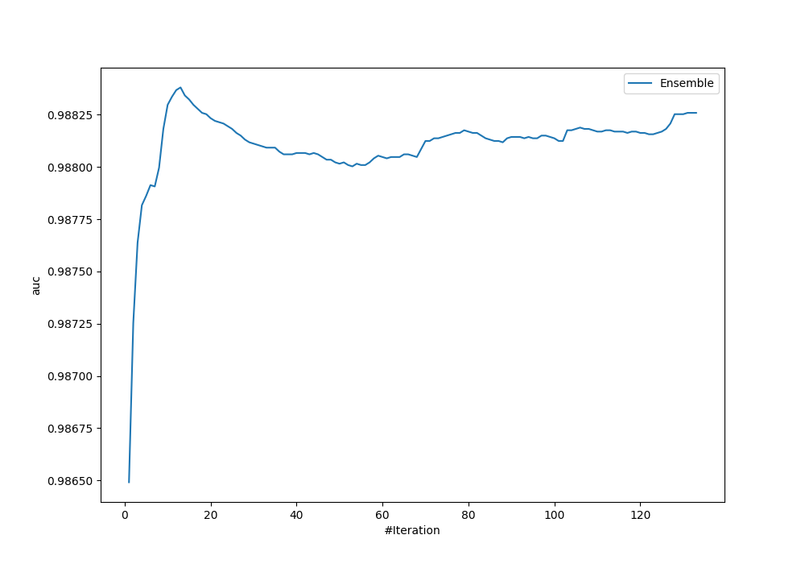
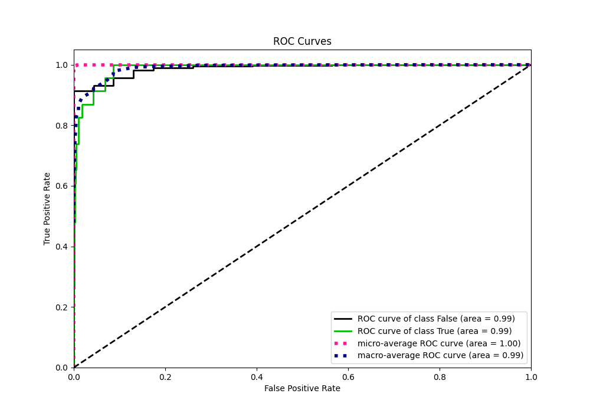
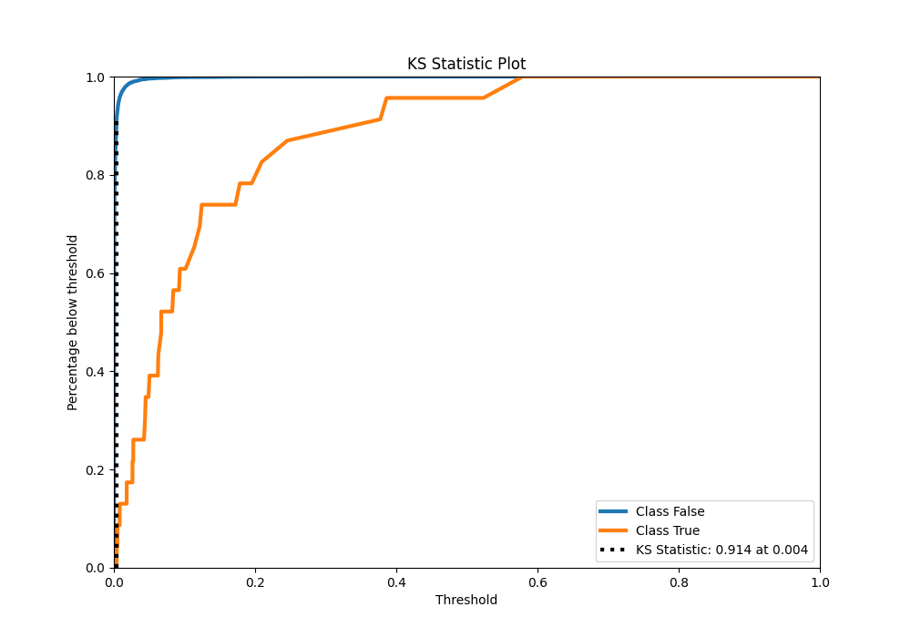
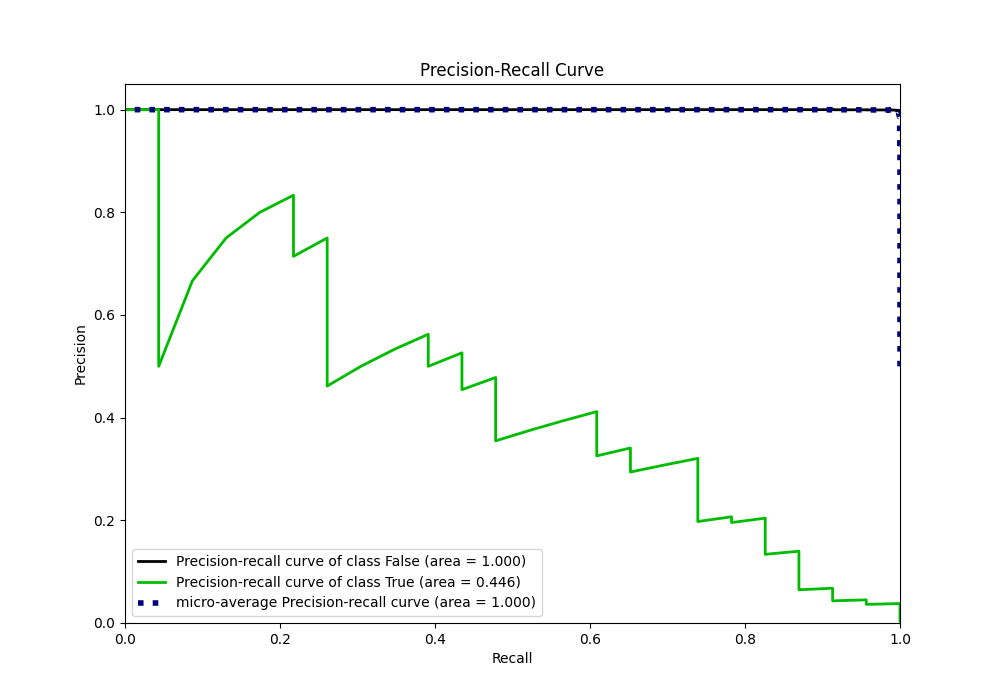
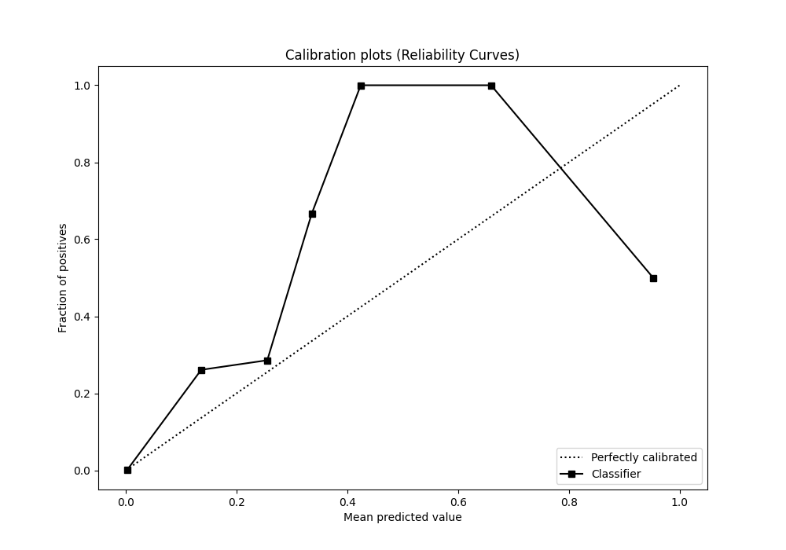
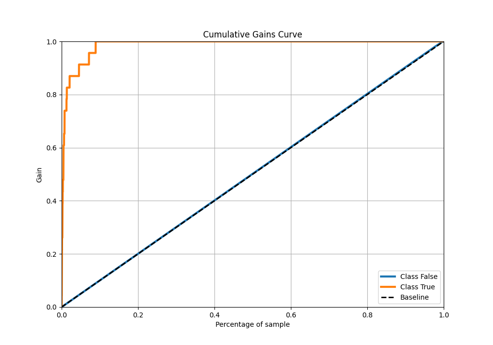
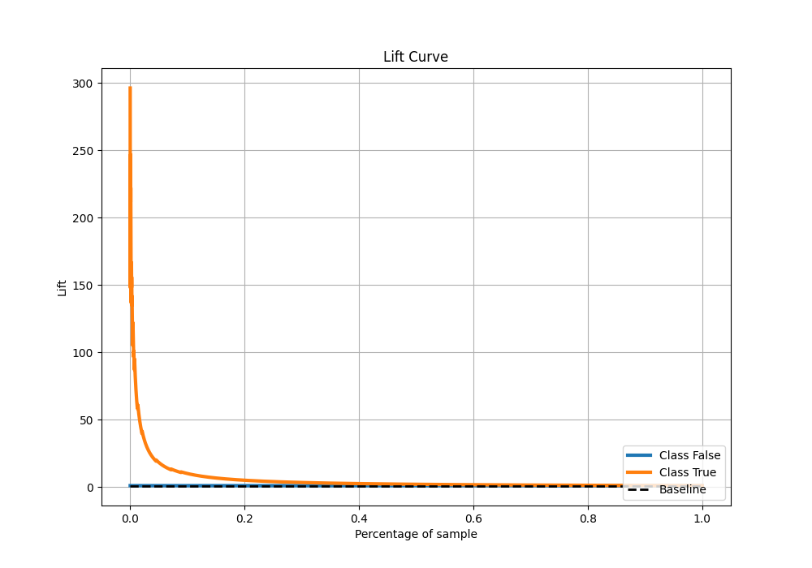

# Summary of Ensemble

[<< Go back](../README.md)

## Ensemble structure
| Model                        |   Weight |
|:-----------------------------|---------:|
| 16_Xgboost                   |        2 |
| 1_DecisionTree               |        1 |
| 26_LightGBM                  |        4 |
| 29_CatBoost_SelectedFeatures |        2 |
| 64_NeuralNetwork             |        1 |
| 75_CatBoost                  |        1 |
| 77_CatBoost_SelectedFeatures |        2 |

## Metric details
|           |     score |     threshold |
|:----------|----------:|--------------:|
| logloss   | 0.0111883 | nan           |
| auc       | 0.988381  | nan           |
| f1        | 0.336634  |   0.0318892   |
| accuracy  | 0.990163  |   0.0318892   |
| precision | 0.217949  |   0.0318892   |
| recall    | 1         |   0.000108363 |
| mcc       | 0.3981    |   0.0318892   |

## Metric details with threshold from accuracy metric
|           |     score |   threshold |
|:----------|----------:|------------:|
| logloss   | 0.0111883 | nan         |
| auc       | 0.988381  | nan         |
| f1        | 0.336634  |   0.0318892 |
| accuracy  | 0.990163  |   0.0318892 |
| precision | 0.217949  |   0.0318892 |
| recall    | 0.73913   |   0.0318892 |
| mcc       | 0.3981    |   0.0318892 |

## Confusion matrix (at threshold=0.031889)
|              |   Predicted as 0 |   Predicted as 1 |
|:-------------|-----------------:|-----------------:|
| Labeled as 0 |             6727 |               61 |
| Labeled as 1 |                6 |               17 |

## Learning curves

## Confusion Matrix

## Normalized Confusion Matrix

## ROC Curve

## Kolmogorov-Smirnov Statistic

## Precision-Recall Curve

## Calibration Curve

## Cumulative Gains Curve

## Lift Curve

[<< Go back](../README.md)
