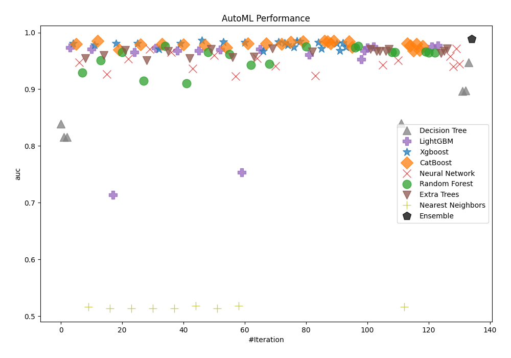
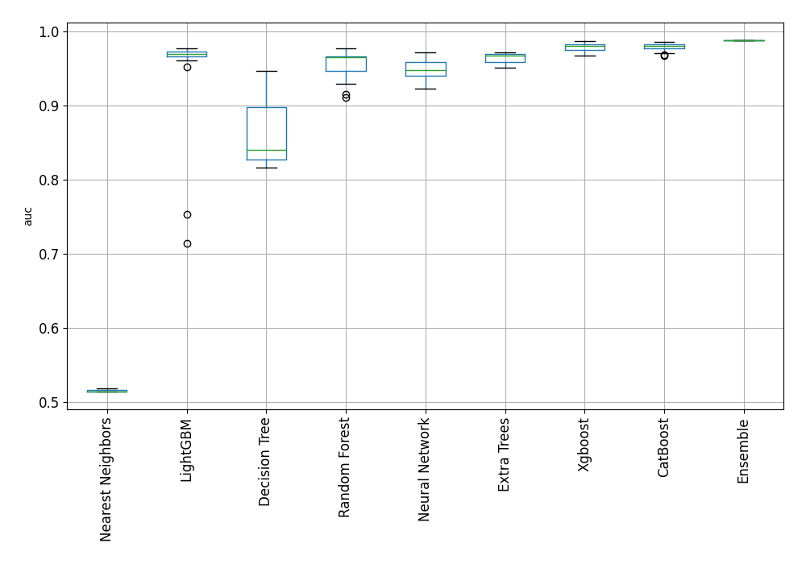
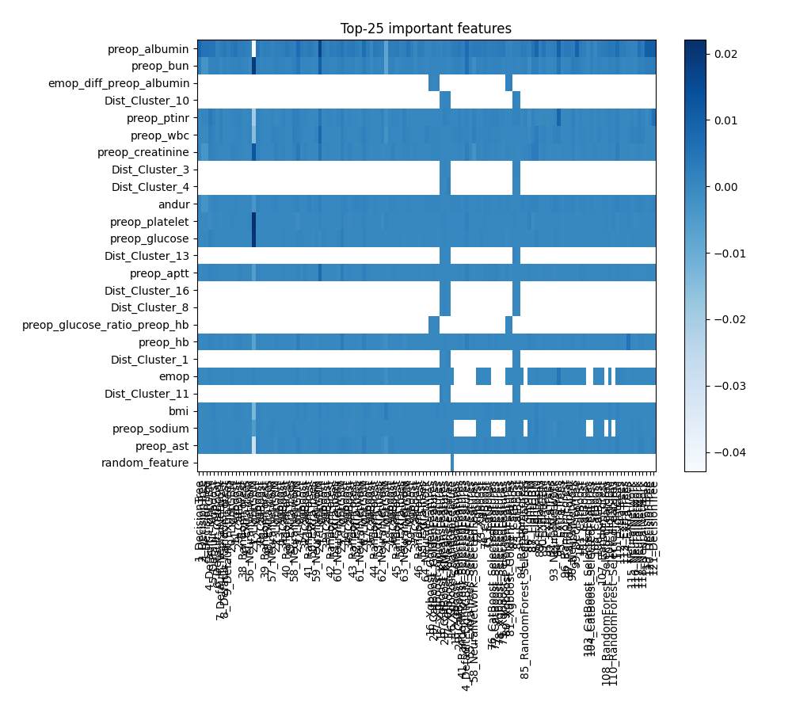
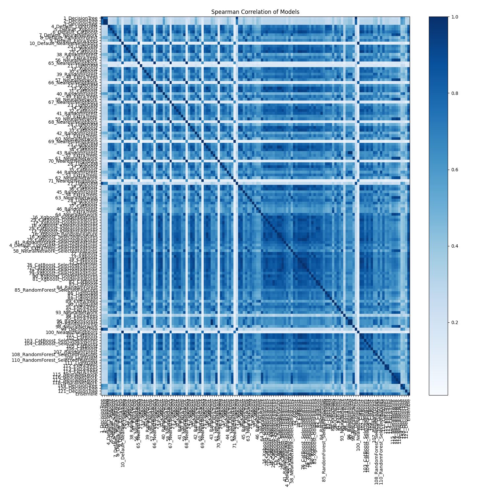

# AutoML Leaderboard

| Best model   | name                                                                                 | model_type        | metric_type   |   metric_value |   train_time |
|:-------------|:-------------------------------------------------------------------------------------|:------------------|:--------------|---------------:|-------------:|
|              | [1_DecisionTree](1_DecisionTree/README.md)                                           | Decision Tree     | auc           |       0.839147 |        17.38 |
|              | [2_DecisionTree](2_DecisionTree/README.md)                                           | Decision Tree     | auc           |       0.815826 |        13.75 |
|              | [3_DecisionTree](3_DecisionTree/README.md)                                           | Decision Tree     | auc           |       0.815826 |        14.26 |
|              | [4_Default_LightGBM](4_Default_LightGBM/README.md)                                   | LightGBM          | auc           |       0.973585 |        20.58 |
|              | [5_Default_Xgboost](5_Default_Xgboost/README.md)                                     | Xgboost           | auc           |       0.98049  |         9.76 |
|              | [6_Default_CatBoost](6_Default_CatBoost/README.md)                                   | CatBoost          | auc           |       0.979805 |         6.22 |
|              | [7_Default_NeuralNetwork](7_Default_NeuralNetwork/README.md)                         | Neural Network    | auc           |       0.947683 |        13.42 |
|              | [8_Default_RandomForest](8_Default_RandomForest/README.md)                           | Random Forest     | auc           |       0.929188 |        11.47 |
|              | [9_Default_ExtraTrees](9_Default_ExtraTrees/README.md)                               | Extra Trees       | auc           |       0.954658 |         7.74 |
|              | [10_Default_NearestNeighbors](10_Default_NearestNeighbors/README.md)                 | Nearest Neighbors | auc           |       0.516141 |         5.2  |
|              | [20_LightGBM](20_LightGBM/README.md)                                                 | LightGBM          | auc           |       0.970395 |         9.22 |
|              | [11_Xgboost](11_Xgboost/README.md)                                                   | Xgboost           | auc           |       0.978363 |        10    |
|              | [29_CatBoost](29_CatBoost/README.md)                                                 | CatBoost          | auc           |       0.985544 |         9.07 |
|              | [38_RandomForest](38_RandomForest/README.md)                                         | Random Forest     | auc           |       0.950828 |         8.21 |
|              | [47_ExtraTrees](47_ExtraTrees/README.md)                                             | Extra Trees       | auc           |       0.959692 |         7.62 |
|              | [56_NeuralNetwork](56_NeuralNetwork/README.md)                                       | Neural Network    | auc           |       0.926315 |        13.1  |
|              | [65_NearestNeighbors](65_NearestNeighbors/README.md)                                 | Nearest Neighbors | auc           |       0.514002 |         4.97 |
|              | [21_LightGBM](21_LightGBM/README.md)                                                 | LightGBM          | auc           |       0.713878 |         9.18 |
|              | [12_Xgboost](12_Xgboost/README.md)                                                   | Xgboost           | auc           |       0.980291 |        11.42 |
|              | [30_CatBoost](30_CatBoost/README.md)                                                 | CatBoost          | auc           |       0.970017 |         5.91 |
|              | [39_RandomForest](39_RandomForest/README.md)                                         | Random Forest     | auc           |       0.965306 |        10.35 |
|              | [48_ExtraTrees](48_ExtraTrees/README.md)                                             | Extra Trees       | auc           |       0.96848  |         8.39 |
|              | [57_NeuralNetwork](57_NeuralNetwork/README.md)                                       | Neural Network    | auc           |       0.953255 |        15.2  |
|              | [66_NearestNeighbors](66_NearestNeighbors/README.md)                                 | Nearest Neighbors | auc           |       0.514079 |         5.05 |
|              | [22_LightGBM](22_LightGBM/README.md)                                                 | LightGBM          | auc           |       0.965668 |         9.16 |
|              | [13_Xgboost](13_Xgboost/README.md)                                                   | Xgboost           | auc           |       0.980733 |        10.47 |
|              | [31_CatBoost](31_CatBoost/README.md)                                                 | CatBoost          | auc           |       0.979241 |         7.09 |
|              | [40_RandomForest](40_RandomForest/README.md)                                         | Random Forest     | auc           |       0.915167 |         8.38 |
|              | [49_ExtraTrees](49_ExtraTrees/README.md)                                             | Extra Trees       | auc           |       0.951215 |         8.03 |
|              | [58_NeuralNetwork](58_NeuralNetwork/README.md)                                       | Neural Network    | auc           |       0.970383 |        16.61 |
|              | [67_NearestNeighbors](67_NearestNeighbors/README.md)                                 | Nearest Neighbors | auc           |       0.514079 |         5.25 |
|              | [23_LightGBM](23_LightGBM/README.md)                                                 | LightGBM          | auc           |       0.972701 |        27.07 |
|              | [14_Xgboost](14_Xgboost/README.md)                                                   | Xgboost           | auc           |       0.970536 |         8.88 |
|              | [32_CatBoost](32_CatBoost/README.md)                                                 | CatBoost          | auc           |       0.979971 |         6.39 |
|              | [41_RandomForest](41_RandomForest/README.md)                                         | Random Forest     | auc           |       0.976583 |         9.61 |
|              | [50_ExtraTrees](50_ExtraTrees/README.md)                                             | Extra Trees       | auc           |       0.967507 |         7.3  |
|              | [59_NeuralNetwork](59_NeuralNetwork/README.md)                                       | Neural Network    | auc           |       0.965441 |        14.22 |
|              | [68_NearestNeighbors](68_NearestNeighbors/README.md)                                 | Nearest Neighbors | auc           |       0.514002 |         5.38 |
|              | [24_LightGBM](24_LightGBM/README.md)                                                 | LightGBM          | auc           |       0.967968 |        12.89 |
|              | [15_Xgboost](15_Xgboost/README.md)                                                   | Xgboost           | auc           |       0.980765 |        10.7  |
|              | [33_CatBoost](33_CatBoost/README.md)                                                 | CatBoost          | auc           |       0.97926  |         6.97 |
|              | [42_RandomForest](42_RandomForest/README.md)                                         | Random Forest     | auc           |       0.910248 |         8.66 |
|              | [51_ExtraTrees](51_ExtraTrees/README.md)                                             | Extra Trees       | auc           |       0.95469  |         9.92 |
|              | [60_NeuralNetwork](60_NeuralNetwork/README.md)                                       | Neural Network    | auc           |       0.936858 |        15.59 |
|              | [69_NearestNeighbors](69_NearestNeighbors/README.md)                                 | Nearest Neighbors | auc           |       0.518498 |         5.37 |
|              | [25_LightGBM](25_LightGBM/README.md)                                                 | LightGBM          | auc           |       0.968282 |        18.55 |
|              | [16_Xgboost](16_Xgboost/README.md)                                                   | Xgboost           | auc           |       0.986492 |        11.38 |
|              | [34_CatBoost](34_CatBoost/README.md)                                                 | CatBoost          | auc           |       0.977985 |         8.74 |
|              | [43_RandomForest](43_RandomForest/README.md)                                         | Random Forest     | auc           |       0.965748 |        10.68 |
|              | [52_ExtraTrees](52_ExtraTrees/README.md)                                             | Extra Trees       | auc           |       0.970495 |         8.15 |
|              | [61_NeuralNetwork](61_NeuralNetwork/README.md)                                       | Neural Network    | auc           |       0.960218 |        14.71 |
|              | [70_NearestNeighbors](70_NearestNeighbors/README.md)                                 | Nearest Neighbors | auc           |       0.514002 |         5.46 |
|              | [26_LightGBM](26_LightGBM/README.md)                                                 | LightGBM          | auc           |       0.969742 |        17.43 |
|              | [17_Xgboost](17_Xgboost/README.md)                                                   | Xgboost           | auc           |       0.983359 |        12.57 |
|              | [35_CatBoost](35_CatBoost/README.md)                                                 | CatBoost          | auc           |       0.973585 |         6.35 |
|              | [44_RandomForest](44_RandomForest/README.md)                                         | Random Forest     | auc           |       0.962145 |         9.98 |
|              | [53_ExtraTrees](53_ExtraTrees/README.md)                                             | Extra Trees       | auc           |       0.956573 |         8.39 |
|              | [62_NeuralNetwork](62_NeuralNetwork/README.md)                                       | Neural Network    | auc           |       0.923247 |        13.1  |
|              | [71_NearestNeighbors](71_NearestNeighbors/README.md)                                 | Nearest Neighbors | auc           |       0.51837  |         5.68 |
|              | [27_LightGBM](27_LightGBM/README.md)                                                 | LightGBM          | auc           |       0.753481 |         8.6  |
|              | [18_Xgboost](18_Xgboost/README.md)                                                   | Xgboost           | auc           |       0.982879 |        11.82 |
|              | [36_CatBoost](36_CatBoost/README.md)                                                 | CatBoost          | auc           |       0.980624 |         7.75 |
|              | [45_RandomForest](45_RandomForest/README.md)                                         | Random Forest     | auc           |       0.94302  |         8.64 |
|              | [54_ExtraTrees](54_ExtraTrees/README.md)                                             | Extra Trees       | auc           |       0.95713  |        15.56 |
|              | [63_NeuralNetwork](63_NeuralNetwork/README.md)                                       | Neural Network    | auc           |       0.954533 |        15.21 |
|              | [28_LightGBM](28_LightGBM/README.md)                                                 | LightGBM          | auc           |       0.97094  |        10.17 |
|              | [19_Xgboost](19_Xgboost/README.md)                                                   | Xgboost           | auc           |       0.967308 |         9.48 |
|              | [37_CatBoost](37_CatBoost/README.md)                                                 | CatBoost          | auc           |       0.980355 |         6.31 |
|              | [46_RandomForest](46_RandomForest/README.md)                                         | Random Forest     | auc           |       0.944666 |         8.87 |
|              | [55_ExtraTrees](55_ExtraTrees/README.md)                                             | Extra Trees       | auc           |       0.97176  |         7.58 |
|              | [64_NeuralNetwork](64_NeuralNetwork/README.md)                                       | Neural Network    | auc           |       0.941108 |        13.77 |
|              | [16_Xgboost_GoldenFeatures](16_Xgboost_GoldenFeatures/README.md)                     | Xgboost           | auc           |       0.983699 |        13.2  |
|              | [29_CatBoost_GoldenFeatures](29_CatBoost_GoldenFeatures/README.md)                   | CatBoost          | auc           |       0.979881 |        11.66 |
|              | [17_Xgboost_GoldenFeatures](17_Xgboost_GoldenFeatures/README.md)                     | Xgboost           | auc           |       0.981438 |        13.74 |
|              | [16_Xgboost_KMeansFeatures](16_Xgboost_KMeansFeatures/README.md)                     | Xgboost           | auc           |       0.977774 |        12.69 |
|              | [29_CatBoost_KMeansFeatures](29_CatBoost_KMeansFeatures/README.md)                   | CatBoost          | auc           |       0.983046 |        17.86 |
|              | [17_Xgboost_KMeansFeatures](17_Xgboost_KMeansFeatures/README.md)                     | Xgboost           | auc           |       0.97427  |        12.58 |
|              | [16_Xgboost_RandomFeature](16_Xgboost_RandomFeature/README.md)                       | Xgboost           | auc           |       0.984736 |         7.94 |
|              | [16_Xgboost_SelectedFeatures](16_Xgboost_SelectedFeatures/README.md)                 | Xgboost           | auc           |       0.98409  |        10.04 |
|              | [29_CatBoost_SelectedFeatures](29_CatBoost_SelectedFeatures/README.md)               | CatBoost          | auc           |       0.984339 |         9.41 |
|              | [41_RandomForest_SelectedFeatures](41_RandomForest_SelectedFeatures/README.md)       | Random Forest     | auc           |       0.974815 |         9.83 |
|              | [4_Default_LightGBM_SelectedFeatures](4_Default_LightGBM_SelectedFeatures/README.md) | LightGBM          | auc           |       0.960422 |        11.96 |
|              | [55_ExtraTrees_SelectedFeatures](55_ExtraTrees_SelectedFeatures/README.md)           | Extra Trees       | auc           |       0.966546 |         8.54 |
|              | [58_NeuralNetwork_SelectedFeatures](58_NeuralNetwork_SelectedFeatures/README.md)     | Neural Network    | auc           |       0.923913 |        16.73 |
|              | [72_Xgboost](72_Xgboost/README.md)                                                   | Xgboost           | auc           |       0.982495 |        10.25 |
|              | [73_Xgboost](73_Xgboost/README.md)                                                   | Xgboost           | auc           |       0.971292 |        10.39 |
|              | [74_CatBoost](74_CatBoost/README.md)                                                 | CatBoost          | auc           |       0.984903 |        10.36 |
|              | [75_CatBoost](75_CatBoost/README.md)                                                 | CatBoost          | auc           |       0.983897 |        10.01 |
|              | [76_CatBoost_SelectedFeatures](76_CatBoost_SelectedFeatures/README.md)               | CatBoost          | auc           |       0.980362 |         9.35 |
|              | [77_CatBoost_SelectedFeatures](77_CatBoost_SelectedFeatures/README.md)               | CatBoost          | auc           |       0.984916 |         8.89 |
|              | [78_Xgboost_SelectedFeatures](78_Xgboost_SelectedFeatures/README.md)                 | Xgboost           | auc           |       0.981021 |         9.67 |
|              | [79_Xgboost_SelectedFeatures](79_Xgboost_SelectedFeatures/README.md)                 | Xgboost           | auc           |       0.967897 |         8.74 |
|              | [80_Xgboost_GoldenFeatures](80_Xgboost_GoldenFeatures/README.md)                     | Xgboost           | auc           |       0.981969 |        12.35 |
|              | [81_Xgboost_GoldenFeatures](81_Xgboost_GoldenFeatures/README.md)                     | Xgboost           | auc           |       0.974392 |        12.23 |
|              | [82_CatBoost](82_CatBoost/README.md)                                                 | CatBoost          | auc           |       0.983968 |        16.52 |
|              | [83_CatBoost](83_CatBoost/README.md)                                                 | CatBoost          | auc           |       0.974751 |        11.65 |
|              | [84_RandomForest](84_RandomForest/README.md)                                         | Random Forest     | auc           |       0.973156 |        10.37 |
|              | [85_RandomForest_SelectedFeatures](85_RandomForest_SelectedFeatures/README.md)       | Random Forest     | auc           |       0.975788 |         9.02 |
|              | [86_LightGBM](86_LightGBM/README.md)                                                 | LightGBM          | auc           |       0.952519 |        14.87 |
|              | [87_LightGBM](87_LightGBM/README.md)                                                 | LightGBM          | auc           |       0.96823  |        15.68 |
|              | [88_LightGBM](88_LightGBM/README.md)                                                 | LightGBM          | auc           |       0.973239 |        29.58 |
|              | [89_ExtraTrees](89_ExtraTrees/README.md)                                             | Extra Trees       | auc           |       0.970565 |         8.01 |
|              | [90_LightGBM](90_LightGBM/README.md)                                                 | LightGBM          | auc           |       0.975013 |        14.31 |
|              | [91_ExtraTrees](91_ExtraTrees/README.md)                                             | Extra Trees       | auc           |       0.966687 |        10.47 |
|              | [92_ExtraTrees](92_ExtraTrees/README.md)                                             | Extra Trees       | auc           |       0.967241 |         8.94 |
|              | [93_NeuralNetwork](93_NeuralNetwork/README.md)                                       | Neural Network    | auc           |       0.942443 |        16.52 |
|              | [94_ExtraTrees](94_ExtraTrees/README.md)                                             | Extra Trees       | auc           |       0.966773 |         8.4  |
|              | [95_ExtraTrees](95_ExtraTrees/README.md)                                             | Extra Trees       | auc           |       0.970341 |         8.55 |
|              | [96_RandomForest](96_RandomForest/README.md)                                         | Random Forest     | auc           |       0.965764 |        11.6  |
|              | [97_RandomForest](97_RandomForest/README.md)                                         | Random Forest     | auc           |       0.965217 |        11.58 |
|              | [98_NeuralNetwork](98_NeuralNetwork/README.md)                                       | Neural Network    | auc           |       0.950475 |        16.07 |
|              | [99_DecisionTree](99_DecisionTree/README.md)                                         | Decision Tree     | auc           |       0.839967 |        14.15 |
|              | [100_NearestNeighbors](100_NearestNeighbors/README.md)                               | Nearest Neighbors | auc           |       0.516083 |         6.34 |
|              | [101_CatBoost](101_CatBoost/README.md)                                               | CatBoost          | auc           |       0.980772 |        12.95 |
|              | [102_CatBoost](102_CatBoost/README.md)                                               | CatBoost          | auc           |       0.977467 |         8.5  |
|              | [103_CatBoost_SelectedFeatures](103_CatBoost_SelectedFeatures/README.md)             | CatBoost          | auc           |       0.967692 |         7.01 |
|              | [104_CatBoost_SelectedFeatures](104_CatBoost_SelectedFeatures/README.md)             | CatBoost          | auc           |       0.979548 |         7.38 |
|              | [105_CatBoost](105_CatBoost/README.md)                                               | CatBoost          | auc           |       0.96848  |         7.21 |
|              | [106_CatBoost](106_CatBoost/README.md)                                               | CatBoost          | auc           |       0.976224 |         8.33 |
|              | [107_RandomForest](107_RandomForest/README.md)                                       | Random Forest     | auc           |       0.966399 |        10.17 |
|              | [108_RandomForest_SelectedFeatures](108_RandomForest_SelectedFeatures/README.md)     | Random Forest     | auc           |       0.964554 |         9.21 |
|              | [109_LightGBM](109_LightGBM/README.md)                                               | LightGBM          | auc           |       0.975167 |        14.15 |
|              | [110_RandomForest_SelectedFeatures](110_RandomForest_SelectedFeatures/README.md)     | Random Forest     | auc           |       0.964137 |         9.34 |
|              | [111_LightGBM](111_LightGBM/README.md)                                               | LightGBM          | auc           |       0.976845 |        16.92 |
|              | [112_ExtraTrees](112_ExtraTrees/README.md)                                           | Extra Trees       | auc           |       0.963519 |         8.44 |
|              | [113_ExtraTrees](113_ExtraTrees/README.md)                                           | Extra Trees       | auc           |       0.96702  |         8.38 |
|              | [114_ExtraTrees](114_ExtraTrees/README.md)                                           | Extra Trees       | auc           |       0.971965 |         9.11 |
|              | [115_NeuralNetwork](115_NeuralNetwork/README.md)                                     | Neural Network    | auc           |       0.958479 |        15.78 |
|              | [116_NeuralNetwork](116_NeuralNetwork/README.md)                                     | Neural Network    | auc           |       0.940019 |        14.57 |
|              | [117_NeuralNetwork](117_NeuralNetwork/README.md)                                     | Neural Network    | auc           |       0.97126  |        17.84 |
|              | [118_NeuralNetwork](118_NeuralNetwork/README.md)                                     | Neural Network    | auc           |       0.944262 |        14.52 |
|              | [119_DecisionTree](119_DecisionTree/README.md)                                       | Decision Tree     | auc           |       0.897229 |        13.75 |
|              | [120_DecisionTree](120_DecisionTree/README.md)                                       | Decision Tree     | auc           |       0.897392 |        15.07 |
|              | [121_DecisionTree](121_DecisionTree/README.md)                                       | Decision Tree     | auc           |       0.947084 |        15.68 |
| **the best** | [Ensemble](Ensemble/README.md)                                                       | Ensemble          | auc           |       0.988381 |        96.94 |

### AutoML Performance

### AutoML Performance Boxplot

### Features Importance

### Spearman Correlation of Models

